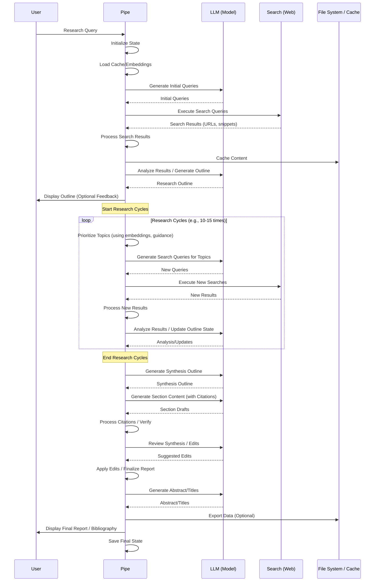

# Chapter 1: The Research Pipe

Welcome to the Deep Research at Home tutorial! In this first chapter, we'll introduce you to the very heart of this project: something we call **The Research Pipe**.

Think about the last time you had to research a topic deeply. You probably:

1.  Started with a question.
2.  Searched on Google or another search engine.
3.  Opened promising links in new tabs.
4.  Read through articles, websites, or PDFs.
5.  Tried to find the most relevant information.
6.  Took notes or copied important snippets.
7.  Searched again based on what you just learned.
8.  Repeated steps 3-7 many times.
9.  Organized your notes.
10. Wrote a report or summary, making sure to cite your sources.

This can be a slow and often overwhelming process, especially for complex topics with lots of information.

Wouldn't it be great if you could automate many of these steps? That's exactly what **The Research Pipe** is designed to do!

## What is The Research Pipe?

Imagine an orchestra playing a complex symphony. You have many different instruments: violins, trumpets, drums, etc. Each instrument plays its part, but without someone directing them, it would just be noise. The **conductor** brings it all together, telling each instrument when and how to play, ensuring the final performance is harmonious and complete.

In the Deep Research at Home project, **The Research Pipe** is the conductor. It's the main engine that takes your research question and orchestrates all the different components needed to produce a final, comprehensive report with a bibliography.

It manages the entire flow:

1.  Understanding your question.
2.  Searching the web for information.
3.  Reading and processing the results.
4.  Figuring out what topics still need research.
5.  Searching again for those topics (in "research cycles").
6.  Synthesizing all the gathered information.
7.  Generating a final report and bibliography.

The Pipe calls upon different "instruments" (like the search tools, the language models, the text processors) and tells them what to do at each step of the research process.

## How to Use the Research Pipe

The great thing about the Pipe is that, as a user, you primarily just interact with it by providing your research query. The Pipe then handles the rest of the complexity for you.

In the code, the `Pipe` class contains the main logic. When you send a message to the system and the Pipe is enabled, its `pipe` method is called.

Here's a simplified look at how you might initiate a research request through the Pipe (though in Open WebUI, this is handled automatically when you interact with the chat interface where the Pipe is installed):

```python
from pipe import Pipe
# ... assume body, user, etc. are set up ...

research_pipe = Pipe() # Create an instance of the Pipe

# The main method that runs the research process
# It receives the user message, context, etc.
result = await research_pipe.pipe(
    body=body,
    __user__=user,
    __event_emitter__=event_emitter, # Used to send messages/status back
    __event_call__=event_call,
    __task__=task,
    __model__=model, # The language model being used by the chat
    __request__=request
)

# The Pipe sends updates and the final report via event_emitter
# The result of the pipe method call itself is typically empty in this setup
```

When this `pipe` method is called with your query (e.g., "Explain the history of renewable energy"), here's what you'll see happening in the chat interface:

*   Status messages indicating what the Pipe is currently doing (e.g., "Starting deep research...", "Generating initial search queries...", "Searching for: history of solar energy...", "Processing result...", "Research cycle 2: Generating search queries...", etc.).
*   It will display the initial search results it finds.
*   It will show you the research outline it generated.
*   It will provide updates on which topics are being researched or completed in each cycle.
*   Finally, it will present the comprehensive report, including titles, an abstract, the main content organized by topics, and a bibliography.

You don't need to manually call search, process text, or format citations – the Pipe handles it all.

## Under the Hood: The Research Flow

So, what exactly is the conductor doing behind the scenes when you give it a query? It orchestrates a series of steps. Here's a simplified look at the main flow:



Let's break down some of these steps briefly:

*   **Initialization & State:** The Pipe first sets up everything it needs and loads any previous progress for this conversation.
*   **Initial Queries & Search:** It generates a first set of questions based on your query and sends them to a web search tool.
*   **Processing Results:** It fetches the actual content from the links provided by the search, cleans it up, and prepares it for analysis. This involves interacting with [Web Search & Content Fetching](05_web_search___content_fetching.md) and [Content Preprocessing](06_content_preprocessing.md).
*   **Outline Generation:** It uses the initial results to create a plan or outline of topics that need to be covered to answer your query.
*   **Research Cycles:** This is where the magic happens! The Pipe repeatedly:
    *   Identifies which topics in the outline still need more information (using semantic analysis, which we'll cover in [Semantic Guidance (Dimensions, PDV, Trajectory)](08_semantic_guidance__dimensions__pdv__trajectory.md)).
    *   Generates new, more specific search queries for those topics.
    *   Searches the web again.
    *   Processes the new results.
    *   Updates its understanding of what's been covered.
    This continues until enough topics are covered or a maximum number of cycles is reached.
*   **Synthesis:** Once enough information is gathered, the Pipe uses the language model to write the research report. It generates content section by section based on the refined outline, drawing directly from the gathered research results. This involves the logic explained in [Synthesis & Report Generation](09_synthesis___report_generation.md).
*   **Citation Management:** As it synthesizes, the Pipe ensures that information from the sources is cited correctly, and it builds the bibliography. ([Citation Management & Verification](10_citation_management___verification.md))
*   **Review & Finalize:** It performs a final review to improve the flow and structure, adds titles and an abstract, and then presents the complete report to you.

Throughout this process, the Pipe manages the flow of information, making sure the right data goes to the right component at the right time. It keeps track of the overall research state ([Research State Management](03_research_state_management.md)), including which topics are covered, which sources have been used, and important semantic information.

## Code Spotlight: The `Pipe` Class

Let's look at just a tiny piece of the `pipe.py` file to see the basic structure of the `Pipe` class.

```python
import logging
# ... other imports ...
from pydantic import BaseModel, Field

# ... setup_logger ...

class ResearchStateManager:
    """Manages research state per conversation"""
    # ... state management logic ...

# Define valves (configuration settings)
class Pipe:
    __current_event_emitter__: Callable[[dict], Awaitable[None]]
    # ... other internal variables ...

    class Valves(BaseModel):
        ENABLED: bool = Field(...) # Configuration option
        RESEARCH_MODEL: str = Field(...) # Another option
        # ... many other configuration options ...

    def __init__(self):
        self.type = "manifold"
        self.valves = self.Valves() # Load configuration
        self.state_manager = ResearchStateManager() # Initialize state manager
        self.conversation_id = None # To be set later
        # ... other initializations ...

    async def pipe(self, body: dict, __user__: dict, ...):
        # This is the main entry point called by the system
        # It handles conversation state, calls other methods,
        # and orchestrates the whole research process.
        # ... core logic ...
        pass # The actual implementation is long and covers the whole flow
```

This snippet shows you that the `Pipe` class has:

*   `Valves`: This is how you configure the Pipe's behavior (like choosing models, setting limits). We'll dive deep into this in the next chapter, [Configuration (Valves)](02_configuration__valves.md).
*   `ResearchStateManager`: This is how the Pipe remembers what happened in previous messages or research cycles for a specific conversation. It ensures your research on one topic doesn't mix with another. We'll explore this in [Research State Management](03_research_state_management.md).
*   The `pipe` method: This is the main function that gets called and runs the entire orchestration process you saw in the sequence diagram.

The rest of the code in `pipe.py` consists of many helper methods (`search_web`, `process_search_result`, `generate_synthesis_outline`, `generate_bibliography`, etc.) that handle the individual steps of the process. The `pipe` method calls these helpers in the correct order.

For example, the `pipe` method might call `search_web` like this:

```python
    async def search_web(self, query: str) -> List[Dict]:
        """Perform web search with fallbacks"""
        logger.debug(f"Starting web search for query: {query}")
        # ... logic to call external search API ...
        pass # Returns a list of dictionaries with result data
```

And then process results by calling `process_search_result`:

```python
    async def process_search_result(self, result: Dict, query: str, ...):
        """Process a search result to extract and compress content"""
        # ... logic to fetch content, clean, truncate, etc. ...
        pass # Returns a processed result dictionary
```

You can see how the `pipe` method acts as the central hub, calling out to these specialized functions whenever a specific task (like searching or processing a result) is needed.

## Conclusion

In this chapter, we learned that **The Research Pipe** is the central coordinator of the Deep Research at Home project. It automates the complex process of going from a research question to a comprehensive report by orchestrating various components like search, analysis, and synthesis. We saw the high-level flow of how it works and a glimpse of its basic structure in the code.

Understanding the Pipe's role as the conductor is key to understanding how the entire project functions. In the next chapter, we'll look at how you can configure the Pipe's behavior using its **Valves**.

[Chapter 2: Configuration (Valves)](02_configuration__valves.md)

---

<sub><sup>Generated by [AI Codebase Knowledge Builder](https://github.com/The-Pocket/Tutorial-Codebase-Knowledge).</sup></sub> <sub><sup>**References**: [[1]](https://github.com/atineiatte/deep-research-at-home/blob/bd54417a0423fd4df886f22cf9195952ee72c3b5/pipe)</sup></sub>
````