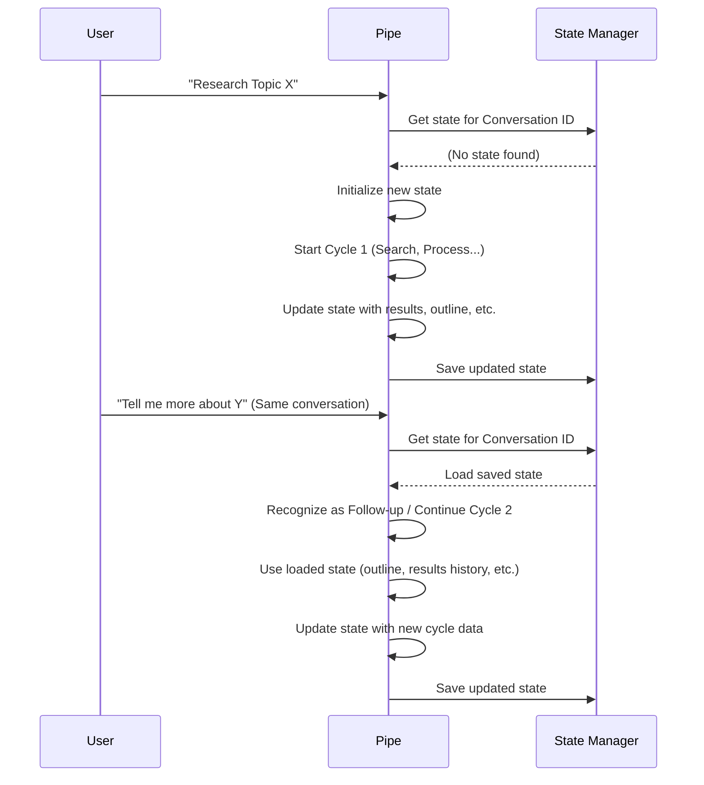

# Chapter 3: Research State Management

Welcome back to the Deep Research at Home tutorial! In the last chapter, we explored [Chapter 2: Configuration (Valves)](02_configuration__valves.md), learning how to adjust the Pipe's settings to control *how* it performs research.

Now, let's look at something equally important: how the Pipe remembers *what* it's doing and *what* it has found. Imagine if you were doing a complex research project, but every time you took a break, you lost all your notes, bookmarks, and everything you'd learned! You'd have to start from scratch every single time. That would be incredibly inefficient and frustrating.

This is where **Research State Management** comes in.

## What is Research State Management?

Think of a human researcher working on a topic for hours or even days. They keep a messy desk full of papers, notes, printed articles, lists of websites they visited, maybe a growing outline, and notes on what they still need to find. This collection of items is their "research state" for that specific project. It lets them pause their work and pick it back up later, knowing exactly where they left off and what they've already covered.

In the Deep Research at Home project, the **Research State Management** system does this job for the Research Pipe. It's the Pipe's digital notebook and filing cabinet. Its main goal is to keep track of everything relevant to a specific research query as the research progresses, potentially across multiple interactions or even days.

This state includes:

*   **The original research query:** What you asked the Pipe to research.
*   **Search queries used:** All the specific searches the Pipe ran.
*   **Search results found:** The list of links and snippets from the web.
*   **Content fetched and processed:** The actual text extracted from the websites or PDFs, after cleaning and compressing.
*   **The evolving research outline:** The plan of topics the Pipe is trying to cover, which changes as it learns more.
*   **Completed topics:** Which parts of the outline the Pipe thinks are sufficiently researched.
*   **Irrelevant topics:** Topics the Pipe identified as distractions or not relevant.
*   **User preferences:** Any specific instructions or filters you provided (like keeping/removing outline items).
*   **Source tracking:** Which URLs were considered, fetched, and used.
*   **Citation data:** Which sources were cited and where, and if they were verified.
*   **Semantic information:** Things like research dimensions and trajectory, which guide future searches ([Semantic Guidance (Dimensions, PDV, Trajectory)](08_semantic_guidance__dimensions__pdv__trajectory.md)).
*   **Memory usage:** How many tokens of information the Pipe is currently holding in its memory for the synthesis step.

All this information is stored and associated with your specific conversation or research session.

## Why is State Management Important?

Without state management, every time you sent a message to the Pipe, it would have to start completely fresh. It wouldn't remember the search results it just showed you, the content it processed from the last batch of links, or which topics it thought were complete. This would make iterative research cycles impossible and prevent the system from building a comprehensive picture over time.

State management allows the Pipe to:

*   **Continue research:** Pick up where it left off if a session is interrupted or if you come back to the topic later.
*   **Avoid repetition:** Remember which sources it already looked at and processed.
*   **Build incrementally:** Use previously gathered information and the evolving outline to guide the next steps.
*   **Provide context:** Refer back to earlier findings during analysis and synthesis.
*   **Handle user feedback:** Remember your specific instructions (like removing certain outline topics) and apply them throughout the process.

## How State Works in the Pipe

Let's look at a simplified flow of how the Pipe uses state:



In this diagram:

1.  The **User** sends a research query to the **Pipe**.
2.  The **Pipe** asks the **State Manager** for the state associated with this specific conversation.
3.  If it's a new conversation, the **State Manager** says there's no state, and the **Pipe** initializes a fresh state.
4.  The **Pipe** runs its first research cycle, gathering initial information and generating an outline. As it does this, it constantly updates the state in its memory.
5.  After the cycle, the **Pipe** saves the current state using the **State Manager**.
6.  Later, the **User** sends another message *in the same conversation*.
7.  The **Pipe** again asks the **State Manager** for the state for this conversation ID.
8.  This time, the **State Manager** finds the saved state and loads it back into the **Pipe**'s memory.
9.  The **Pipe** recognizes that it has a previous state and continues the research process (either as a follow-up or the next research cycle), using the loaded information.
10. The **Pipe** updates the state as it goes and saves it again.

This cycle of loading, updating, and saving state allows the research process to be dynamic and iterative.

## Under the Hood: State in the Code

The state management is handled by a dedicated class, `ResearchStateManager`. This class doesn't *do* the research itself; its job is purely to store and retrieve the state data for different conversations.

Let's look at a very simplified version of the `ResearchStateManager` class found in `pipe.py`:

```python
class ResearchStateManager:
    """Manages research state per conversation"""

    def __init__(self):
        # This dictionary holds the state for each conversation, keyed by conversation_id
        self.conversation_states = {} 

    def get_state(self, conversation_id):
        """Get state for a specific conversation, creating if needed"""
        if conversation_id not in self.conversation_states:
            # If no state exists, create a default empty state structure
            self.conversation_states[conversation_id] = {
                "research_completed": False,
                "results_history": [],
                "active_outline": [],
                "completed_topics": set(),
                # ... many other state variables initialized here ...
            }
        return self.conversation_states[conversation_id] # Return the state dictionary

    def update_state(self, conversation_id, key, value):
        """Update a specific state value for a conversation"""
        # Get the state dictionary
        state = self.get_state(conversation_id)
        # Update the value for the given key
        state[key] = value

    def reset_state(self, conversation_id):
        """Reset the state for a specific conversation"""
        if conversation_id in self.conversation_states:
            # Delete the state for this conversation
            del self.conversation_states[conversation_id]
            logger.info(f"State reset for conversation: {conversation_id}")

```

This `ResearchStateManager` is simple: it has a dictionary (`self.conversation_states`) to store states, and methods to get, update, and reset the state for a given `conversation_id`.

Now, how does the `Pipe` class use this state manager? Let's look at snippets from the `Pipe` class in `pipe.py`:

```python
class Pipe:
    # ... other class definitions and variables ...

    def __init__(self):
        # ... other initializations ...
        # Initialize the state manager instance
        self.state_manager = ResearchStateManager() 
        # Placeholder for the current conversation ID
        self.conversation_id = None  

    async def pipe(self, body: dict, __user__: dict, ...):
        # ... Extract conversation_id from body/user ...
        # Set the current conversation ID for this pipe instance
        self.conversation_id = conversation_id 

        # Get the current state using the state manager
        state = self.get_state() # Calls self.state_manager.get_state(self.conversation_id)

        # Check if we're continuing previous research
        is_follow_up = await self.is_follow_up_query(messages)
        self.update_state("follow_up_mode", is_follow_up) # Update state

        # ... Check for outline feedback state ...
        if state.get("waiting_for_outline_feedback", False):
            # Process user feedback, which updates the state
            feedback_result = await self.process_outline_feedback_continuation(user_message)
            # The continuation function itself updates state variables directly

        # ... Later in the research cycle ...
        # Add new results to the state's results_history list
        results_history = state.get("results_history", [])
        results_history.extend(cycle_results)
        self.update_state("results_history", results_history) # Save updated list

        # Update the set of completed topics in the state
        completed_topics.update(newly_completed)
        self.update_state("completed_topics", completed_topics) # Save updated set

        # Update memory stats in the state
        await self.update_token_counts(cycle_results) # This function updates state directly

        # ... At the very end of the pipe method ...
        # Mark research as completed in the state
        self.update_state("research_completed", True)
        # Store the final answer in state for follow-ups
        self.update_state("prev_comprehensive_summary", comprehensive_answer)
```

In this snippet:

1.  The `Pipe` class creates an instance of `ResearchStateManager` in its `__init__`.
2.  When the `pipe` method is called (which is the main entry point for a user message), it identifies the `conversation_id`.
3.  It then uses `self.get_state()` (which is a helper method calling `self.state_manager.get_state()`) to load the state for that conversation.
4.  Throughout the `pipe` method and its helpers, data is read from the `state` dictionary (e.g., `state.get("results_history", [])`) or updated using `self.update_state(key, value)` (which calls `self.state_manager.update_state()`).
5.  When the `pipe` method finishes processing a user message, the state for that conversation is left in the `self.state_manager`, ready to be loaded the next time a message comes in for the same conversation.
6.  The `reset_state()` method allows starting fresh for a conversation, usually for a completely new research query.

By using the `ResearchStateManager`, the `Pipe` class doesn't need to worry about *how* the state is stored (in memory, in a database, etc. - though currently it's just in memory for a single user session). It just needs to call `get_state` to load and `update_state` to save. This separation makes the code cleaner and easier to manage.

## Conclusion

**Research State Management** is the system that allows the Deep Research at Home project to maintain context and progress for each research query. By acting as the Pipe's digital notebook and filing cabinet, it stores all the information gathered, decisions made, and the current status of the research outline. This is essential for enabling iterative research cycles and allowing the system to pick up where it left off.

Understanding how the Pipe manages its state is crucial because the next step in the research process, **Iterative Research Cycles**, relies heavily on the information stored and updated in the state.

[Chapter 4: Iterative Research Cycles](04_iterative_research_cycles.md)

---

<sub><sup>Generated by [AI Codebase Knowledge Builder](https://github.com/The-Pocket/Tutorial-Codebase-Knowledge).</sup></sub> <sub><sup>**References**: [[1]](https://github.com/atineiatte/deep-research-at-home/blob/bd54417a0423fd4df886f22cf9195952ee72c3b5/pipe)</sup></sub>
````