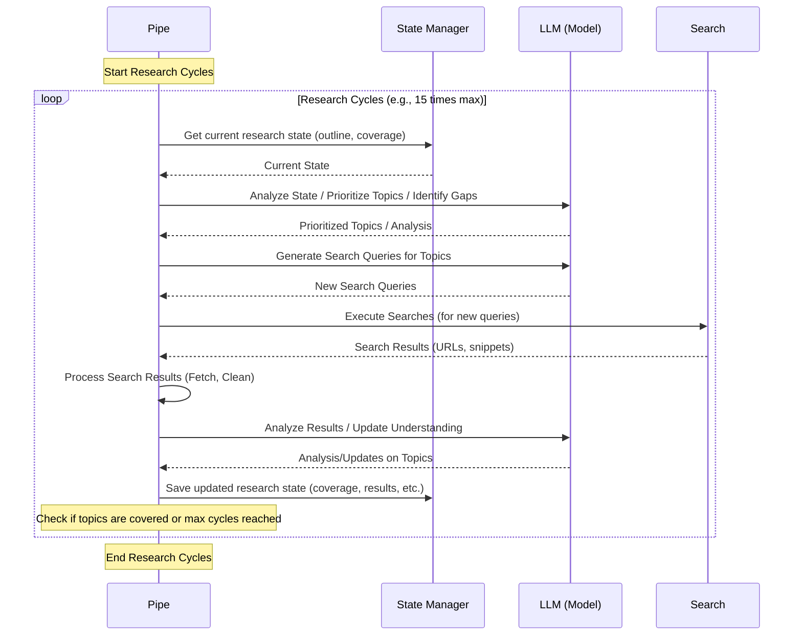

# Chapter 4: Iterative Research Cycles

Welcome back to the Deep Research at Home tutorial! In the previous chapters, we introduced [The Research Pipe](01_the_research_pipe_.md) as the conductor orchestrating the research process, learned how to customize its behavior using [Configuration (Valves)](02_configuration__valves.md), and understood how it keeps track of everything using [Research State Management](03_research_state_management.md).

Now, let's dive into the engine room of the Research Pipe – the **Iterative Research Cycles**. This is where the actual "deep" research happens, not in one big step, but through repeated cycles of learning and refinement.

## What are Iterative Research Cycles?

Imagine you're researching a complex topic for a school project. You don't just do *one* Google search and write the report. Instead, your process probably looks like this:

1.  You start with a main question.
2.  You do some initial searches and find a few articles.
3.  You read those articles, maybe take some notes, and start forming a basic idea or outline of the topic.
4.  As you read, you find mentions of specific sub-topics or related concepts you didn't know about. You realize you need *more* information on those.
5.  You go back to Google, but this time you search for those *specific* sub-topics.
6.  You find more articles, read them, add to your notes, and refine your outline based on the new details.
7.  You repeat steps 4-6 several times, each time digging deeper into related areas, until you feel you have a comprehensive understanding.

This repeated process of searching, reading, analyzing, and refining your understanding based on new information is an **Iterative Research Cycle**. You iterate, or loop, through the research steps, getting more detailed and comprehensive with each pass.

The Deep Research at Home project automates this exact process. After it gets an initial grasp of your query and generates a first outline, it enters a core loop where it performs these cycles again and again.

## Why Iterate?

Why is one big search not enough?

*   **Discover Hidden Connections:** Research often reveals sub-topics or related fields you weren't initially aware of. Iteration allows the system to discover these and incorporate them.
*   **Deepen Understanding:** Initial searches might only give surface-level information. Subsequent targeted searches allow the system to find more detailed or specialized content.
*   **Adapt to New Information:** The understanding of the topic evolves as new information is processed. Iteration lets the research plan (the outline) adapt dynamically.
*   **Handle Complexity:** Complex topics can't be fully understood from a single set of search results. Breaking it down into smaller research cycles makes the problem manageable.

Each cycle builds upon the knowledge gained in previous cycles, allowing the system to progressively deepen its understanding and refine the research focus.

## The Steps Within Each Cycle

Inside the main iteration loop, the Research Pipe essentially performs the following high-level steps:

1.  **Prioritize Topics:** Look at the current [Research State Management](03_research_state_management.md) (the outline, which topics are covered, which need more info) and decide which topics are most important to research *next*. This often involves using semantic analysis and [Semantic Guidance (Dimensions, PDV, Trajectory)](08_semantic_guidance__dimensions__pdv__trajectory.md) concepts to understand what areas are lacking coverage or align with user preferences.
2.  **Generate Targeted Queries:** Create specific search queries designed to find information about the prioritized topics. These queries become more focused as the research progresses.
3.  **Search the Web:** Use the generated queries to search for new information online ([Web Search & Content Fetching](05_web_search___content_fetching.md)).
4.  **Process Results:** Fetch the content from promising search results, clean it up, and prepare it for analysis ([Content Preprocessing](06_content_preprocessing.md)).
5.  **Analyze & Update State:** Use the language model to analyze the new information, identify key points, determine how it addresses the research outline, update the [Research State Management](03_research_state_management.md) (mark topics as partially or fully covered, potentially add new topics), and generate a summary of what was learned in this cycle.

This sequence of steps repeats for a set number of cycles, or until the system determines that most topics in the outline are sufficiently covered.

## Visualizing the Iteration Loop

Let's simplify the overall flow we saw in Chapter 1 and focus just on the core research cycles:



As you can see, the **Pipe** acts as the orchestrator, pulling information from the **State Manager** (its memory), asking the **LLM** to perform analysis and planning tasks, sending queries to **Search**, and processing the results before saving the updated state back to the **State Manager**. This cycle continues until the stopping conditions are met.

## How Valves Control the Cycles

The behavior of these iterative cycles is directly influenced by the [Configuration (Valves)](02_configuration__valves.md). Here are a few key examples:

*   `MAX_CYCLES`: This integer valve sets the upper limit on how many times the loop will run. A higher number allows for deeper research but takes more time and resources. A lower number means faster, but potentially less comprehensive research.
*   `MIN_CYCLES`: This valve sets the lower limit, ensuring the research runs for at least this many cycles, even if the system thinks it's "done" earlier.
*   `SEARCH_RESULTS_PER_QUERY`: This affects how much raw information is brought into the Pipe *within* each cycle for each search query. More results mean more data to process and analyze in each step.
*   `SUCCESSFUL_RESULTS_PER_QUERY`: This valve controls how many *useful* results the Pipe aims to get from each query before moving on, ensuring quality over quantity within a cycle.
*   `QUALITY_FILTER_ENABLED`, `QUALITY_SIMILARITY_THRESHOLD`: These valves determine how strictly results are filtered *within* a cycle based on their relevance, affecting the quality of the information analyzed.
*   `SEMANTIC_TRANSFORMATION_STRENGTH`, `TRAJECTORY_MOMENTUM`, `GAP_EXPLORATION_WEIGHT`: These valves influence how the system prioritizes topics and generates queries *between* cycles using semantic analysis ([Semantic Guidance (Dimensions, PDV, Trajectory)](08_semantic_guidance__dimensions__pdv__trajectory.md)).

Adjusting these valves lets you customize the depth, speed, and focus of the iterative research process.

## Under the Hood: The Iteration Loop in Code

In the `pipe.py` file, within the main `pipe` method (the conductor's main score), you'll find the `while` loop that implements these cycles.

Here's a simplified glimpse of that section:

```python
# pipe.py

# ... (initialization and outline generation steps) ...

# Initialize research variables for continued cycles
# Get initial state after outline generation
state = self.get_state()
cycle = 1 # We've already done some initial work, starting logical cycles from 1 or 2
max_cycles = self.valves.MAX_CYCLES # Read from Valve
min_cycles = self.valves.MIN_CYCLES # Read from Valve

# Load state for the loop
completed_topics = set(state.get("completed_topics", set()))
irrelevant_topics = set(state.get("irrelevant_topics", set()))
search_history = state.get("search_history", [])
results_history = state.get("results_history", [])
active_outline = list(set(all_topics) - completed_topics - irrelevant_topics) # Get list of topics not yet completed/irrelevant
cycle_summaries = state.get("cycle_summaries", [])

# Ensure consistent token counts are loaded
await self.update_token_counts()

# Step 4: Begin research cycles
# The loop continues as long as we haven't hit max cycles AND there are still topics in the active outline
while cycle < max_cycles and active_outline:

    cycle += 1 # Increment the cycle counter
    await self.emit_status( # Inform the user about the current cycle
        "info",
        f"Research cycle {cycle}/{max_cycles}: Generating search queries...",
        False,
    )

    # Calculate trajectory from previous cycles (logic depends on cycle number)
    # This updates state['research_trajectory']
    if cycle > 2 and results_history:
        research_trajectory = await self.calculate_research_trajectory(
            search_history, results_history
        )
        self.update_state("research_trajectory", research_trajectory)

    # Calculate gap vector (logic depends on research progress)
    # This uses state['research_dimensions'] and updates state['gap_coverage_history']
    gap_vector = await self.calculate_gap_vector()

    # Prioritize active topics using semantic analysis, trajectory, gaps, etc.
    # This reads state['research_trajectory'], state['research_dimensions'], state['user_preferences']
    prioritized_topics = await self.rank_topics_by_research_priority(
        active_outline, gap_vector, completed_topics, results_history
    )

    # Select the top topics for this cycle's queries (limited to first 10)
    priority_topics = prioritized_topics[:10]

    # Build context for query generation based on current state
    search_context = ""
    # ... (code to build search_context using state data like user_message, topics, history, dimensions) ...

    # Generate new queries for this cycle based on prioritized topics and context
    # This interacts with the LLM
    query_objects = await self.improved_query_generation(
        user_message, priority_topics, search_context
    )

    # Track topics used for queries to update usage counts
    # This updates state['topic_usage_counts']
    used_topics = [q.get("topic", "") for q in query_objects if q.get("topic")]
    await self.update_topic_usage_counts(used_topics)

    # Display queries to the user
    # ... (code to emit messages with queries) ...

    # Add queries to search history in state
    query_strings = [q.get("query", "") for q in query_objects]
    search_history.extend(query_strings)
    self.update_state("search_history", search_history)

    # Execute searches and process results SEQUENTIALLY for this cycle
    cycle_results = []
    for query_obj in query_objects:
        query = query_obj.get("query", "")
        topic = query_obj.get("topic", "")

        # Get query embedding (potentially transformed)
        # This uses self.get_embedding and state['semantic_transformations']
        query_embedding = await self.get_embedding(query)
        # ... (code to apply transformation) ...

        # Process the query and get results - this involves search_web and process_search_result
        # This also updates state['url_selected_count'], state['url_token_counts'], state['master_source_table']
        results = await self.process_query(
            query,
            query_embedding,
            outline_embedding, # Outline embedding from initial state
            None, # No cycle-specific feedback here
            summary_embedding, # Summary embedding if follow-up
        )

        # Add successful results to the cycle results and history
        cycle_results.extend(results)
        # results_history is updated implicitly by process_query (in this snippet, though the full code might update it here)
        # Let's assume results_history is updated here for clarity in this simplified view
        results_history.extend(results)


    # Update results_history in state
    self.update_state("results_history", results_history)

    # Analyze results and update research outline/topic completion status
    # This interacts with the LLM, updates state['completed_topics'], state['irrelevant_topics'],
    # state['active_outline'], state['all_topics'], state['cycle_summaries']
    if cycle_results:
        await self.emit_status("info", "Analyzing search results...", False)
        # ... (code to generate analysis prompt and call LLM) ...
        # Based on analysis, update completed_topics, irrelevant_topics, active_outline, etc.
        # ... (code to update state based on analysis results) ...

        # Update dimension coverage for each result
        # This uses state['research_dimensions']
        for result in cycle_results:
             await self.update_dimension_coverage(result.get('content', ''), result.get('similarity', 0)) # Simplified

        # Display analysis to the user
        # ... (code to emit analysis message) ...

    # Check termination criteria (either all topics covered OR max cycles reached)
    if not active_outline or (cycle >= min_cycles and len(completed_topics) / len(all_topics) > 0.7):
        await self.emit_status("info", "Research topics addressed or sufficient coverage reached.", False)
        break

    if cycle >= max_cycles:
        await self.emit_status("info", f"Maximum research cycles ({max_cycles}) reached.", False)
        break

    # If not terminating, prepare for the next cycle
    await self.emit_status("info", f"Research cycle {cycle} complete. Moving to next cycle...", False)

# ... (Synthesis steps follow the loop) ...

```

This snippet shows the heart of the iterative process: the `while` loop runs for a maximum number of cycles (`max_cycles`) as long as there are still topics in the `active_outline` list. Inside the loop, it calls other methods (`rank_topics_by_research_priority`, `improved_query_generation`, `process_query`, `analyze_results`, `update_dimension_coverage`) to perform the steps of prioritization, query generation, search/processing, analysis, and state updates. Critically, the loop relies heavily on reading from and writing to the `state` managed by `ResearchStateManager` in each iteration.

## Conclusion

The **Iterative Research Cycles** are the core mechanism that enables the Deep Research at Home project to go beyond simple search and provide comprehensive, deep reports. By repeatedly searching, processing information, analyzing results, and refining the research plan based on new findings, the system builds a richer understanding of the topic over time. These cycles are controlled by various [Valves](02_configuration__valves.md) and rely heavily on the persistent information stored by [Research State Management](03_research_state_management.md) and the analytical capabilities informed by [Semantic Guidance (Dimensions, PDV, Trajectory)](08_semantic_guidance__dimensions__pdv__trajectory.md).

Now that we understand the repetitive core loop, let's look closer at two crucial steps within each cycle: finding the information on the web and getting that content ready for the system to use. In the next chapter, we'll explore **Web Search & Content Fetching**.

[Chapter 5: Web Search & Content Fetching](05_web_search___content_fetching.md)

---

<sub><sup>Generated by [AI Codebase Knowledge Builder](https://github.com/The-Pocket/Tutorial-Codebase-Knowledge).</sup></sub> <sub><sup>**References**: [[1]](https://github.com/atineiatte/deep-research-at-home/blob/bd54417a0423fd4df886f22cf9195952ee72c3b5/README.md), [[2]](https://github.com/atineiatte/deep-research-at-home/blob/bd54417a0423fd4df886f22cf9195952ee72c3b5/pipe)</sup></sub>
````