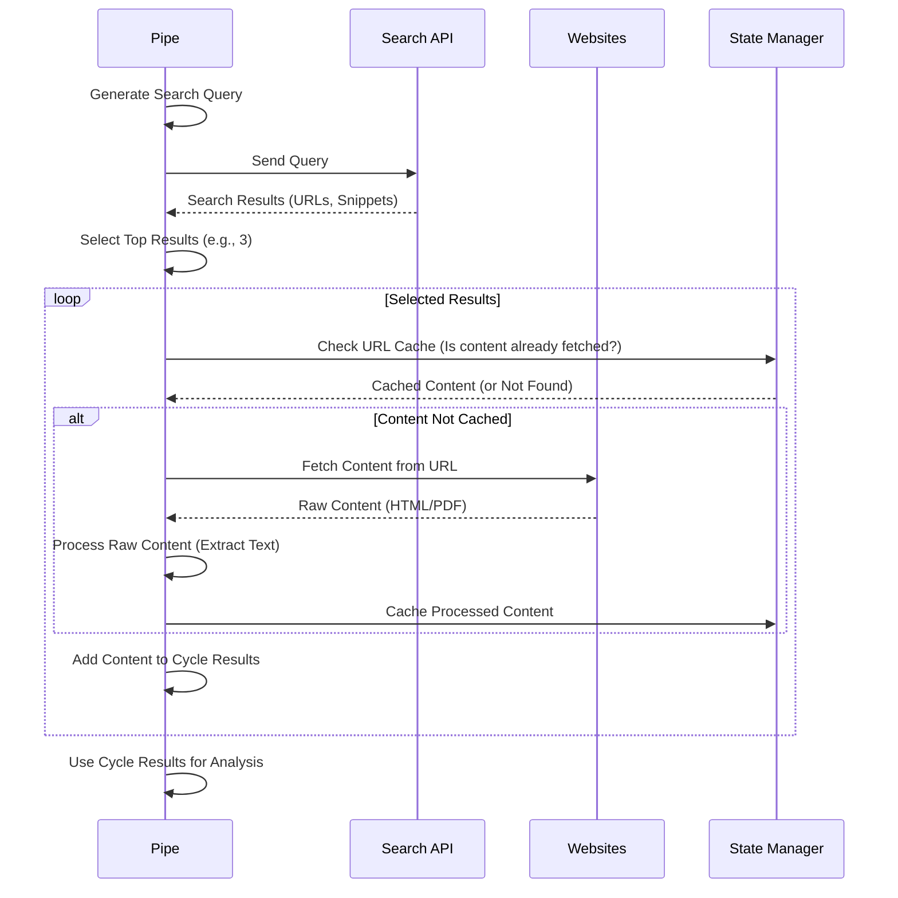

# Chapter 5: Web Search & Content Fetching

Welcome back to the Deep Research at Home tutorial! In the last chapter, [Chapter 4: Iterative Research Cycles](04_iterative_research_cycles.md), we saw how the Research Pipe repeatedly goes through cycles of planning, searching, and learning to build a comprehensive report.

But how does the Pipe actually *get* the information from the vast ocean of the internet during these cycles? That's the job of the **Web Search & Content Fetching** component.

## What is Web Search & Content Fetching?

Think about doing research yourself. First, you type something into a search engine like Google or DuckDuckGo. This is **Web Search**. The search engine gives you a list of links (search results), often with a short summary (snippet) for each.

Then, you click on the promising links. Your browser goes to that website and downloads the page content. This is **Content Fetching**. Sometimes the link might be to a PDF document, and your browser downloads that instead.

This component of the Deep Research at Home project automates exactly these two steps: **Web Search** (getting the list of links) and **Content Fetching** (downloading the actual stuff at those links). It acts like the project's built-in internet explorer and downloader.

## Why Separate Search and Fetching?

Why doesn't the search engine just give the AI *all* the text?

1.  **Efficiency:** Search engines give you snippets, not the full book. The AI doesn't need the full text of *every single* search result, only the ones that look most promising based on the snippet. Fetching only the relevant pages saves time and resources.
2.  **Variety:** Search results come from different websites (HTML pages), PDFs, and maybe other document types. The system needs a way to handle getting content from all these different places.
3.  **Website Behavior:** Websites behave differently. Some might block automated access, require specific headers, or be slow. Fetching needs to be robust enough to handle these real-world internet challenges.

So, the Pipe first performs a **Search** to get a list of potential sources, and then selectively performs **Fetching** on the sources it thinks are most likely to be useful.

## How It Works: The Two Steps

Let's break down the process:

1.  **Web Search:**
    *   The [Research Pipe](01_the_research_pipe_.md), often using the AI model, generates specific search queries based on the current research topic identified in the [Iterative Research Cycles](04_iterative_research_cycles.md).
    *   These queries are sent to an external search tool (like a self-hosted SearXNG instance or OpenWebUI's built-in search feature).
    *   The search tool returns a list of results, typically including the title, URL, and a short snippet for each.

2.  **Content Fetching:**
    *   The Pipe receives the list of search results.
    *   For the top 'N' results (configured by a Valve), the Pipe attempts to download the actual content from the URL.
    *   This involves making an HTTP request to the website or file server.
    *   It needs to handle different content types (HTML, PDF).
    *   It might use techniques to make the requests look more like a regular browser visit to avoid being blocked.
    *   If successful, it gets the raw content (e.g., the raw HTML of a page or the bytes of a PDF).

Once the raw content is fetched, it's passed on to the next stage: [Content Preprocessing](06_content_preprocessing.md), where it gets cleaned up and made ready for analysis.

## Using Search & Fetching

As a user interacting with the Deep Research at Home Pipe, you don't directly trigger search or fetching. These are internal steps orchestrated by the Pipe during its research cycles.

Your main interaction points are:

*   **Providing the initial research query:** This kicks off the whole process, including the first searches.
*   **Configuring the Search Tool:** The Pipe needs to know *where* to send the search queries. This is done via the `SEARCH_URL` Valve. If you are using OpenWebUI's built-in search, this might be handled automatically, but for a custom search instance, you'd set this valve.

Let's look at the `SEARCH_URL` Valve from the [Configuration (Valves)](02_configuration__valves.md) chapter:

```python
class Pipe:
    # ... other definitions ...
    class Valves(BaseModel):
        # ... other valves ...
        SEARCH_URL: str = Field(
            default="http://192.168.1.1:8888/search?q=",
            description="URL for web search API",
        )
        # ... more valves ...
```

This valve tells the Pipe the base address and query parameter for the search engine it should use. When the Pipe needs to search, it will take the generated query, encode it safely for a URL, and append it to this `SEARCH_URL`.

You can also control *how many* results the Pipe fetches using other valves, which we'll look at in the "Valves" section below.

## Under the Hood: Search and Fetching in Code

Let's peek at some very simplified methods in the `pipe.py` file that handle these steps. Remember, the goal here is understanding the *purpose* of the code, not every detail.

First, the `search_web` method:

```python
# pipe.py

async def search_web(self, query: str) -> List[Dict]:
    """
    Perform web search using the configured search API.
    Takes a search query (str).
    Returns a list of dictionaries, each representing a search result
    with keys like 'title', 'url', 'snippet'.
    """
    logger.debug(f"Starting web search for query: {query}")
    sanitized_query = await self.sanitize_query(query) # Clean query

    # This is where the code would call the external search API
    # using self.valves.SEARCH_URL or OpenWebUI's internal function.
    # It handles potential retries or fallbacks.

    # Example (simplified - real code is more complex):
    # search_results = await self._call_search_api(self.valves.SEARCH_URL, sanitized_query)

    # The results are typically a list of dicts:
    # [ {'title': '...', 'url': '...', 'snippet': '...'}, ... ]

    return search_results # Returns the list of results
```

This function is the entry point for performing a web search. It takes the query, cleans it up (`sanitize_query`), calls the actual search provider (abstracted here for simplicity), and returns the structured results provided by the search engine.

Next, the `fetch_content` method:

```python
# pipe.py

async def fetch_content(self, url: str) -> str:
    """
    Fetch raw content from a given URL.
    Takes a URL (str).
    Returns the raw content (str for HTML/text, handled internally for PDF).
    Includes logic for handling headers, timeouts, etc.
    """
    logger.debug(f"Attempting to fetch content from: {url}")

    # This is where the code makes an HTTP request to the URL.
    # It sets headers (like User-Agent), handles potential redirects,
    # sets timeouts, and reads the response body.

    # It also checks the content type (e.g., 'application/pdf')
    # and might route PDF content to a different internal handler.

    # Example (simplified):
    # async with aiohttp.ClientSession() as session:
    #     async with session.get(url, headers=...) as response:
    #         if response.status == 200:
    #             raw_content = await response.text() # Or .read() for binary

    # The real code also includes caching (url_results_cache) and error handling.

    return raw_content # Returns the raw HTML, text, or processed PDF text
```

This method is responsible for going to a specific web address (URL) and getting what's there. It's like your browser's core download function. The `url_results_cache` is used here to store fetched content in the [Research State Management](03_research_state_management.md) so it doesn't need to be fetched again if the same URL appears in future search results.

The connection point between search results and fetching content is often handled by another method, like `process_search_result` or as part of a loop that iterates through selected search results.

Here's a simplified look at the flow:



This diagram shows how the `Pipe` uses the `Search API` to get a list, then loops through the relevant items from that list, asking `Websites` for the actual content, and using the `State Manager` to cache the fetched content.

## Valves for Search & Fetching

Several [Configuration (Valves)](02_configuration__valves.md) directly influence how the Web Search & Content Fetching component behaves:

*   `SEARCH_URL`: (Already mentioned) Defines the endpoint for the external search tool.
*   `SEARCH_RESULTS_PER_QUERY`: An integer controlling how many search results (URLs) from the initial list the Pipe will attempt to fetch content from in a standard scenario.
*   `EXTRA_RESULTS_PER_QUERY`: An integer that adds extra search results to consider when the Pipe encounters URLs it has processed multiple times before, trying to find new sources.
*   `MAX_FAILED_RESULTS`: An integer limiting how many times the Pipe will attempt to process (fetch and clean) results for a single query if they consistently fail (e.g., fetching errors, empty content). This prevents getting stuck on problematic queries.
*   `EXTRACT_CONTENT_ONLY`: A boolean. If true, the fetching process attempts to strip out navigation, ads, headers, footers, and other non-essential parts from HTML before using the content. This relies on internal cleaning methods like `extract_text_from_html`.
*   `HANDLE_PDFS`: A boolean enabling or disabling PDF processing.
*   `PDF_MAX_PAGES`: An integer limiting the number of pages extracted from a PDF to manage processing time and token count.
*   `RELEVANCY_SNIPPET_LENGTH`: An integer determining how much content is fetched *just* for similarity checks (to decide which URLs are most relevant), especially when extra results are considered.

By adjusting these valves, you can control the breadth of the search, how aggressively the system tries to get content, and how it handles different content types and challenging websites.

## Conclusion

The **Web Search & Content Fetching** component is the Research Pipe's eyes and hands on the internet. It translates the AI's research needs into concrete actions: finding relevant links via **Web Search** and retrieving the actual source material via **Content Fetching**. This gathered raw content is essential fuel for the rest of the research process.

However, the raw content from websites and PDFs is often messy. Before the AI can analyze it or extract insights, it needs to be cleaned up. This crucial step is handled by **Content Preprocessing**, which we'll explore in the next chapter.

[Chapter 6: Content Preprocessing](06_content_preprocessing.md)

---

<sub><sup>Generated by [AI Codebase Knowledge Builder](https://github.com/The-Pocket/Tutorial-Codebase-Knowledge).</sup></sub> <sub><sup>**References**: [[1]](https://github.com/atineiatte/deep-research-at-home/blob/bd54417a0423fd4df886f22cf9195952ee72c3b5/pipe)</sup></sub>
````