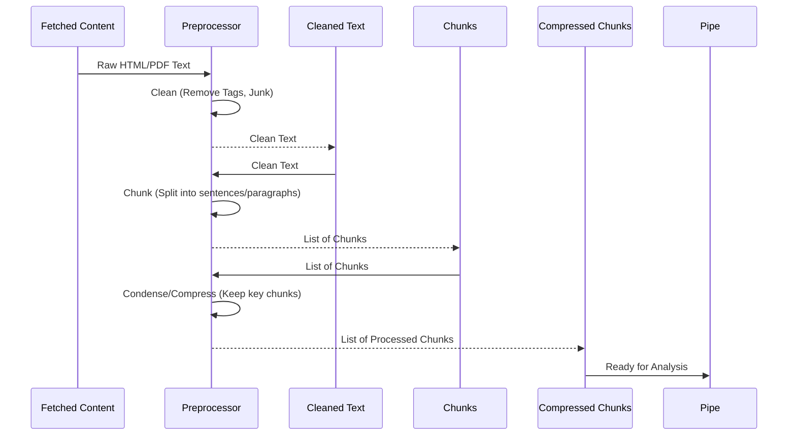

# Chapter 6: Content Preprocessing

Welcome back to the Deep Research at Home tutorial! In the previous chapter, [Chapter 5: Web Search & Content Fetching](05_web_search___content_fetching.md), we learned how the Research Pipe uses search tools to find relevant links on the internet and then fetches the raw content from those links.

Now imagine you've just downloaded a stack of articles, websites, and PDFs for your research project. Are they perfectly formatted, clean documents ready for you to instantly understand? Probably not! Websites are full of navigation menus, advertisements, social media buttons, scripts, and hidden formatting. PDFs might have headers, footers, page numbers, and weird line breaks.

Before you can effectively read through these documents and take notes, you'd likely:

1.  Skim past all the "junk" (ads, menus).
2.  Focus only on the main article text.
3.  Maybe break down long articles into sections or highlight key sentences or paragraphs to make them easier to digest.

This is exactly what **Content Preprocessing** does for the Research Pipe!

## What is Content Preprocessing?

Content Preprocessing is the stage in the Research Pipe where the raw text fetched from websites and documents gets cleaned up and prepared for analysis by the AI models.

Think of it as the **cleaning crew and the highlighter squad** for your downloaded research documents.

Its main jobs are:

1.  **Cleaning:** Removing all the irrelevant clutter like HTML tags, JavaScript code, CSS styles, navigation menus, ads, and repetitive patterns that aren't part of the core informational content.
2.  **Structuring (Chunking):** Splitting the cleaned content into smaller, manageable pieces. These pieces, or "chunks," are typically sentences or paragraphs.
3.  **Condensing (Compression):** Making the text shorter while keeping the most important information. This is crucial because AI models have limits on how much text they can read at once.

By performing these steps, preprocessing transforms messy, raw web data into clean, structured, and focused text that the AI can efficiently read, understand, and use for synthesis.

## Why is Preprocessing Important?

If the Research Pipe fed raw HTML directly to an AI model, it would be like asking you to read a book where every other sentence is a programming command or an advertisement. It would be confusing, inefficient, and the AI would likely get distracted by or misunderstand the noise.

Preprocessing ensures that the AI models receive only the relevant, high-quality text, allowing them to:

*   **Focus:** Analyze the actual research content without being bogged down by clutter.
*   **Save Resources:** Process much less text per document, saving time and computational power (especially important for costly AI model calls).
*   **Improve Accuracy:** Avoid potential misinterpretations caused by website formatting or irrelevant sections.
*   **Manage Context:** Break down long documents into chunks that fit within the limited "memory" (context window) of AI models.

## How it Works: The Steps

After the [Web Search & Content Fetching](05_web_search___content_fetching.md) step delivers raw content, the Preprocessing stage takes over. Here's a simplified flow:



In this diagram, the `Preprocessor` takes the raw fetched content, cleans it, splits it into `Chunks`, potentially condenses those chunks, and then provides the usable `Compressed Chunks` back to the Pipe for the next stages like analysis ([Iterative Research Cycles](04_iterative_research_cycles.md)) and embedding ([Semantic Embeddings](07_semantic_embeddings.md)).

## Key Concepts in Preprocessing

Let's look at the main tasks involved.

### Cleaning Raw Content

Raw web content is noisy. The cleaning step gets rid of the distracting parts.

*   **Removing HTML Tags & Scripts:** This is like stripping out all the formatting code (`<p>`, `<div>`, `<script>`) and leaving just the text. The `extract_text_from_html` method does this, often using libraries like BeautifulSoup (if available) or regular expressions as a fallback. It also tries to remove obvious navigation, headers, and footers.
*   **Handling Boilerplate & Repetitive Patterns:** Websites often have repeated sections (like footers or sidebars) or weird character patterns caused by bad formatting. The `clean_text_formatting` and `handle_repeated_content` methods look for these patterns (like lots of short lines that look like a menu or repeated text blocks) and either remove them or process them specially.

Here's a simplified look at a cleaning function's core idea:

```python
# pipe.py (Simplified)

async def extract_text_from_html(self, html_content: str) -> str:
    """Extract meaningful text content from HTML"""
    try:
        # Example using BeautifulSoup (if installed)
        # from bs4 import BeautifulSoup
        # soup = BeautifulSoup(html_content, "html.parser")
        # Remove scripts, styles, nav, etc.
        # for junk_tag in soup(["script", "style", "nav", "header", "footer"]):
        #     junk_tag.decompose()
        # text = soup.get_text(" ", strip=True) # Get text, normalize whitespace
        # return text

        # Fallback using regex
        import re
        # Remove script and style tags
        content = re.sub(r"<script[^>]*>.*?</script>", " ", html_content, flags=re.DOTALL)
        content = re.sub(r"<style[^>]*>.*?</style>", " ", content, flags=re.DOTALL)
        # Remove HTML tags
        content = re.sub(r"<[^>]*>", " ", content)
        # Normalize whitespace
        content = re.sub(r"\s+", " ", content).strip()
        return content

    except Exception as e:
        logger.error(f"Error extracting text: {e}")
        return html_content # Return original on failure
```
*This code snippet shows the basic idea of stripping tags and normalizing whitespace. The actual `extract_text_from_html` method in `pipe.py` is more robust, including handling HTML entities and attempting to remove common navigation/layout elements.*

### Structuring Content (Chunking)

Once the text is clean, it's broken down into chunks. Why? Because AI models can only process a limited amount of text at once (their "context window"). Passing a whole book or a very long article wouldn't work. Chunking breaks it into paragraphs or sentences that fit better and can be analyzed individually or in small groups.

The `chunk_text` method handles this based on a configuration setting (a Valve).

```python
# pipe.py (Simplified)

def chunk_text(self, text: str) -> List[str]:
    """Split text into chunks based on the configured chunk level"""
    chunk_level = self.valves.CHUNK_LEVEL # Read the Valve setting

    if chunk_level == 2: # Sentence level (common setting)
        # Split by sentences (periods, question marks, exclamation points)
        # Handles multiple newlines as paragraph breaks between sentences
        sentences = []
        for paragraph in text.split("\n\n"): # Split by paragraphs first
             sentences.extend(re.split(r"(?<=[.!?])\s+", paragraph))

        # Filter out empty chunks and strip whitespace
        chunks = [s.strip() for s in sentences if s.strip()]
        return chunks

    elif chunk_level == 3: # Paragraph level
        # Split by paragraphs (multiple newlines)
        chunks = [p.strip() for p in text.split("\n\n") if p.strip()]
        return chunks

    # ... other chunk levels ...

    return [text] # Default: return as single chunk
```
*This snippet illustrates how `chunk_text` uses the `CHUNK_LEVEL` Valve to decide how to split the text, typically using punctuation or paragraph breaks.*

### Condensing Content (Compression)

Even after cleaning and chunking, a long document might result in too many chunks or chunks that are still too large or contain less important information. Compression aims to reduce the overall amount of text that needs to be processed by:

*   Selecting the most relevant sentences or paragraphs from the chunks.
*   Summarizing sections (though this is less common in the current basic preprocessing flow and more related to later synthesis or analysis steps).

Methods like `compress_content_with_local_similarity` and `compress_content_with_eigendecomposition` (which will be better understood after learning about [Semantic Embeddings](07_semantic_embeddings.md)) are used to intelligently select the most important parts based on their relevance to the research query and their semantic meaning. They ensure the processed text isn't just the *beginning* of the document, but the most *important* parts scattered throughout.

The `handle_repeated_content` method also contributes to condensing by applying strategies like a "sliding window" or re-centering the focus for documents from URLs that have appeared multiple times in search results, preventing the same information from dominating the research context.

### Handling PDFs

For PDF documents (identified either by the URL ending in `.pdf` or by inspecting the content type during fetching), a specialized process is needed to extract text, as they don't have standard HTML structure. The `extract_text_from_pdf` method uses libraries like PyPDF2 or pdfplumber (if installed) to read the PDF bytes and pull out the text content, respecting page limits set by Valves.

```python
# pipe.py (Simplified)

async def extract_text_from_pdf(self, pdf_content_bytes) -> str:
    """Extract text from PDF bytes"""
    if not self.valves.HANDLE_PDFS:
        return "PDF processing disabled."

    max_pages = self.valves.PDF_MAX_PAGES

    try:
        # Example using PyPDF2 (if installed)
        # import io
        # from PyPDF2 import PdfReader
        # pdf_file = io.BytesIO(pdf_content_bytes)
        # pdf_reader = PdfReader(pdf_file)
        # text = []
        # for page_num in range(min(len(pdf_reader.pages), max_pages)):
        #     text.append(pdf_reader.pages[page_num].extract_text() or "")
        # return "\n\n".join(text)

        # Simplified fallback
        return f"Text extracted from a PDF (limited to {max_pages} pages)..."

    except Exception as e:
        logger.error(f"Error extracting PDF text: {e}")
        return "Could not extract text from PDF."
```
*This snippet shows that the `extract_text_from_pdf` method takes raw PDF data and attempts to get text out, respecting the `PDF_MAX_PAGES` Valve.*

## Valves for Content Preprocessing

Several [Configuration (Valves)](02_configuration__valves.md) allow you to customize how the preprocessing step works:

| Valve Name           | Type    | Default Example | What it Controls                                                     | Analogy                     |
| :------------------- | :------ | :-------------- | :------------------------------------------------------------------- | :-------------------------- |
| `CHUNK_LEVEL`        | Integer | `2`             | How finely to split text (1=phrase, 2=sentence, 3=paragraph, etc.) | Size of your highlighter pen |
| `COMPRESSION_LEVEL`  | Integer | `4`             | How aggressively to condense/select text from chunks (1=min, 10=max) | How much you summarize       |
| `LOCAL_INFLUENCE_RADIUS` | Integer | `3`           | How many surrounding chunks to consider for relevance during compression | How much nearby context matters |
| `EXTRACT_CONTENT_ONLY`| Boolean | `True`          | Whether to aggressively remove non-content parts (menus, footers) from HTML | Use the "Reader View" button |
| `HANDLE_PDFS`        | Boolean | `True`          | Enable or disable PDF text extraction.                               | Turn on/off PDF reader      |
| `PDF_MAX_PAGES`      | Integer | `25`            | Limit on how many pages to read from a PDF.                          | Don't read the whole book   |
| `REPEATS_BEFORE_EXPANSION`| Integer | `3`        | How many times a URL must appear before applying special handling | "I've seen this before, look closer/differently" |
| `REPEAT_WINDOW_FACTOR`| Float | `0.95`         | Controls the behavior of the sliding window for repeated content     | How much you shift your focus |
| `MAX_RESULT_TOKENS`  | Integer | `4000`          | Target maximum number of tokens for a single processed result.       | Size limit for one note card |
| `COMPRESSION_SETPOINT`| Integer | `4000`         | The token length at which semantic compression kicks in.             | When to start summarizing aggressively |

Adjusting `CHUNK_LEVEL` changes the granularity of the chunks. A lower number means smaller pieces (more chunks), useful for detailed analysis but potentially increasing overhead. A higher number means larger pieces (fewer chunks), good for capturing context but might exceed model limits. `COMPRESSION_LEVEL` and the related token limit valves (`MAX_RESULT_TOKENS`, `COMPRESSION_SETPOINT`) balance detail retention with the need to fit within AI model context windows.

## Under the Hood: Preprocessing in the Process

The cleaning, chunking, and condensing logic is primarily orchestrated within methods like `process_search_result` which is called for each promising search result obtained during the [Iterative Research Cycles](04_iterative_research_cycles.md).

Here's how a simplified `process_search_result` might use the preprocessing functions:

```python
# pipe.py (Simplified)

async def process_search_result(self, result: Dict, query: str, ...) -> Dict:
    """Process a search result: fetch, clean, chunk, condense."""
    url = result.get("url", "")
    snippet = result.get("snippet", "")

    # Step 1: Fetch content if snippet is insufficient or missing
    # This method internally handles HTML/PDF detection and calls extract_text_from_pdf or fetch_content
    if url and (not snippet or len(snippet) < 200):
         raw_content = await self.fetch_content(url) # Fetches & caches, calls extract_text_from_pdf if PDF
         if raw_content and len(raw_content) > 200:
              # Use fetched content, applies extract_text_from_html if needed based on EXTRACT_CONTENT_ONLY
              content = raw_content 
              self.is_pdf_content = url.lower().endswith(".pdf") # Set flag
         else:
              content = snippet # Use original snippet if fetching fails
              self.is_pdf_content = False
    else:
         content = snippet # Use snippet if available
         self.is_pdf_content = url.lower().endswith(".pdf") # Set flag based on URL


    # Check if content is usable
    if not content or len(content) < 200:
         return {"valid": False, ...} # Mark as invalid

    # Step 2: Apply content formatting cleaning (removes weird line breaks, etc.)
    cleaned_content = await self.clean_text_formatting(content)

    # Step 3: Handle repeated content (sliding window, centering)
    # This uses url_selected_count from state
    repeat_count = state.get("url_selected_count", {}).get(url, 0) # Get repeat count
    processed_content = await self.handle_repeated_content(
        cleaned_content, url, query_embedding, repeat_count
    )
    # IMPORTANT: handle_repeated_content might return a PART of the original content

    # Step 4: Get embedding for the processed content (needed for compression/relevance)
    content_embedding = await self.get_embedding(processed_content[:2000])

    # Step 5: Scale token limit based on relevance (using PDV if available)
    state = self.get_state()
    pdv = state.get("user_preferences", {}).get("pdv")
    scaled_max_tokens = await self.scale_token_limit_by_relevance(
        {"similarity": result.get("similarity", 0.0)}, query_embedding, pdv
    )

    # Step 6: Apply compression if content is over the scaled token limit or setpoint
    content_tokens = await self.count_tokens(processed_content)

    if content_tokens > scaled_max_tokens or content_tokens > self.valves.COMPRESSION_SETPOINT:
         await self.emit_status("info", "Compressing content...", False)
         # Uses chunking and semantic analysis internally
         compressed_content = await self.compress_content_with_eigendecomposition(
            processed_content, query_embedding, summary_embedding, max_tokens=scaled_max_tokens
         )
         final_content = compressed_content
         final_tokens = await self.count_tokens(final_content)
    else:
         final_content = processed_content
         final_tokens = content_tokens


    # Step 7: Mark URL as selected and store in state (including tokens)
    # url_selected_count updated here
    # url_token_counts updated here
    # master_source_table updated here
    # url_results_cache updated implicitly by fetch_content

    return {
        "title": result.get("title", ""),
        "url": url,
        "content": final_content, # Return the processed content
        "tokens": final_tokens,
        "query": query,
        "repeat_count": repeat_count,
        "similarity": result.get("similarity", 0.0), # Preserve similarity score
        "valid": True,
        # is_pdf_content is a class variable tracking the last processed type
    }

```
*This simplified flow shows how `process_search_result` acts as a wrapper, calling different helper functions for fetching, cleaning, handling repeats, calculating token limits, and applying compression based on various Valves and the content properties. The original fetched content is transformed step-by-step into the final `content` that is stored and used for research.*

The Research Pipe calls `process_search_result` for each relevant result found by the search component. The output of `process_search_result` – the cleaned, potentially chunked/compressed text – is then stored in the [Research State Management](03_research_state_management.md) (specifically, the `results_history` list) and made available for subsequent analysis and synthesis steps.

## Conclusion

**Content Preprocessing** is a vital hidden step in the Deep Research at Home project. It acts as the cleaning crew and highlighter squad, transforming the raw, messy content fetched from the internet into clean, structured, and manageable pieces (chunks) ready for the AI models to understand. By stripping away irrelevant noise, handling different content types like PDFs, and strategically condensing information, it ensures the AI can focus on the core research material efficiently and accurately.

Now that the raw content has been cleaned up and prepared, the next step is to understand its meaning – not just the words themselves, but the concepts they represent. This is where **Semantic Embeddings** come in, which we'll explore in the next chapter.

[Chapter 7: Semantic Embeddings](07_semantic_embeddings.md)

---

<sub><sup>Generated by [AI Codebase Knowledge Builder](https://github.com/The-Pocket/Tutorial-Codebase-Knowledge).</sup></sub> <sub><sup>**References**: [[1]](https://github.com/atineiatte/deep-research-at-home/blob/bd54417a0423fd4df886f22cf9195952ee72c3b5/pipe)</sup></sub>
````