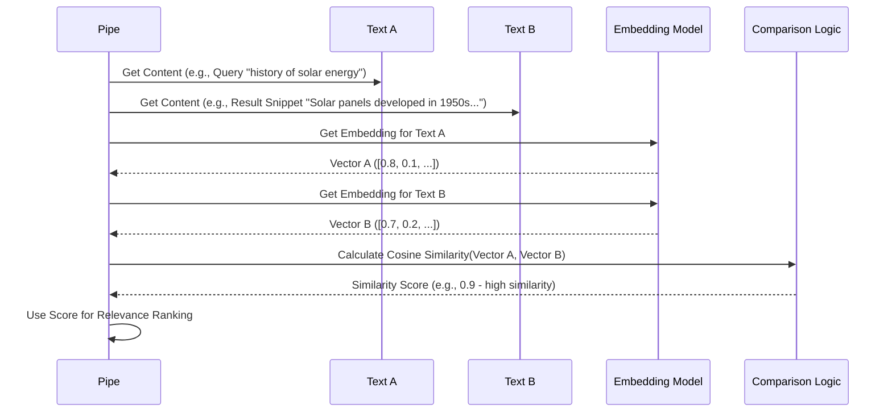

# Chapter 7: Semantic Embeddings

Welcome back to the Deep Research at Home tutorial! In the last chapter, [Chapter 6: Content Preprocessing](06_content_preprocessing.md), we learned how the Research Pipe cleans up and prepares the raw text fetched from the internet, making it ready for the AI to understand.

But even with clean text, how does the AI truly grasp the *meaning* of the words? How does it know that "car" and "automobile" are related, or that a document about "climate change impacts" is relevant to a query about "environmental science effects"? Reading words isn't enough; the AI needs a way to understand the concepts and relationships behind them.

This is where **Semantic Embeddings** come in.

## What are Semantic Embeddings?

Imagine you have a list of concepts, like "king," "queen," "man," and "woman." If you were to represent these concepts in a way that shows their relationships, you might notice:

*   "King" and "queen" are related by royalty.
*   "Man" and "woman" are related by gender.
*   The relationship between "king" and "man" is similar to the relationship between "queen" and "woman" (Gender difference within royalty).

Semantic embeddings are a technique that allows AI to represent words, sentences, paragraphs, or even whole documents as **numerical vectors** (lists of numbers). These vectors are created in a way that captures the *meaning* and *context* of the text.

Think of it like translating human language into a universal mathematical code. In this mathematical code, words or pieces of text with similar meanings will have vectors that are numerically "close" to each other in a high-dimensional space.

**Analogy:** Imagine words are like locations on a map. "Paris" and "France" are close, "Tokyo" and "Japan" are close, but "Paris" and "Japan" are far apart. With semantic embeddings, we create maps where words with similar meanings are close together, regardless of how they are spelled. "Happy" and "joyful" would be neighbors, while "happy" and "sad" would be far apart.

The magic is that relationships can also be captured. The vector for "king" might be `[0.6, -0.1, 0.9]` and "man" `[0.5, 0.0, -0.2]`. If you subtract the "man" vector from the "king" vector (`[0.1, -0.1, 1.1]`), you might get a vector representing "royalty + masculinity". If you then add the "woman" vector (`[0.5, 0.0, -0.2]`) to that difference, you might get `[0.6, -0.1, 0.9] + [0.5, 0.0, -0.2] - [0.5, 0.0, -0.2]` (corrected example: King - Man + Woman) = `[0.6, -0.1, 0.9] - [0.5, 0.0, -0.2] + [0.5, 0.0, -0.2]` = `[0.6, -0.1, 0.9]`. The vector arithmetic example is King - Man + Woman = Queen. If King = K, Man=M, Woman=W, Queen=Q, the math is K - M + W ≈ Q. The vector for "king - man + woman" should be numerically close to the vector for "queen".

This means the AI can perform mathematical operations on these vectors to understand analogies, find related concepts, and measure how similar two pieces of text are *semantically*, not just based on keyword matching.

## Key Concepts

1.  **Vectors:** A list of numbers (e.g., `[0.1, -0.5, 0.9, ...]`). The length of the list (the number of dimensions) depends on the specific embedding model used. Some models produce vectors with hundreds or even thousands of numbers.
2.  **Semantic Space:** The conceptual space where these vectors live. In this space, vectors that are close together represent text with similar meanings.
3.  **Embedding Models:** These are specialized AI models trained specifically to convert text into these semantic vectors. They have learned to map language onto this numerical space.
4.  **Similarity:** The most common way to measure how "close" two vectors are is using **Cosine Similarity**. This measures the cosine of the angle between the two vectors. A score close to 1 means they point in roughly the same direction (similar meaning), and a score close to -1 means they point in opposite directions (very different meaning).

## How Semantic Embeddings are Used in the Pipe

Semantic embeddings are fundamental to how Deep Research at Home understands and works with information. They are used in several key places throughout the [Iterative Research Cycles](04_iterative_research_cycles.md):

1.  **Comparing Query to Results:** When the Pipe gets search results ([Web Search & Content Fetching](05_web_search___content_fetching.md)), it needs to know which snippets or documents are most relevant to the user's original query or the current research topic. It does this by getting embeddings for the query/topic and the document content (after [Content Preprocessing](06_content_preprocessing.md)), and calculating their cosine similarity. Higher similarity means higher relevance.
2.  **Content Compression:** As mentioned in [Content Preprocessing](06_content_preprocessing.md), when a document is too long, the Pipe uses embeddings to find the chunks (sentences/paragraphs) that are most central to the document's main theme or most relevant to the query/topic. It keeps these key chunks and discards less relevant ones.
3.  **Ranking Research Topics:** In each research cycle, the Pipe needs to decide which remaining topics in the outline are most important to research next. It uses embeddings to understand how well topics align with the overall research direction (the "trajectory") and which topics are in areas that haven't been explored yet (the "gap"). This is a core part of [Semantic Guidance (Dimensions, PDV, Trajectory)](08_semantic_guidance__dimensions__pdv__trajectory.md).
4.  **Understanding User Preferences (PDV):** When you provide feedback on the outline by keeping or removing topics, the Pipe calculates a "Preference Direction Vector" (PDV). This vector represents *your* preferred direction in the semantic space. It's calculated using the embeddings of the topics you kept versus the topics you removed. This PDV is then used to influence future searches and topic prioritization.
5.  **Measuring Research Coverage:** The Pipe can use embeddings to identify the main "dimensions" or sub-areas within the research topic. It then tracks how much coverage it has found for each dimension, helping identify gaps.

Semantic embeddings provide the AI with a rich, conceptual understanding that goes far beyond simple keyword matching, enabling more intelligent and directed research.

## Visualizing Semantic Comparison

Here's a simplified view of how embeddings are used for comparing text:



In this flow, the `Pipe` takes two pieces of text, sends them to the `Embedding Model` to get their vector representations, and then uses simple `Comparison Logic` (like cosine similarity) to measure how related they are in meaning.

## Configuring the Embedding Model (Valves)

The choice of the Embedding Model is controlled by a [Configuration (Valves)](02_configuration__valves.md) setting:

```python
class Pipe:
    # ... other definitions ...
    class Valves(BaseModel):
        # ... other valves ...
        EMBEDDING_MODEL: str = Field(
            default="granite-embedding:30m",
            description="Model for semantic comparison of content",
        )
        # ... more valves ...
```

This `EMBEDDING_MODEL` valve tells the Pipe which specific model (available via your Ollama installation or other configured service) to use for generating embeddings. Different models can have different performance characteristics and vector sizes, affecting the quality and speed of the semantic comparisons.

Other valves, like `QUALITY_SIMILARITY_THRESHOLD` or the weights related to [Semantic Guidance (Dimensions, PDV, Trajectory)](08_semantic_guidance__dimensions__pdv__trajectory.md) (`SEMANTIC_TRANSFORMATION_STRENGTH`, `TRAJECTORY_MOMENTUM`, `GAP_EXPLORATION_WEIGHT`, etc.), influence *how* these calculated similarities and vectors are *used* in decision-making, but the core vector creation comes from the `EMBEDDING_MODEL`.

## Under the Hood: Embeddings in Code

The core function responsible for getting embeddings is `get_embedding`. It takes a string of text and returns a list of numbers (the vector). It also uses a cache to avoid asking the embedding model for the same text multiple times.

Here's a very simplified look at the `get_embedding` method:

```python
# pipe.py

class EmbeddingCache:
    # ... (cache logic) ...
    pass

class Pipe:
    # ... other definitions ...

    def __init__(self):
        # ... other initializations ...
        # Initialize the embedding cache
        self.embedding_cache = EmbeddingCache() 
        # ... other initializations ...

    async def get_embedding(self, text: str) -> Optional[List[float]]:
        """
        Get embedding for a text string using the configured embedding model with caching.
        Takes text (str).
        Returns a list of floats (the vector) or None on failure.
        """
        if not text or not text.strip():
            return None

        # Limit the text length sent to the embedding model for efficiency
        text = text[:2000] 

        # Check cache first
        cached_embedding = self.embedding_cache.get(text)
        if cached_embedding is not None:
            return cached_embedding # Return from cache if found

        # If not in cache, get from API (simplified)
        try:
            # This section calls your configured EMBEDDING_MODEL via API
            # It sends the text and gets the vector back.
            # Example (abstracted):
            # embedding = await self._call_embedding_api(self.valves.EMBEDDING_MODEL, text)

            # Ensure embedding is a list of floats
            if embedding and isinstance(embedding, list):
                # Cache the result before returning
                self.embedding_cache.set(text, embedding)
                return embedding

            return None # Return None if API call failed or returned invalid data
        except Exception as e:
            logger.error(f"Error getting embedding: {e}")
            return None # Return None on error

    # ... other methods ...
```

This snippet shows:

1.  The `EmbeddingCache` is used to store embeddings.
2.  The `get_embedding` method first checks if the embedding for the given text is already in the cache.
3.  If not, it calls an internal method (abstracted here for simplicity, but in the real code, it talks to the Ollama API or equivalent) to get the embedding from the `EMBEDDING_MODEL` specified in the valves.
4.  The fetched embedding is stored in the cache before being returned, so the next time the same text needs an embedding, it's retrieved quickly from memory.

Embeddings calculated by `get_embedding` are then used in various places. For example, in the `process_search_result` method (which we saw simplified in [Content Preprocessing](06_content_preprocessing.md)), after fetching and cleaning content, the code often gets its embedding and the query's embedding to calculate relevance:

```python
# pipe.py (Snippet from process_search_result)

async def process_search_result(...):
    # ... (fetching and cleaning content into `content`) ...

    # Get embedding for the processed content
    content_embedding = await self.get_embedding(content[:2000]) # Get embedding

    # Get the query embedding (usually already computed before calling this method)
    # Let's assume query_embedding was passed in or is available

    # Calculate similarity using the embeddings
    if content_embedding and query_embedding:
        # Cosine similarity calculation using numpy/scikit-learn
        similarity = cosine_similarity([content_embedding], [query_embedding])[0][0]
        result["similarity"] = similarity # Store the score with the result

    # ... (rest of processing, like compression based on similarity) ...

    pass # Returns the processed result dictionary with similarity score
```

This shows how the `get_embedding` function provides the numerical representation, and then standard mathematical libraries (like `cosine_similarity` from `sklearn.metrics.pairwise` in the real code) are used to perform calculations on these vectors to derive meaningful scores, like relevance.

## Conclusion

**Semantic Embeddings** are the numerical language the Deep Research at Home project uses to understand the meaning of text. By converting words and documents into vectors, the system can perform mathematical comparisons to measure relevance, identify core concepts, understand user preferences, and intelligently guide the research process. This goes far beyond simple keyword matching, allowing for a deeper, more nuanced understanding of the research topic.

Now that we understand how text is translated into this mathematical code, we can explore how these embeddings are used to actively steer the research process – identifying gaps, following user interests, and maintaining research direction. This is the topic of our next chapter, **Semantic Guidance (Dimensions, PDV, Trajectory)**.

[Chapter 8: Semantic Guidance (Dimensions, PDV, Trajectory)](08_semantic_guidance__dimensions__pdv__trajectory.md)

---

<sub><sup>Generated by [AI Codebase Knowledge Builder](https://github.com/The-Pocket/Tutorial-Codebase-Knowledge).</sup></sub> <sub><sup>**References**: [[1]](https://github.com/atineiatte/deep-research-at-home/blob/bd54417a0423fd4df886f22cf9195952ee72c3b5/pipe)</sup></sub>
````