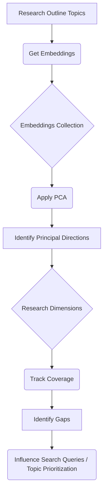
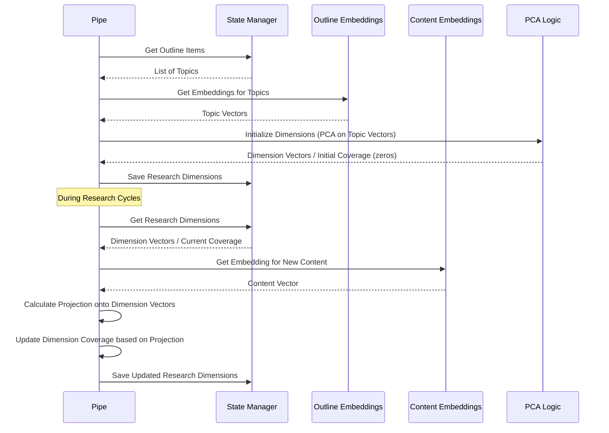
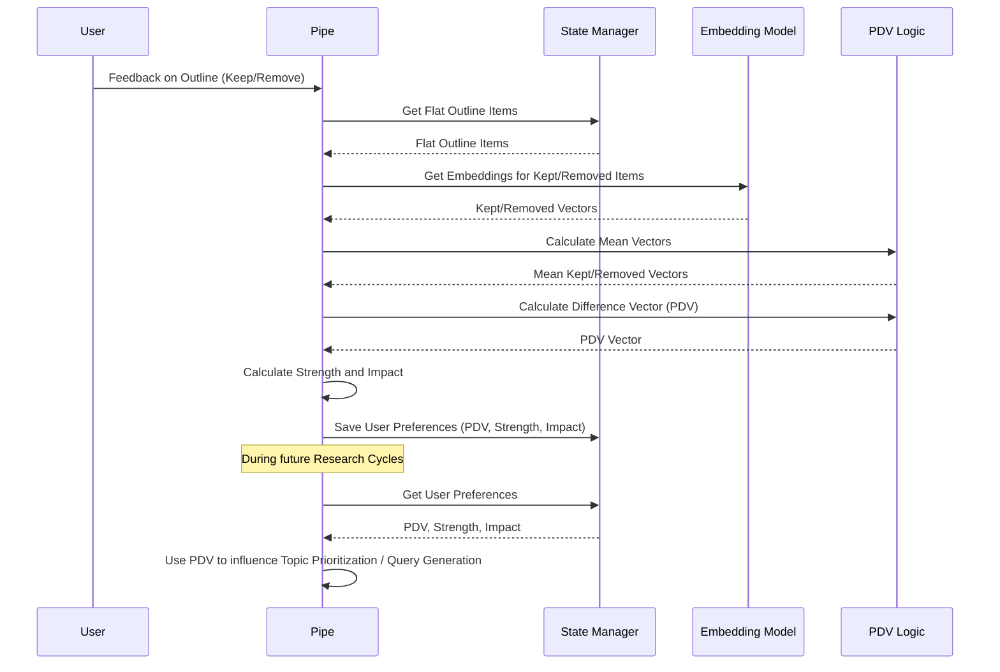
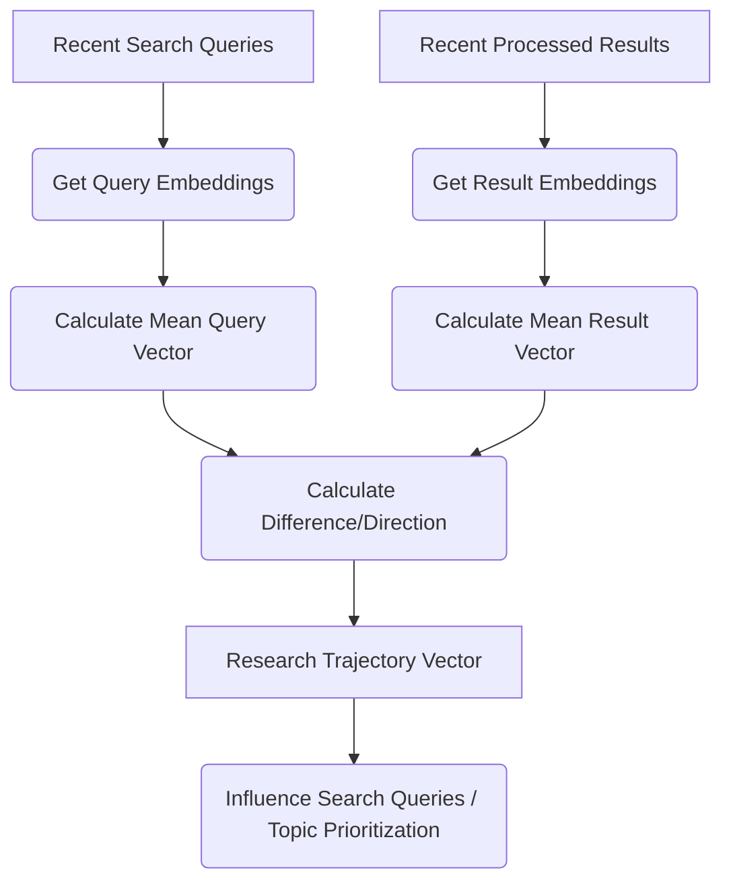
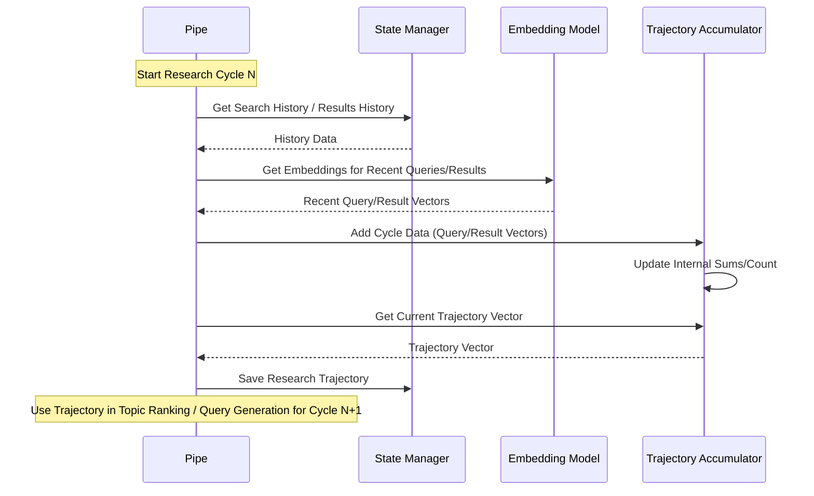

# Chapter 8: Semantic Guidance (Dimensions, PDV, Trajectory)

Welcome back to the Deep Research at Home tutorial! In the last chapter, [Semantic Embeddings](07_semantic_embeddings.md), we unlocked the AI's ability to understand the *meaning* of text by turning words and documents into numerical vectors. This is a powerful tool, but knowing the meaning of individual pieces of information isn't enough for deep research. The AI also needs to understand the *overall landscape* of the research topic and decide *where to explore next*.

Think of a human researcher exploring a vast library on a complex subject. They don't just grab random books that mention a keyword. They try to understand:

1.  What are the main branches or sub-fields of this subject? (Like looking at the section names in the library).
2.  Which specific areas are *they* most interested in or find most promising? (Their personal research focus).
3.  What ground have they already covered? (The books they've already read and the notes they've taken).

They use this understanding to decide which sections to visit next, which books to pull off the shelves, and what specific questions to ask.

This is the role of **Semantic Guidance** in the Deep Research at Home project. It uses the power of [Semantic Embeddings](07_semantic_embeddings.md) to create a conceptual "map" of the research topic and plot a course through it, ensuring the research is comprehensive and aligned with your interests.

## What is Semantic Guidance?

Semantic Guidance is the system that steers the research process based on the meaning of the information. It's the Research Pipe's internal compass, map, and navigation system. It helps the Pipe decide *what to search for next* in the [Iterative Research Cycles](04_iterative_research_cycles.md) and *which topics to prioritize*.

It does this by tracking three key things, all based on [Semantic Embeddings](07_semantic_embeddings.md):

1.  **Research Dimensions:** Understanding the major conceptual axes or sub-areas that make up the overall research topic. Like identifying the main sections of that library.
2.  **Preference Direction Vector (PDV):** Learning your personal interests and focus based on the feedback you provide on the research outline. Like drawing a line on the map towards the specific area *you* want to explore.
3.  **Research Trajectory:** Keeping track of the conceptual path the research has already taken based on the results gathered in previous cycles. Like leaving breadcrumbs or highlighting the route on your map.

By combining information from these three sources, Semantic Guidance helps the Pipe intelligently explore the topic space.

## 1. Research Dimensions (The Map Axes)

When you start a research project, especially a broad one, it often branches out into several key areas. For example, researching "renewable energy" might involve dimensions like:

*   Solar Technology
*   Wind Power
*   Geothermal Energy
*   Energy Policy
*   Environmental Impacts
*   Economic Viability

Research Dimensions are the system's attempt to automatically identify these major conceptual branches based on the initial research outline topics you provided (or that the AI generated).

How does it figure these out? It uses the embeddings of your outline topics and a mathematical technique called **Principal Component Analysis (PCA)**.

**Analogy:** Imagine you have a cloud of data points scattered in a 3D space. PCA finds the main directions (axes) along which this data is most spread out. These axes represent the core dimensions or variances in your data. In our case, the data points are the *embeddings* of your outline topics. PCA finds the main directions in the semantic space where your research topics lie.

These directions become the "dimensions" of your research topic's conceptual space. The system then tracks how much information it has gathered that aligns with each of these dimensions.

<br>


*Diagram: How Research Dimensions are identified and used.*

<br>

The `initialize_research_dimensions` method in the code is responsible for taking the embeddings of the initial outline topics and performing PCA to find these dimensions.

<br>

```python
# pipe.py (Simplified)

async def initialize_research_dimensions(
    self, outline_items: List[str], user_query: str
):
    """Initialize the semantic dimensions for tracking research progress"""
    try:
        # Get embeddings for each outline item sequentially
        item_embeddings = []
        for item in outline_items:
            embedding = await self.get_embedding(item[:2000]) # Use get_embedding from Chapter 7
            if embedding:
                item_embeddings.append(embedding)

        # Ensure we have enough embeddings for PCA
        if len(item_embeddings) < 3:
            logger.warning("Not enough embeddings for research dimensions")
            self.update_state("research_dimensions", None)
            return

        # Apply PCA to reduce to key dimensions
        pca = PCA(n_components=min(10, len(item_embeddings))) # Limit to max 10 dimensions
        embedding_array = np.array(item_embeddings)
        pca.fit(embedding_array)

        # Store the PCA results (eigenvectors are the dimension directions) and initialize coverage
        research_dimensions = {
            "eigenvectors": pca.components_.tolist(), # Directions of dimensions
            "eigenvalues": pca.explained_variance_.tolist(), # Importance of dimensions
            "explained_variance": pca.explained_variance_ratio_.tolist(),
            "dimensions": pca.n_components_,
            "coverage": np.zeros(pca.n_components_).tolist(),  # Coverage starts at 0
        }

        self.update_state("research_dimensions", research_dimensions) # Store in state
        logger.info(f"Initialized research dimensions with {pca.n_components_} dimensions")
    except Exception as e:
        logger.error(f"Error initializing research dimensions: {e}")
        self.update_state("research_dimensions", None)

```
*Code: Simplified `initialize_research_dimensions` showing PCA calculation on outline item embeddings.*

<br>

As the research progresses and new search results are processed, the `update_dimension_coverage` method calculates how much each new piece of content contributes to the understanding of these dimensions. Content strongly aligned with a dimension vector increases that dimension's coverage score.

<br>

```python
# pipe.py (Simplified)

async def update_dimension_coverage(
    self, content: str, quality_factor: float = 1.0
):
    """Update the coverage of research dimensions based on new content"""
    state = self.get_state()
    research_dimensions = state.get("research_dimensions")
    if not research_dimensions:
        return

    try:
        # Get embedding for the content
        content_embedding = await self.get_embedding(content[:2000])
        if not content_embedding:
            return

        # Get current coverage and dimension vectors (eigenvectors)
        current_coverage = research_dimensions.get("coverage", [])
        eigenvectors = research_dimensions.get("eigenvectors", [])

        if not current_coverage or not eigenvectors:
            return

        # Convert to numpy for calculations
        coverage_array = np.array(current_coverage)
        eigenvectors_array = np.array(eigenvectors)

        # Calculate projection of content embedding onto each dimension vector
        projection = np.dot(np.array(content_embedding), eigenvectors_array.T)

        # Contribution is based on the magnitude of projection along each dimension, scaled by quality
        contribution = np.abs(projection) * quality_factor

        # Update coverage (non-linear increase to reflect diminishing returns)
        for i in range(min(len(contribution), len(coverage_array))):
            # Add contribution, but less effect as coverage increases
            current_value = coverage_array[i]
            new_contribution = contribution[i] * (1 - current_value / 2) # (1 - coverage / 2) means less contribution when coverage is high
            coverage_array[i] += new_contribution

        # Update the coverage in the research_dimensions state
        research_dimensions["coverage"] = coverage_array.tolist()
        self.update_state("research_dimensions", research_dimensions) # Save to state

        logger.debug(f"Updated dimension coverage: {[round(c * 100) for c in coverage_array.tolist()]}%")

    except Exception as e:
        logger.error(f"Error updating dimension coverage: {e}")
```
*Code: Simplified `update_dimension_coverage` showing how content embeddings update dimension coverage using projection onto eigenvectors.*

<br>

The system can then identify "gaps" – dimensions with low coverage – and prioritize searching for topics that fall within those areas, ensuring the research covers all major aspects of the topic.

<br>


*Diagram: Research Dimensions initialization and coverage updates.*

## 2. Preference Direction Vector (PDV) (The Personal Compass)

Deep Research at Home is designed to be *your* research assistant. When you interact with the research outline, perhaps removing topics you aren't interested in or adding notes, you are providing valuable feedback about your research goals and preferences.

The system captures this feedback and translates it into a **Preference Direction Vector (PDV)**. This vector points in the semantic "direction" of the topics you chose to *keep* relative to the topics you chose to *remove*.

**Analogy:** Imagine the semantic space as a huge city map where every building is a concept. If you tell the system you like "parks" and "museums" but dislike "factories" and "highways," the PDV would be a vector pointing towards the greener, cultural parts of the city, away from the industrial/transit areas.

The PDV helps the system understand what kind of information or topics you are more likely to find relevant or interesting *throughout* the research process, not just in your initial query.

<br>

```mermaid
graph TD
    A[User Feedback (Keep/Remove Topics)] --> B(Identify Kept Topics)
    A --> C(Identify Removed Topics)
    B --> D(Get Kept Topic Embeddings)
    C --> E(Get Removed Topic Embeddings)
    D --> F(Calculate Mean Kept Vector)
    E --> G(Calculate Mean Removed Vector)
    F --> H(Subtract Vectors)
    G --> H(Subtract Vectors)
    H --> I[Preference Direction Vector (PDV)]
    I --> J(Influence Search Queries / Topic Prioritization)
```
*Diagram: How the Preference Direction Vector (PDV) is calculated and used.*

<br>

The `calculate_preference_direction_vector` method is where this happens, typically after you've provided feedback on the initial research outline.

<br>

```python
# pipe.py (Simplified)

async def calculate_preference_direction_vector(
    self, kept_items: List[str], removed_items: List[str], all_topics: List[str]
) -> Dict:
    """Calculate the Preference Direction Vector based on kept and removed items"""
    if not kept_items or not removed_items:
        return {"pdv": None, "strength": 0.0, "impact": 0.0}

    # Get embeddings for kept and removed items sequentially
    kept_embeddings = []
    for item in kept_items:
        embedding = await self.get_embedding(item) # Get embedding
        if embedding:
            kept_embeddings.append(embedding)

    removed_embeddings = []
    for item in removed_items:
        embedding = await self.get_embedding(item) # Get embedding
        if embedding:
            removed_embeddings.append(embedding)

    if not kept_embeddings or not removed_embeddings:
        return {"pdv": None, "strength": 0.0, "impact": 0.0}

    try:
        # Calculate mean vectors for kept and removed embeddings
        kept_mean = np.mean(kept_embeddings, axis=0)
        removed_mean = np.mean(removed_embeddings, axis=0)

        # Calculate the preference direction vector (difference between means)
        pdv = kept_mean - removed_mean

        # Normalize the vector to a unit vector (direction matters more than magnitude here)
        pdv_norm = np.linalg.norm(pdv)
        if pdv_norm < 1e-10: # Avoid division by zero
            return {"pdv": None, "strength": 0.0, "impact": 0.0}

        pdv = pdv / pdv_norm

        # Calculate preference strength (distance between centroids) - indicates how distinct preferences were
        strength = np.linalg.norm(kept_mean - removed_mean)

        # Calculate impact (based on how many items were removed)
        total_items = len(all_topics)
        impact = len(removed_items) / total_items if total_items > 0 else 0.0

        return {"pdv": pdv.tolist(), "strength": float(strength), "impact": impact}
    except Exception as e:
        logger.error(f"Error calculating PDV: {e}")
        return {"pdv": None, "strength": 0.0, "impact": 0.0}
```
*Code: Simplified `calculate_preference_direction_vector` using mean vectors and subtraction.*

<br>

The PDV, along with a measure of the "strength" and "impact" of your preferences, is stored in the [Research State Management](03_research_state_management.md) and can be used in subsequent research cycles to influence topic prioritization and query generation, nudging the research towards areas you are more likely to be interested in.

<br>


*Diagram: PDV calculation and usage based on user feedback.*

## 3. Research Trajectory (The Breadcrumbs)

As the Research Pipe completes each [Iterative Research Cycle](04_iterative_research_cycles.md), it gathers new information. The collection of search queries used and the content processed represents the conceptual "ground" that the research has covered. The **Research Trajectory** is a vector that represents the overall semantic direction the research has moved towards across previous cycles.

**Analogy:** If you've been walking northeast on your map, leaving breadcrumbs, the trajectory vector points northeast. It shows the general path taken.

Tracking the trajectory helps the system understand where the research has been focusing. This is useful because the system might want to:

*   Continue exploring in a similar direction if it's proving fruitful.
*   Consciously move away from that direction if it seems stuck or needs to explore other areas (especially if there's a strong PDV or unexplored dimensions).

The trajectory is typically calculated by looking at the embeddings of the search queries and the embeddings of the processed results from recent cycles and finding the average direction.

<br>


*Diagram: How the Research Trajectory is calculated and used.*

<br>

The `calculate_research_trajectory` method updates this trajectory based on the most recent research activity.

<br>

```python
# pipe.py (Simplified)

async def calculate_research_trajectory(self, previous_queries, successful_results):
    """Calculate the research trajectory based on successful searches from recent cycles only"""
    if not previous_queries or not successful_results:
        return None

    # Get trajectory accumulator (stored in state)
    if self.trajectory_accumulator is None:
        # Initialize with a dummy dimension if needed, will be updated on first data
        self.trajectory_accumulator = TrajectoryAccumulator(embedding_dim=384)

    try:
        # Limit to a fixed number of recent queries/results for efficiency and focus
        max_items = 10 
        recent_queries = previous_queries[-max_items:]
        recent_results = successful_results[-max_items:]

        # Get embeddings for recent queries sequentially
        query_embeddings = []
        for query in recent_queries:
            embedding = await self.get_embedding(query)
            if embedding:
                query_embeddings.append(embedding)

        # Get embeddings for recent results sequentially
        result_embeddings = []
        for result in recent_results:
            content = result.get("content", "")[:2000] # Limit content length
            if not content:
                continue
            embedding = await self.get_embedding(content)
            if embedding:
                result_embeddings.append(embedding)

        if not query_embeddings or not result_embeddings:
            return None

        # Update trajectory accumulator with new cycle data (uses internal averaging)
        self.trajectory_accumulator.add_cycle_data(query_embeddings, result_embeddings)

        # Get the current accumulated trajectory
        trajectory = self.trajectory_accumulator.get_trajectory()

        # Store trajectory in state
        self.update_state("research_trajectory", trajectory)

        logger.info(f"Calculated research trajectory")

        return trajectory

    except Exception as e:
        logger.error(f"Error calculating research trajectory: {e}")
        return None
```
*Code: Simplified `calculate_research_trajectory` using a `TrajectoryAccumulator` (details of accumulator logic abstracted).*

<br>

The `TrajectoryAccumulator` class itself is a helper that keeps a running average of the difference between query embeddings and result embeddings across cycles.

<br>


*Diagram: Research Trajectory calculation during iterative cycles.*

## Putting it Together: Semantic Guidance in Action

During each [Iterative Research Cycle](04_iterative_research_cycles.md), after results are processed and analyzed, Semantic Guidance plays a crucial role in planning the *next* cycle.

The `rank_topics_by_research_priority` method is where the dimensions, PDV, and trajectory all come together. It scores each remaining active outline topic based on how well it aligns with:

*   **The Research Trajectory:** Is this topic in a direction the research has successfully explored? (Controlled by `TRAJECTORY_MOMENTUM` Valve)
*   **The Preference Direction Vector (PDV):** Is this topic in a direction the user is interested in? (Controlled by `SEMANTIC_TRANSFORMATION_STRENGTH` and user preference `impact` Valve/Value)
*   **The Gap Vector:** Is this topic related to a dimension that still has low coverage? (Controlled by `GAP_EXPLORATION_WEIGHT` Valve)
*   **Novelty/Relevance:** How distinct is this topic from concepts already covered, and how relevant is it to the gathered results?

<br>

```mermaid
graph TD
    A[Active Topics] --> B(Get Topic Embeddings)
    C{Research Trajectory} --> D{Calculate Alignment with Trajectory}
    E{Preference Direction Vector (PDV)} --> F{Calculate Alignment with PDV}
    G{Research Dimensions / Coverage} --> H{Calculate Gap Vector}
    H --> I{Calculate Alignment with Gap Vector}
    J{Previous Results / Completed Topics} --> K{Calculate Novelty / Information Need}
    B --> D
    B --> F
    B --> I
    B --> K
    D --> L(Combine Scores)
    F --> L
    I --> L
    K --> L
    L --> M{Apply Dampening based on Usage}
    M --> N[Ranked Topics]
    N --> O(Generate Targeted Queries for Top Topics)
```
*Diagram: How Semantic Guidance factors influence Topic Ranking.*

<br>

The combined score, potentially dampened if the topic has been searched many times without useful results, determines which topics are prioritized for the next search queries. This ensures the research is not random but directed towards fulfilling the outline, exploring gaps, and following your expressed interests.

Several [Configuration (Valves)](02_configuration__valves.md) allow you to tune how much influence each of these factors has:

*   `SEMANTIC_TRANSFORMATION_STRENGTH`: How strongly semantic transformations (like shifting queries towards the PDV) affect query embeddings before search.
*   `TRAJECTORY_MOMENTUM`: How much weight is given to continuing the previous research direction when prioritizing topics.
*   `GAP_EXPLORATION_WEIGHT`: How much weight is given to exploring dimensions with low coverage when prioritizing topics.
*   `USER_PREFERENCE_THROUGHOUT`: A boolean to enable/disable using the PDV beyond the initial outline adjustment.
*   `LOCAL_INFLUENCE_RADIUS`: While technically in preprocessing, this affects how embeddings are calculated for compression, indirectly influencing the vectors used in guidance.

By adjusting these valves, you can make the research process lean more towards exploring new areas, following your preferences closely, or sticking to the path already taken.

## Conclusion

**Semantic Guidance** is the intelligent navigation system that makes Deep Research at Home truly *deep* and *directed*. By using [Semantic Embeddings](07_semantic_embeddings.md) to understand the conceptual landscape of the research topic through **Research Dimensions**, learning your **Preference Direction Vector (PDV)** from your feedback, and tracking the **Research Trajectory**, the system can make informed decisions about what to research next. This ensures the iterative research cycles efficiently explore relevant areas, cover different aspects of the subject, and align with your personal interests, much like a skilled researcher navigating a complex library with a map, compass, and memory of where they've been.

With information gathered and guided, the next crucial step is to take all these pieces and weave them into a coherent report. This is the process of **Synthesis & Report Generation**, which we will cover in the next chapter.

[Chapter 9: Synthesis & Report Generation](09_synthesis___report_generation.md)

---

<sub><sup>Generated by [AI Codebase Knowledge Builder](https://github.com/The-Pocket/Tutorial-Codebase-Knowledge).</sup></sub> <sub><sup>**References**: [[1]](https://github.com/atineiatte/deep-research-at-home/blob/bd54417a0423fd4df886f22cf9195952ee72c3b5/pipe)</sup></sub>
````