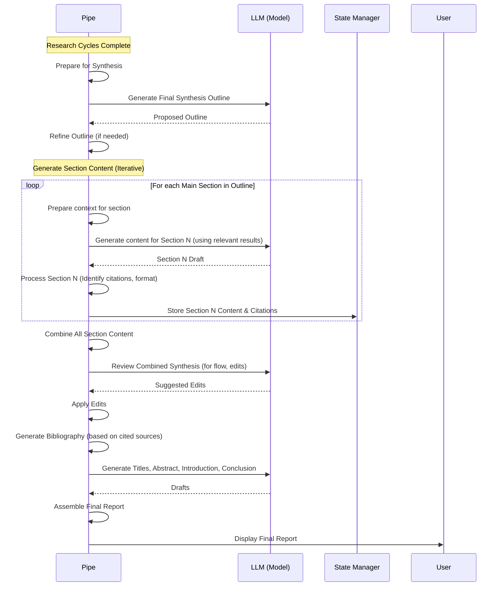

# Chapter 9: Synthesis & Report Generation

Welcome back to the Deep Research at Home tutorial! In the previous chapters, we journeyed through the Research Pipe's engine room. We saw how it manages its [Research State Management](03_research_state_management.md), goes through [Iterative Research Cycles](04_iterative_research_cycles.md), pulls information from the web using [Web Search & Content Fetching](05_web_search___content_fetching.md), cleans it up with [Content Preprocessing](06_content_preprocessing.md), understands its meaning using [Semantic Embeddings](07_semantic_embeddings.md), and intelligently directs the research using [Semantic Guidance (Dimensions, PDV, Trajectory)](08_semantic_guidance__dimensions__pdv__trajectory.md).

After all that digging, collecting, and understanding, you have a massive pile of processed information, potentially covering various sub-topics and dimensions of your query. What's next? You need to write the final report!

Imagine you've just finished weeks of research for a major project. Your desk is covered in notes, printed articles, highlighted PDFs, and half-finished outlines. The most challenging part might still be ahead: taking all those pieces and weaving them into a single, coherent, well-written, and comprehensive report. You need to structure it logically, write clear paragraphs for each section, ensure smooth transitions, add an introduction and conclusion, and create a bibliography.

This is precisely the challenge that the **Synthesis & Report Generation** stage of the Deep Research at Home project solves. It acts as the project's internal writer and editor, taking the raw materials from the research cycles and assembling them into the polished final output you receive.

## What is Synthesis & Report Generation?

**Synthesis** is the process of combining disparate pieces of information into a new, coherent whole. In the context of this project, it means taking all the processed content from numerous search results gathered across multiple research cycles and consolidating the relevant parts into flowing prose.

**Report Generation** is the task of structuring that synthesized information into a standard report format. This involves:

*   Creating the main body, often broken down into sections and subsections based on a final outline.
*   Ensuring that the information within each section is accurate according to the sources and properly cited.
*   Adding introductory material (title, abstract, introduction) that sets the stage.
*   Adding concluding material (conclusion, bibliography) that summarizes findings and lists sources.
*   Reviewing and editing the combined text for flow, consistency, and readability.

This abstraction layer orchestrates the final writing and editing process, turning a large collection of research notes into a finished document.

## How it Works: The Flow

Once the main [Iterative Research Cycles](04_iterative_research_cycles.md) have completed (either by covering most topics or hitting the maximum cycle limit), the Pipe transitions into the synthesis phase.

Here is a simplified look at the main steps involved after the research cycles are done:



In this diagram:

1.  The **Pipe** signals the end of the iterative research phase.
2.  It asks the **LLM** to generate a refined outline specifically for the final report structure, based on the original outline and what was learned.
3.  It then loops through this final outline, asking the **LLM** to write the content for each major section and its subsections, using only the relevant information gathered from the [Research State Management](03_research_state_management.md).
4.  As it generates sections, it identifies where the LLM used information from specific sources, potentially using temporary markers or local IDs for citations.
5.  After all sections are drafted and combined, the **Pipe** might send the full draft back to the **LLM** for a final review and suggested edits to improve flow and consistency.
6.  The **Pipe** collects all unique sources cited across all sections and uses the information stored in the [Research State Management](03_research_state_management.md)'s master source table to build a bibliography.
7.  Finally, it asks the **LLM** to generate the front matter (titles, abstract, introduction) and back matter (conclusion), and then stitches everything together into the final, comprehensive report presented to the **User**.

This process leverages the power of the LLM for creative writing and editing tasks while the Pipe manages the structure, source attribution, and overall orchestration.

## Under the Hood: Code Snippets

Let's look at some simplified glimpses into the `pipe.py` code that handles these steps.

### Generating the Synthesis Outline

The final structure of the report is based on a refined outline, generated by the LLM itself, considering the original query and the actual research results.

```python
# pipe.py (Simplified)

async def generate_synthesis_outline(...):
    """Generate a refined research outline for synthesis"""

    # Prompt the LLM to create a final outline
    synthesis_outline_prompt = {
        "role": "system",
        "content": """You are an academic scholar reorganizing a research outline...
        Create a refined outline that condenses key topics/subtopics...
        Focus on addressing the original query in areas best supported by the research...
        Include relevant new topics discovered...
        Format as JSON {"outline": [...]}""",
    }

    # Build context including the original outline and a summary of results
    outline_context = "### Original Research Outline:\n..." # Details omitted for brevity
    outline_context += "\n### Research Results Summary:\n..." # Details omitted for brevity

    messages = [ synthesis_outline_prompt, {"role": "user", "content": outline_context} ]

    # Call the LLM to generate the outline
    response = await self.generate_completion(
        self.get_synthesis_model(), # Use synthesis model
        messages,
        temperature=self.valves.SYNTHESIS_TEMPERATURE # Use synthesis temperature valve
    )

    # ... (Parsing the JSON response) ...
    synthesis_outline = [] # Placeholder for extracted outline
    return synthesis_outline # Returns a list of dicts [{"topic": "...", "subtopics": [...]}, ...]

```
*This snippet shows the core idea: a system prompt guides the LLM to act as a scholar refining the outline, and the user message provides the necessary context (original outline, results). The model's response is expected in a specific JSON format which the code then parses.*

### Generating Section Content with Citations

This is a crucial step where the bulk of the report's body is written. The Pipe iterates through the `synthesis_outline`, and for each main topic, it gathers the most relevant search results related to that section/subtopics and asks the LLM to write the content, ensuring citations are included.

```python
# pipe.py (Simplified)

async def generate_section_content_with_citations(...):
    """Generate content for a section by combining subtopics with citations"""

    # ... (Status update) ...

    # Generate content for each subtopic independently (iterative process)
    subtopic_contents = {}
    section_sources = {} # Track sources used in this section
    all_section_citations = [] # Track all citations in this section

    for subtopic in subtopics: # Loop through subtopics in this section
        # Find most relevant results for THIS subtopic
        relevant_results = await self.find_relevant_results(subtopic, research_results) # Simplified

        # Prompt the LLM to write content for the subtopic using ONLY relevant sources
        subtopic_prompt = {
            "role": "system",
            "content": f"""You are a research assistant writing a subsection about "{subtopic}"...
            Use FULL use of the provided research sources, and ONLY the provided sources.
            Include IN-TEXT CITATIONS for all information, using ONLY the numerical IDs...""",
        }

        # Build context including relevant sources and their content, plus the subtopic prompt
        subtopic_context = f"# Subtopic to Write: {subtopic}\n"
        subtopic_context += "## Available Source List (Use ONLY these numerical citations):\n...\n" # Source IDs and URLs
        subtopic_context += "## Research Results:\n...\n" # Content of relevant results

        messages = [ subtopic_prompt, {"role": "user", "content": subtopic_context} ]

        # Call the LLM to generate subtopic content
        response = await self.generate_completion(
            synthesis_model, messages, temperature=... # Use synthesis temperature
        )

        if response and "choices" in response:
            subtopic_content = response["choices"][0]["message"]["content"]

            # Process content to identify local citations (e.g. [1], [2])
            # ... (Code to extract citations and map to source URLs) ...

            subtopic_contents[subtopic] = subtopic_content
            # Store sources used and citations found for this subtopic
            # ... (Update section_sources, all_section_citations) ...

    # Combine subtopic contents into a single section draft
    combined_content = ""
    for subtopic, content in subtopic_contents.items():
         combined_content += f"\n\n### {subtopic}\n\n{content}\n\n"

    # Review and smooth transitions between subtopics
    if len(subtopics) > 1:
        section_content = await self.smooth_section_transitions(
             section_title, subtopics, combined_content, original_query, synthesis_model
        )
    else:
        section_content = combined_content

    # Replace local citation IDs with global bibliography IDs and apply verification flags
    # ... (Code to re-number citations and apply strikethrough for unverified claims) ...

    # Store content in state manager
    # ... (Update section_synthesized_content, section_sources_map, section_citations) ...

    return {"content": section_content, "tokens": ..., "sources": ..., "citations": ...}

```
*This snippet shows that section generation is an iterative process over subtopics. For each subtopic, the LLM is given relevant source content and instructed to write based on that content and use numerical citations. The code then processes the LLM's output to identify these citations and prepare them for the final bibliography and verification steps.*

### Smoothing Section Transitions

Once individual sections are drafted, they might sound disjointed. The Pipe uses the LLM again to act as an editor and improve the flow.

```python
# pipe.py (Simplified)

async def smooth_section_transitions(...):
    """Review and smooth transitions between subtopics in a section"""

    smoothing_prompt = {
        "role": "system",
        "content": """You are a research editor reviewing a section combining subtopics...
        Ensure smooth transitions, consistent style, and proper Markdown...
        Maintain the exact factual content in sentences with numerical citations...
        DO NOT remove or edit ANY in-text citations or applied strikethrough...""",
    }

    smoothing_context = f"# Section to Improve: '{section_title}'\n\n"
    smoothing_context += f"## Combined Section Content:\n\n{combined_content}\n\n"
    smoothing_context += "Please improve this section..."

    messages = [ smoothing_prompt, {"role": "user", "content": smoothing_context} ]

    # Call the LLM for editing
    response = await self.generate_completion(
        synthesis_model, messages, temperature=... # Lower temperature for editing
    )

    if response and "choices" in response:
         improved_content = response["choices"][0]["message"]["content"]
         return improved_content
    return combined_content # Fallback to original

```
*This snippet shows how a prompt instructs the LLM to act as an editor, focusing specifically on improving transitions and consistency while strictly preserving cited content and citations. The combined section content is provided as context.*

### Final Touches: Titles, Abstract, Introduction, Conclusion

Before presenting the final report, the Pipe generates the standard academic report components.

```python
# pipe.py (Simplified)

async def generate_titles(...):
    """Generate a main title and subtitle"""
    titles_prompt = {
        "role": "system",
        "content": """You are a research writer creating compelling titles...
        Create a main title and subtitle... Format as JSON {"main_title": "...", "subtitle": "..."},""",
    }
    titles_context = f"Original Query: {user_message}\n\nReport Content Summary: ..." # Summarized report content
    ... # Call LLM, parse JSON

async def generate_abstract(...):
    """Generate an abstract"""
    abstract_prompt = {
        "role": "system",
        "content": """You are a research assistant writing an abstract...
        Create a concise academic abstract (150-250 words)...""",
    }
    abstract_context = f"Research Query: {user_message}\n\nReport Full Content: ..." # Full report content
    ... # Call LLM

async def generate_introduction(...):
    """Generate an introduction"""
    intro_prompt = {
        "role": "system",
        "content": """You are a research assistant writing an introduction...
        Create a concise introduction (2-3 paragraphs)... Introduce the research objective...""",
    }
    intro_context = f"Research Query: {user_message}\n\nResearch Outline:...\n\nSection Content Summary:..." # Outline and summarized content
    ... # Call LLM

async def generate_conclusion(...):
    """Generate a conclusion"""
    concl_prompt = {
        "role": "system",
        "content": """You are a research assistant writing a comprehensive conclusion...
        Create a concise conclusion (2-4 paragraphs)... Synthesize key findings...""",
    }
    concl_context = f"Research Query: {user_message}\n\nKey findings from each section:..." # Summarized findings
    ... # Call LLM

async def generate_bibliography(...):
     """Generate a bibliography based on actual citations used"""
     # This function collects all sources that were actually cited in the generated text
     # It uses the master_source_table and global_citation_map from state manager
     # It returns a formatted list of sources.
     pass # Detailed implementation in Chapter 10
```
*These snippets illustrate that the LLM is prompted specifically for each component (titles, abstract, intro, conclusion) with the relevant context from the research results and outline.*

The `pipe` method orchestrates all these steps sequentially after the research cycles finish, building the final `comprehensive_answer` string piece by piece before presenting it to the user.

## Valves Affecting Synthesis

Several [Configuration (Valves)](02_configuration__valves.md) influence the Synthesis & Report Generation process:

| Valve Name                  | Type    | Default Example | What it Controls                                                        | Analogy                        |
| :-------------------------- | :------ | :-------------- | :---------------------------------------------------------------------- | :----------------------------- |
| `SYNTHESIS_MODEL`           | String  | `"gemma3:27b"`  | The specific language model used for generating sections, titles, abstract, conclusion, and reviewing. | The specific writer/editor you hire |
| `RESEARCH_MODEL`            | String  | `"gemma3:12b"`  | Used for tasks if `SYNTHESIS_MODEL` is not set or is the same.          | The default staff writer       |
| `SYNTHESIS_TEMPERATURE`     | Float   | `0.6`           | Controls the creativity/focus of the synthesis model during writing.    | The writer's level of formality/creativity |
| `TEMPERATURE`               | Float   | `0.7`           | Used for some synthesis steps if `SYNTHESIS_TEMPERATURE` isn't specific enough, or as a base. | General model creativity       |
| `MAX_RESULT_TOKENS`         | Integer | `4000`          | Limits the token length of *processed research results* used as context for synthesis. | The max size of a note card given to the writer |
| `COMPRESSION_SETPOINT`      | Integer | `4000`          | Threshold at which result content is compressed before synthesis.     | When to start summarizing notes |
| `STEPPED_SYNTHESIS_COMPRESSION`| Boolean | `True`       | Whether to compress older research results more aggressively before synthesis. | Re-summarize older notes harder |
| `VERIFY_CITATIONS`          | Boolean | `True`          | Whether the Pipe attempts to verify facts against sources and flags unverified claims in the final report. | Turn on/off the fact-checker    |

These valves allow you to tune which model is used for the demanding writing tasks, control its writing style (via temperature), and manage the amount of source material provided to the model during synthesis.

## Conclusion

**Synthesis & Report Generation** is the culminating stage of the Deep Research at Home project. It takes all the intelligence gathered and guided throughout the iterative research cycles and transforms it into a structured, comprehensive, and polished report. By orchestrating the LLM to generate content section by section, incorporate citations, apply edits, and add standard report components like titles, abstracts, and conclusions, the system automates the often-laborious process of writing from research notes.

A critical part of generating a reliable report is ensuring that the information presented is accurately attributed to its sources. The next chapter will delve deeper into this crucial aspect: **Citation Management & Verification**.

[Chapter 10: Citation Management & Verification](10_citation_management___verification.md)

---

<sub><sup>Generated by [AI Codebase Knowledge Builder](https://github.com/The-Pocket/Tutorial-Codebase-Knowledge).</sup></sub> <sub><sup>**References**: [[1]](https://github.com/atineiatte/deep-research-at-home/blob/bd54417a0423fd4df886f22cf9195952ee72c3b5/README.md), [[2]](https://github.com/atineiatte/deep-research-at-home/blob/bd54417a0423fd4df886f22cf9195952ee72c3b5/pipe)</sup></sub>
````