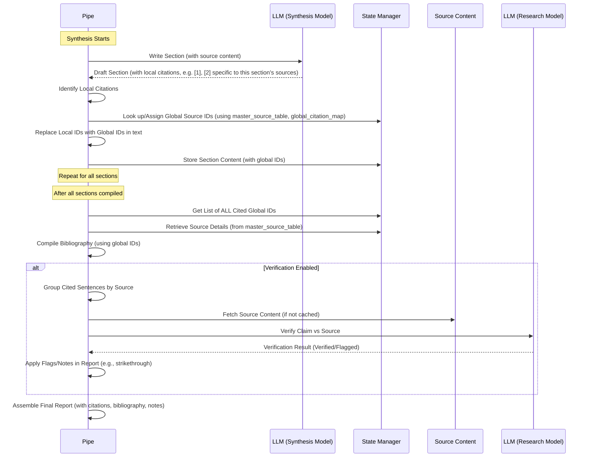

# Chapter 10: Citation Management & Verification

Welcome back to the Deep Research at Home tutorial! In the previous chapter, [Synthesis & Report Generation](09_synthesis___report_generation.md), we saw how the Research Pipe takes all the information gathered and intelligently combines it into a structured, comprehensive report.

But imagine reading a research paper that makes lots of claims without saying *where* the information came from. You wouldn't trust it, right? In academic work, giving credit to your sources and showing readers where you found information is essential. It's called **academic integrity**.

This is the job of the **Citation Management & Verification** system in the Deep Research at Home project. It ensures that the report gives proper credit to the original sources and, optionally, checks if the cited information is actually present in those sources.

Think of this system as the project's very **meticulous librarian** (keeping track of sources) and **careful fact-checker** (making sure claims match sources).

## What is Citation Management & Verification?

This system is crucial for turning raw research findings into a trustworthy report. It handles three main things:

1.  **Source Tracking:** Keeping a record of every unique source (like a website URL or PDF) that the Research Pipe fetched content from during its [Iterative Research Cycles](04_iterative_research_cycles.md).
2.  **In-Text Citation:** Making sure that when the AI uses information from a specific source while writing the report, it adds a marker (like a number in brackets, e.g., `[1]`) right there in the sentence. This marker links the claim back to the source.
3.  **Bibliography Generation:** Creating a list at the end of the report that details all the sources that were cited, organized neatly and linked back to the in-text markers.
4.  **Citation Verification (Optional):** An advanced step where the system attempts to go back to the original source content and check if the sentence containing the citation is actually supported by that source. If it can't verify it, it might flag it in the final report.

By doing these things, the system provides a report that is not only informative but also transparent and accountable regarding where its information originated.

## How it Works: The Process

Citation management and verification happen primarily during and after the [Synthesis & Report Generation](09_synthesis___report_generation.md) phase. Here's a simplified flow:



In this diagram:

1.  The **Pipe** asks the **LLM (Synthesis Model)** to write content for a section, providing it with relevant research results and a list of these sources with *temporary, local* IDs (like `[1]`, `[2]`).
2.  The **LLM** writes the section, using these local IDs for citations.
3.  The **Pipe** gets the draft back and finds all the `[number]` citations.
4.  It then looks up which *global* source ID (a unique number for that URL across the *entire* report) corresponds to the *local* ID used in that section, using the **State Manager**'s source tables.
5.  The **Pipe** replaces the local IDs in the text with the global IDs.
6.  This repeats for all sections.
7.  Once all sections are done and the text is compiled, the **Pipe** gathers all the *global* IDs that were actually used in the text.
8.  It uses these IDs to pull details (like URL and title) from the **State Manager**'s master list of all sources.
9.  It compiles the final **Bibliography** list based on these actually cited sources.
10. **If Verification is enabled:** The **Pipe** takes each sentence containing a citation and the content of the corresponding source. It might fetch the **Source Content** if it's not already in the cache. It sends this pair (sentence + source) to the **LLM (Research Model)** to act as a fact-checker.
11. The **LLM** returns whether the claim in the sentence appears to be supported by the source.
12. The **Pipe** tracks which citations were verified or flagged.
13. Finally, the **Pipe** assembles the **Final Report**, including the text with the global citations, the generated bibliography, and potentially notes or visual indicators (like strikethrough) for claims that could not be verified.

## Key Concepts in Code

Let's look at where these pieces live in the `pipe.py` code.

### Source Tracking (`master_source_table`)

As the Pipe fetches content from URLs ([Web Search & Content Fetching](05_web_search___content_fetching.md)), it keeps a master list of all unique sources it has encountered in the [Research State Management](03_research_state_management.md). This is stored in a dictionary called `master_source_table`.

```python
class ResearchStateManager:
    """Manages research state per conversation"""
    def __init__(self):
        self.conversation_states = {}

    def get_state(self, conversation_id):
        # ... (previous state keys) ...
        # This dictionary stores info about all unique URLs encountered
        # Key: URL, Value: Dictionary with 'id', 'title', 'url', 'source_type', etc.
        "master_source_table": {}, 
        # ... (other state keys) ...
    # ... get_state, update_state, reset_state methods ...
```

*The `master_source_table` in the `ResearchStateManager` is where the details for every unique URL the Pipe processes are stored. This includes assigning a unique internal ID (like "S1", "S2", etc.) to each source.*

When a result is successfully processed (`process_search_result`), its URL and basic info are added to this table if they aren't there already.

### In-Text Citation Generation (During Synthesis)

During synthesis, the `generate_subtopic_content_with_citations` method is crucial. It provides the LLM with a prompt that *requires* it to use numerical citations based on a provided list of sources *for that specific subtopic*.

```python
    async def generate_subtopic_content_with_citations(...):
        # ... (code to find relevant results for subtopic) ...

        # Create source list with TEMPORARY, local IDs for THIS subtopic
        sources_for_subtopic = {}
        source_id = 1 # Local ID starts at 1 for this subtopic
        for result in top_results:
             url = result.get("url", "")
             if url and url not in sources_for_subtopic:
                 sources_for_subtopic[url] = {"id": source_id, "title": result.get("title", "..."), "url": url, ...}
                 source_id += 1

        # Add source list to context for the LLM
        subtopic_context += "## Available Source List (Use ONLY these numerical citations):\n\n"
        for url, source_data in sorted(sources_for_subtopic.items(), key=lambda x: x[1]['title']):
             subtopic_context += f"[{source_data['id']}] {source_data['title']} - {url}\n"

        # ... (prompt instructing LLM to use [ID] citations) ...

        # Call LLM to generate content
        response = await self.generate_completion( synthesis_model, messages, ... )
        subtopic_content = response["choices"][0]["message"]["content"]

        # ... (Return content, sources, and identified citations) ...
```

*This simplified snippet shows how the `generate_subtopic_content_with_citations` method creates a list of sources relevant to the subtopic and gives them temporary IDs (starting from 1). It then tells the LLM to use *only* these IDs for citations.*

The LLM, following the instructions, produces text like "PFAS are persistent [1]" where `[1]` refers to the first source in the list *it was given for that subtopic*.

### Mapping Local to Global IDs (`global_citation_map`)

Since each subtopic might have its own source list starting at `[1]`, the Pipe needs to map these local IDs to a single, consistent sequence of IDs used for the *entire* report's bibliography. This is managed by the `global_citation_map` in the state.

```python
class ResearchStateManager:
    """Manages research state per conversation"""
    def __init__(self):
        # ... (previous state keys) ...
        # Maps URL to a single, sequential integer ID used in the final report bibliography
        "global_citation_map": {}, 
        # ... (other state keys) ...
    # ... get_state, update_state, reset_state methods ...
```

*The `global_citation_map` is another dictionary in the state manager. It assigns a single, increasing integer ID (1, 2, 3, ...) to each unique URL encountered across the entire research process.*

After generating content for a section (which combines subtopics), the `generate_section_content_with_citations` method iterates through the text. For every local citation `[n]`, it finds the corresponding URL from the `sources_for_subtopic` dictionary used for that subtopic. It then looks up the *global* ID for that URL in the `global_citation_map` (adding the URL to the map if it's the first time it's seen globally) and replaces the local `[n]` with the global `[GlobalID]`.

```python
    async def generate_section_content_with_citations(...):
        # ... (code to generate subtopic content and collect local citations) ...

        # Build or update the global citation map with sources from this section
        master_source_table = state.get("master_source_table", {})
        global_citation_map = state.get("global_citation_map", {})

        # Add all unique URLs from section sources to global map
        for url, source_data in section_sources.items(): # section_sources compiled from all subtopics' sources
            if url not in global_citation_map:
                global_citation_map[url] = len(global_citation_map) + 1 # Assign next sequential ID

            # Also make sure it's in the master source table
            if url not in master_source_table:
                # ... add to master_source_table ...
            elif section_title not in master_source_table[url].get("cited_in_sections", set()):
                 master_source_table[url]["cited_in_sections"].add(section_title) # Track where cited

        self.update_state("global_citation_map", global_citation_map)
        self.update_state("master_source_table", master_source_table)


        # ... (Verification logic happens here, adds verified/flagged info to citation objects) ...


        # Now replace local citation IDs with global IDs in each subtopic's text
        processed_subtopic_contents = {}
        for subtopic, content in subtopic_contents.items(): # Loop through each subtopic's generated text

            processed_content = content # Start with the subtopic's content

            # Get the local source map used for THIS subtopic
            subtopic_sources = state.get("subtopic_sources", {}).get(subtopic, {})

            # Replace all local citation IDs [n] with global IDs [GlobalID]
            for url, source_data in subtopic_sources.items():
                 local_id = source_data.get("id") # Get the local ID used for this URL in THIS subtopic
                 if local_id is not None and url in global_citation_map:
                     global_id = global_citation_map[url] # Get the global ID for the URL

                     # Use regex to find all instances of the local ID citation and replace
                     pattern = r"\[" + re.escape(str(local_id)) + r"\]"
                     processed_content = re.sub(pattern, f"[{global_id}]", processed_content)

            # Add strikethrough for any flagged citations in this subtopic's text (details omitted for brevity)

            processed_subtopic_contents[subtopic] = processed_content # Store the modified content

        # Combine the processed subtopic contents (now with global IDs and strikethrough)
        # ... (rest of section generation) ...

        # Store content with global IDs in state manager
        # ... (Update section_synthesized_content, etc.) ...

        return { "content": section_content, ... } # Returns the compiled section with global IDs
```

*This simplified snippet illustrates how the system maps the local IDs used by the LLM within a subtopic's generation context to the consistent, report-wide global IDs stored in `global_citation_map`. It then performs a find-and-replace on the generated text to update the citation markers.*

### Bibliography Generation (`generate_bibliography`)

After all sections are generated and compiled, the `generate_bibliography` function collects all unique URLs that were assigned a global ID and lists them sequentially in the final report, formatted correctly.

```python
    async def generate_bibliography(self, master_source_table, global_citation_map):
        """Generate a bibliography using sequential numbering based on all correlated sources"""
        # ... (Code to find which global IDs were actually cited in the final text) ...

        # Filter global_citation_map to only include cited sources
        cited_urls = {}
        for url, id_num in global_citation_map.items():
            # Check if this global_id was actually found in the compiled report text
            if id_num in actually_cited_ids_from_compiled_text:
                cited_urls[url] = id_num

        # Sort URLs by their assigned global citation ID
        sorted_urls = sorted(cited_urls.items(), key=lambda x: x[1])

        # Create bibliography entries based on cited sources only
        bibliography = []
        for url, global_id in sorted_urls:
            # Get source data (like title) from master_source_table
            source_data = master_source_table.get(url, {})
            title = source_data.get("title", f"Source {global_id}") # Use source data if available

            # Add bibliography entry
            bibliography.append({
                "id": global_id,
                "title": title,
                "url": url,
            })

        # ... (Format bibliography into string) ...
        return { "bibliography": bibliography, ... } # Returns the formatted list and lookup maps
```

*This simplified snippet shows that the `generate_bibliography` function pulls source details from the `master_source_table` for each URL that was assigned a global ID in the `global_citation_map` and formats them into the final bibliography section.*

### Citation Verification (`verify_citations`, `verify_citation_batch`)

If the `VERIFY_CITATIONS` Valve is enabled, the system performs an extra step. After compiling sections but before final formatting, it uses the `verify_citations` and `verify_citation_batch` methods.

```python
    async def verify_citation_batch(self, url, citations_in_batch, source_content):
        """Verify a batch of citations from a single source against its content"""
        # Create a prompt for the LLM to act as a fact-checker
        verify_prompt = {
            "role": "system",
            "content": """You are a post-grad research assistant verifying the accuracy of citations...
            Examine the source content and verify accuracy of each snippet.
            It is imperative you actually confirm accuracy... via direct comparison to source...
            Return your results as a JSON array with {"verified": true/false, "global_id": "..."}""",
        }

        # Create verification context with source content and sentences to check
        verify_context = f"Source URL: {url}\n\nSource content excerpt:\n{source_content[:4000]}...\n\n" # Limit source content
        verify_context += "Citation contexts to verify:\n"
        for i, citation in enumerate(citations_in_batch):
            verify_context += f'{i+1}. "{citation.get("text", "")}" [Global ID: {citation.get("global_id")}]\n'

        # Call the LLM (using RESEARCH_MODEL or similar) to get verification results
        response = await self.generate_completion(
            self.get_research_model(), # Use the research model for fact-checking
            [verify_prompt, {"role": "user", "content": verify_context}],
            temperature=self.valves.TEMPERATURE * 0.2 # Low temp for precision
        )

        # ... (Parse JSON response, determine verified/flagged) ...

        return verification_results # Returns list of results with 'verified'/'flagged' status
```

*This simplified snippet shows the core of the verification process: sending the LLM the source content (or a relevant excerpt) and the specific sentence from the report containing the citation. The prompt instructs the LLM to check if the sentence's claim is supported by the source and report back `true` or `false` in a structured format.*

If `verify_citation_batch` returns `{"verified": false}`, the citation is marked as `flagged`. During the final assembly of the report text in `generate_section_content_with_citations`, sentences containing flagged citations might have strikethrough applied (e.g., `~~This claim could not be verified [5]~~`). A note is also added to the report explaining what the strikethrough means (`add_verification_note`).

## Valves for Citations & Verification

The primary valve controlling this feature is straightforward:

| Valve Name         | Type    | Default Example | What it Controls                                                     | Analogy             |
| :----------------- | :------ | :-------------- | :------------------------------------------------------------------- | :------------------ |
| `VERIFY_CITATIONS` | Boolean | `True`          | Enables or disables the citation verification step and flagging.     | Turn on/off fact-checking |

Turning `VERIFY_CITATIONS` off means the system will still generate citations and a bibliography, but it will skip the step of sending snippets to the LLM for verification against the source content. This saves processing time and cost but reduces the report's reliability.

Other valves, like `RESEARCH_MODEL` or `SYNTHESIS_MODEL` (depending on which model is configured for verification tasks), indirectly affect verification quality and speed as they are the models performing the check.

## Conclusion

**Citation Management & Verification** adds a critical layer of academic rigor and trustworthiness to the reports generated by the Deep Research at Home project. By tracking sources, instructing the AI to cite information in the text, building a comprehensive bibliography, and optionally verifying claims against source content, the system ensures that the final report is not just a summary of findings but a well-attributed and potentially fact-checked document. This system acts as the project's meticulous librarian and fact-checker, giving you confidence in the origins of the information presented.

With the report fully generated, cited, and potentially verified, we have completed the main research pipeline from query to final output.

---

This concludes the tutorial for the core components of the Deep Research at Home project. You've now seen how the Research Pipe orchestrates the entire process, managing state, iterating through research cycles, fetching and processing content, understanding meaning semantically, guiding the research direction, synthesizing findings into a report, and finally, managing and verifying citations.

---

<sub><sup>Generated by [AI Codebase Knowledge Builder](https://github.com/The-Pocket/Tutorial-Codebase-Knowledge).</sup></sub> <sub><sup>**References**: [[1]](https://github.com/atineiatte/deep-research-at-home/blob/bd54417a0423fd4df886f22cf9195952ee72c3b5/README.md), [[2]](https://github.com/atineiatte/deep-research-at-home/blob/bd54417a0423fd4df886f22cf9195952ee72c3b5/pipe)</sup></sub>
````