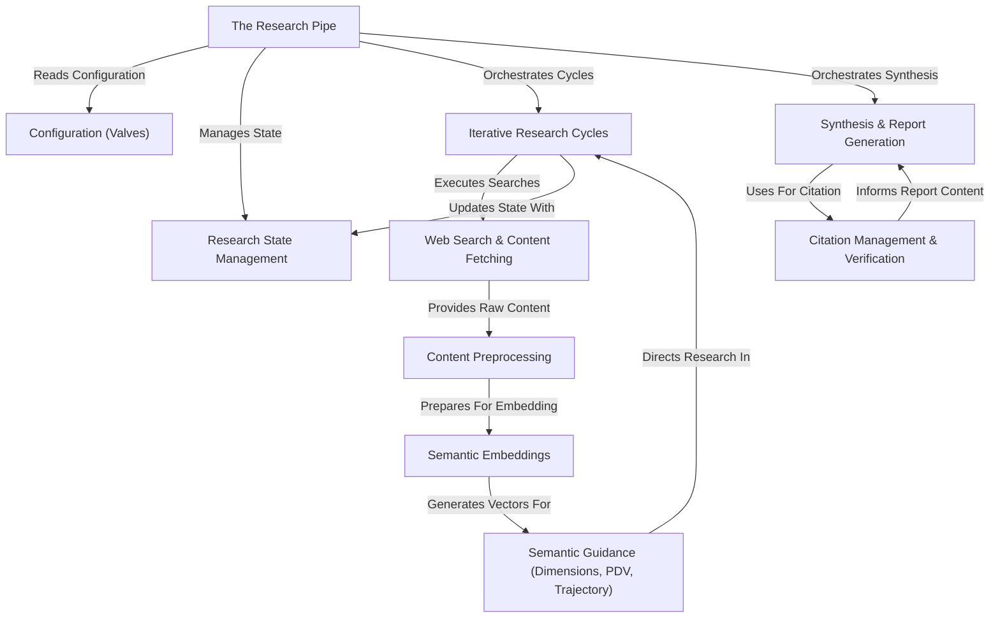

---
tags:
  - index
  - MOQ
  - research
---

# Tutorial: deep-research-at-home

This project, "Deep Research At Home", is an advanced AI system designed
to perform comprehensive **research** on a given query. It acts like an
automated academic, starting with initial searches, refining its focus
through *iterative cycles* based on discovered information and user feedback,
and finally generating a detailed **report** complete with verified *citations*.
It uses sophisticated techniques like **semantic embeddings** and dimensional
analysis to understand the research landscape and navigate effectively.

## Visual Overview

## Chapters

1. [The Research Pipe](01_the_research_pipe.md)
2. [Configuration (Valves)](02_configuration__valves.md)
3. [Research State Management](03_research_state_management.md)
4. [Iterative Research Cycles](04_iterative_research_cycles.md)
5. [Web Search & Content Fetching](05_web_search___content_fetching.md)
6. [Content Preprocessing](06_content_preprocessing.md)
7. [Semantic Embeddings](07_semantic_embeddings.md)
8. [Semantic Guidance (Dimensions, PDV, Trajectory)](08_semantic_guidance__dimensions__pdv__trajectory.md)
9. [Synthesis & Report Generation](09_synthesis___report_generation.md)
10. [Citation Management & Verification](10_citation_management___verification.md)

