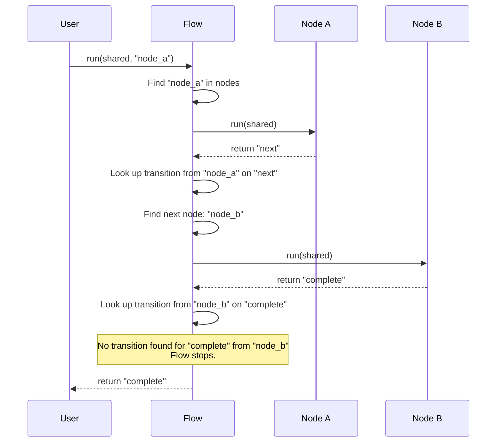

# Chapter 1: Flow Orchestration

Welcome to the first chapter of the Website Analyzer tutorial! In this chapter, we'll introduce the central concept that holds our entire website analysis project together: **Flow Orchestration**.

Imagine you're analyzing a website. What steps do you need to take? You might need to:

1.  Fetch the main page content.
2.  Find all the links on the page to discover other pages.
3.  Visit those other pages to build a map of the site (a sitemap).
4.  From each page, extract information about design (like colors and fonts).
5.  From each page, extract the actual content and identify business details.
6.  Combine all the collected design and content information.
7.  Generate a summary or "specification" based on the combined data.
8.  Create an HTML report of the findings.

That's quite a few steps! And they need to happen in a specific order. You can't extract design elements from a page until you've actually fetched the page content. You can't generate the final report until you've combined all the information.

How do we manage this sequence of operations? How do we ensure that the output of one step becomes the input for the next? This is where **Flow Orchestration** comes in.

Think of Flow Orchestration like the **conductor of an orchestra**. The conductor doesn't play any instrument himself, but he knows the entire musical score. He tells each section (the violins, the trumpets, the drums) when to play, for how long, and how loudly. He ensures everyone plays their part in the correct order to create the beautiful, complete symphony.

In our project, the "symphony" is the complete website analysis. The "sections" of the orchestra are the individual processing steps we listed above. **Flow Orchestration is the conductor that directs these steps.**

Specifically, Flow Orchestration in our Website Analyzer does three main things:

1.  **Defines the sequence:** It sets up the order in which the steps should happen.
2.  **Manages transitions:** It decides which step to go to next, potentially based on the result of the current step (e.g., "if fetching the page failed, go to an error handling step").
3.  **Ensures data flow:** It helps pass information collected by one step to the steps that need it later.

Let's look at the core components of our flow orchestration system.

### Key Concepts

Our Flow Orchestration system is built around three main ideas:

*   **Flow:** This is the overall blueprint or the entire musical score. It defines the network of steps and the possible paths between them.
*   **Nodes:** These are the individual steps or tasks in the process. Each Node does one specific job, like "Fetch a page" or "Extract design elements". In our orchestra analogy, these are the musicians playing their instruments. We'll dive deeper into Nodes in the next chapter, [Processing Nodes](02_processing_nodes_.md).
*   **Transitions:** These are the rules that connect Nodes. A transition says, "After Node A finishes and produces result 'X', go to Node B." These are like the conductor's cues, telling the orchestra which section plays next.

There's also a crucial concept for sharing information:

*   **Shared Data:** A central place (like a shared memory object or dictionary) that all Nodes can access. Nodes write their results here, and subsequent Nodes read their necessary inputs from here. This is how information flows through the system.

### How to Use Flow Orchestration (A Simple Example)

Let's imagine we just want to build a very simple flow: Fetch a page, then do something else (we don't care what for now).

First, you need a `Flow` object and some `Node` objects.

```python
# From nodes.py (simplified)
class Node:
    def run(self, shared):
        # ... do some work ...
        print("Node ran!")
        # Return an action string to tell the Flow what to do next
        return "next" 

class Flow:
    def __init__(self):
        self.nodes = {}
        self.transitions = {}

    def add_node(self, name, node):
        # Store the node with a unique name
        self.nodes[name] = node

    def add_transition(self, from_node_name, action, to_node_name):
        # Define a connection: from 'from_node_name' on 'action', go to 'to_node_name'
        if from_node_name not in self.transitions:
            self.transitions[from_node_name] = {}
        self.transitions[from_node_name][action] = to_node_name

    def run(self, shared_data, start_node_name):
        # ... logic to execute nodes based on transitions ...
        pass # Explained below!

# Our simple nodes (dummy versions for illustration)
class FetchPageNode(Node):
    def run(self, shared):
        print("Fetching page...")
        shared['page_content'] = "<html>...</html>" # Add data to shared
        return "success"

class ProcessContentNode(Node):
    def run(self, shared):
        content = shared.get('page_content', '') # Read data from shared
        print(f"Processing content: {content[:20]}...")
        return "done"

# Create the Flow
my_flow = Flow()

# Create the nodes
fetch_node = FetchPageNode()
process_node = ProcessContentNode()
```
This code snippet shows how we define our `Node` and `Flow` classes (simplified here). We then create instances of our specific Node types (`FetchPageNode`, `ProcessContentNode`) and the main `Flow` object.

Next, we add the nodes to the flow and define how they connect using transitions:

```python
# Add nodes to the flow, giving them names
my_flow.add_node("fetch", fetch_node)
my_flow.add_node("process", process_node)

# Define transitions
# When "fetch" node finishes and returns action "success", go to "process" node.
my_flow.add_transition("fetch", "success", "process")

# We need a shared data dictionary
data_store = {} # This will be passed around

# Run the flow starting at the "fetch" node
print("Starting flow...")
my_flow.run(data_store, "fetch")
print("Flow finished.")
print("Shared data:", data_store)
```

When you run this code, you would see output similar to this (depending on the exact `run` implementation):

```
Starting flow...
Fetching page...
Processing content: <html>...<...
Flow finished.
Shared data: {'page_content': '<html>...</html>'}
```

This simple example shows the core pattern: create nodes, add them to a flow with names, define transitions based on actions, and then tell the flow to `run` starting at a specific node, providing a shared data object.

In our actual `Website-Analyzer` project ([`flow.py`](flow.py)), the flow setup looks very similar. Here's a snippet from `create_website_cloner_flow` showing adding nodes:

```python
# From flow.py (simplified)
from nodes import Flow, InitialFetchNode, SitemapBatchNode # ... other nodes

def create_website_cloner_flow(...):
    flow = Flow()

    # Create nodes (these are the actual analysis steps)
    initial_fetch = InitialFetchNode()
    sitemap_batch = SitemapBatchNode()
    design_batch = DesignElementsBatchNode()
    content_batch = ContentBatchNode()
    # ... other nodes ...

    # Add nodes to flow with names
    flow.add_node("initial_fetch", initial_fetch)
    flow.add_node("sitemap_batch", sitemap_batch)
    flow.add_node("design_batch", design_batch)
    flow.add_node("content_batch", content_batch)
    # ... add other nodes ...

    # Define transitions
    # ... transitions are added here, connecting the nodes ...

    return flow
```

And here's a snippet showing how transitions are added in [`flow.py`](flow.py):

```python
# From flow.py (simplified) - inside create_website_cloner_flow
    # ... nodes are added first ...

    # Define transitions
    # If initial_fetch returns "next", go to sitemap_batch
    flow.add_transition("initial_fetch", "next", "sitemap_batch")
    # If initial_fetch returns "error", go to error_handler node
    flow.add_transition("initial_fetch", "error", "error_handler")

    # If sitemap_batch returns "continue", stay at sitemap_batch (for looping)
    flow.add_transition("sitemap_batch", "continue", "sitemap_batch")
    # If sitemap_batch returns "next", go to design_batch
    flow.add_transition("sitemap_batch", "next", "design_batch")
    # If sitemap_batch returns "error", go to error_handler
    flow.add_transition("sitemap_batch", "error", "error_handler")

    # ... add transitions for other nodes ...
```
This illustrates how different outcomes from a node (`"next"`, `"error"`, `"continue"`) can lead to different subsequent nodes, making the flow dynamic.

Finally, the `main.py` script ([`main.py`](main.py)) gets this flow and runs it:

```python
# From main.py (simplified)
from flow import create_website_cloner_flow # Imports the flow setup function
# ... other imports and setup ...

def main():
    # ... argument parsing and setup ...

    # Prepare shared data (initially contains URL, max_pages, etc.)
    shared = {
        "url": args.url,
        "max_pages": args.max_pages,
        "output_dir": args.output_dir,
        # ... other initial settings ...
    }

    # Create and run the flow
    logger.info(f"Starting Website Cloner for {args.url}")

    try:
        # Get the configured flow object
        flow = create_website_cloner_flow(not args.no_parallel)

        # Run the flow! Start at the "initial_fetch" node.
        flow.run(shared, "initial_fetch")

        # ... check results in 'shared' and report ...

    except Exception as e:
        # ... handle errors ...
```
The `shared` dictionary is the key to passing information. The `InitialFetchNode` adds the fetched page content to `shared`, the `SitemapBatchNode` adds sitemap data and discovered URLs to `shared`, and so on. Subsequent nodes read the data they need from this central `shared` object.

### How it Works Under the Hood (Simple Walkthrough)

Let's look at what happens inside the `Flow.run()` method using a simplified example with Node A and Node B.



Here's what's happening step-by-step:

1.  You call `flow.run(shared, "start_node_name")`.
2.  The `Flow` finds the Node instance associated with "start\_node\_name" (let's say Node A).
3.  The `Flow` calls Node A's `run(shared)` method. Node A does its work (e.g., fetches a page) and modifies the `shared` dictionary. Node A then returns a string, indicating the outcome or action it took (e.g., "next", "error", "continue").
4.  The `Flow` receives the action string ("next" in the diagram example).
5.  The `Flow` looks up in its `transitions` dictionary: "From Node A, if the action is 'next', where should I go?"
6.  It finds the name of the next node (Node B).
7.  The `Flow` finds the Node B instance and calls its `run(shared)` method. Node B does its work (accessing data previously added by Node A if needed) and returns another action string ("complete").
8.  The `Flow` looks up transitions from Node B on "complete".
9.  If no matching transition is found, the flow stops. If a transition were found (e.g., to Node C), the process would repeat.

This loop continues until a node returns an action for which there is no defined transition, or the node explicitly signals the end of the flow (which isn't the primary mechanism here, the transitions control the flow).

Looking at the actual `Flow.run` method in [`nodes.py`](nodes.py):

```python
# From nodes.py (simplified) - inside Flow class
    def run(self, shared, start_node):
        # Check if the start node exists
        if start_node not in self.nodes:
            raise ValueError(f"Node '{start_node}' not found in flow")

        current_node_name = start_node # Start here

        while current_node_name: # Keep going as long as there's a next node
            current_node = self.nodes[current_node_name]

            try:
                # Log which node is running
                logging.info(f"Running node: {current_node_name}")

                # *** Run the current node! ***
                action = current_node.run(shared)

                logging.info(f"Node {current_node_name} completed with action: {action}")

                # *** Look up the next node based on the action ***
                if current_node_name in self.transitions and action in self.transitions[current_node_name]:
                    current_node_name = self.transitions[current_node_name][action]
                    # Note: Parallel transition logic is a bit more complex here,
                    # but the core idea is to find the next node name.
                elif action == "next" and current_node_name in self.transitions:
                    # Handle a default "next" action if no specific action transition
                    # ... find the node connected by "next" ...
                    break # Or continue to the next node name
                else:
                    # No matching transition, stop the flow
                    logging.info(f"No transition found for action '{action}' from node '{current_node_name}'. Flow ending.")
                    break

            except Exception as e:
                logging.error(f"Error in node {current_node_name}: {str(e)}")
                # In the real code, errors might trigger an "error" transition
                # For simplicity here, we'll just break or re-raise
                raise # Stop the flow on error in this simplified view

        return "complete" # Indicate flow finished (successfully or due to no transition)

```
This code shows the `while` loop that continues as long as there's a `current_node_name`. Inside the loop, it gets the node instance, calls its `run` method, gets the returned `action`, and then uses the `self.transitions` dictionary to find the `current_node_name` for the *next* iteration. If it can't find a transition for the returned `action`, the loop stops.

This structured approach, orchestrated by the `Flow`, makes the entire website analysis process modular and manageable. Each node focuses on doing one thing well, and the flow takes care of connecting them and directing the overall process.

### Conclusion

In this chapter, we introduced Flow Orchestration as the conductor of our website analysis symphony. We learned that it uses **Nodes** for individual steps, **Transitions** to define the sequence based on **Actions**, and a **Shared Data** store to pass information between nodes. We saw a simple example of how to define and run a flow and got a peek at how the `Flow.run` method manages the execution sequence.

Understanding Flow Orchestration is key to seeing how all the different parts of the Website Analyzer project fit together. In the next chapter, we'll take a closer look at the individual **Processing Nodes** themselves: [Processing Nodes](02_processing_nodes_.md).

---

<sub><sup>Generated by [AI Codebase Knowledge Builder](https://github.com/The-Pocket/Tutorial-Codebase-Knowledge).</sup></sub> <sub><sup>**References**: [[1]](https://github.com/Theblackcat98/Website-Analyzer/blob/3c2ef570c745520cd623f7b5a5f498ba45f1f35c/flow.py), [[2]](https://github.com/Theblackcat98/Website-Analyzer/blob/3c2ef570c745520cd623f7b5a5f498ba45f1f35c/main.py), [[3]](https://github.com/Theblackcat98/Website-Analyzer/blob/3c2ef570c745520cd623f7b5a5f498ba45f1f35c/nodes.py), [[4]](https://github.com/Theblackcat98/Website-Analyzer/blob/3c2ef570c745520cd623f7b5a5f498ba45f1f35c/tests/test_flow.py)</sup></sub>