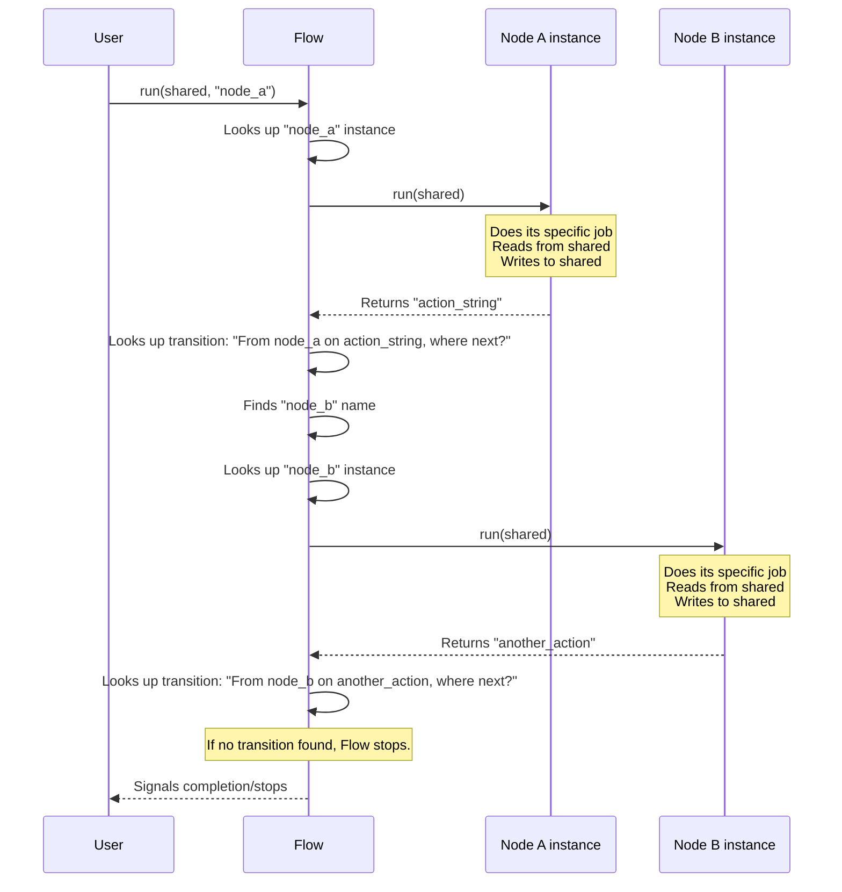

# Chapter 2: Processing Nodes

Welcome back! In the previous chapter, [Flow Orchestration](01_flow_orchestration_.md), we learned that the `Flow` is like the conductor of an orchestra, directing the overall process of analyzing a website. But who are the musicians? Who actually *does* the work?

That's where **Processing Nodes** come in.

Think of the website analysis process as an assembly line. There are many distinct steps: someone fetches the raw website page, someone else extracts the text content, another person pulls out the design details like colors and fonts, and so on, until the final report is assembled.

Each worker on this assembly line is responsible for one specific job before passing the work along. These individual workers are our **Processing Nodes**.

In the context of our `Website-Analyzer` project:

*   A **Node** is a single, self-contained unit of work.
*   Each Node performs one specific task, like "Fetch a web page", "Find links on a page", or "Extract business information".
*   Nodes work together in a sequence defined by the [Flow](01_flow_orchestration_.md), passing information between them using the `shared` data storage.

Let's revisit our simple example from Chapter 1:

1.  Fetch the main page content.
2.  Do something else (process content).

Here, "Fetch the main page content" is one Node, and "Do something else" (process content) is another Node.

The `Flow` doesn't know *how* to fetch a page or process content itself. It just knows *that* it needs these steps and *in what order* they should happen. The *how* is handled by the specific Node instances.

### The Basic Structure of a Node

All Nodes in our project are built upon a base `Node` class. This base class provides the fundamental structure and the `run` method that the [Flow](01_flow_orchestration_.md) calls.

While the actual `Node` class in `nodes.py` has a few methods like `prep`, `exec`, and `post` for more complex operations (which we'll touch on later), the most important method for understanding what a Node *does* when the Flow runs it is the `run` method:

```python
# Simplified Base Node structure from nodes.py
class Node:
    def run(self, shared):
        """
        Runs the logic for this node.
        
        Args:
            shared (dict): The shared data dictionary.
            
        Returns:
            str: An action string ("next", "error", etc.) to tell the Flow
                 what node to execute next.
        """
        # ... Node's specific work happens here ...
        print("A generic Node ran!")
        
        # Node modifies the 'shared' dictionary if needed
        # shared['result_from_this_node'] = some_value 
        
        # Node returns an action string
        return "next" 
```

Every specific Node you create will inherit from `Node` and implement its unique task, usually by overriding the `run` method or its internal `prep`/`exec`/`post` steps. When the [Flow](01_flow_orchestration_.md) calls `node_instance.run(shared_data)`, the Node executes its job, potentially updates the `shared_data` dictionary, and returns an action string.

### How Nodes Use Shared Data

Nodes don't talk directly to each other. They communicate by reading from and writing to the central `shared` data dictionary (or object). This is like workers on an assembly line putting their finished piece into a shared bin for the next worker to pick up.

Let's look at our simple Fetch and Process example again:

```python
# Simple Nodes (revisited from Chapter 1)
class FetchPageNode(Node):
    def run(self, shared):
        print("Fetching page...")
        # *** Node writes data to shared ***
        shared['page_content'] = "<html>...</html>" 
        print("Page content added to shared.")
        return "success"

class ProcessContentNode(Node):
    def run(self, shared):
        # *** Node reads data from shared ***
        content = shared.get('page_content', '') 
        print(f"Processing content: {content[:20]}...")
        
        # This node might also write results back to shared
        shared['processed_data'] = "Summary of content..." 
        print("Processed data added to shared.")
        return "done"

# Example of running them (orchestrated by Flow, but showing the shared part)
data_store = {} # The shared data dictionary

fetch_node_instance = FetchPageNode()
process_node_instance = ProcessContentNode()

# In a real Flow, the Flow manages these calls:
# action_from_fetch = fetch_node_instance.run(data_store) # 'success'
# if action_from_fetch == "success":
#     action_from_process = process_node_instance.run(data_store) # 'done'

print("Initial shared data:", data_store)
fetch_node_instance.run(data_store)
print("Shared data after fetch:", data_store)
process_node_instance.run(data_store)
print("Shared data after process:", data_store)
```

Running this code would show:

```
Initial shared data: {}
Fetching page...
Page content added to shared.
Shared data after fetch: {'page_content': '<html>...</html>'}
Processing content: <html>...<...
Processed data added to shared.
Shared data after process: {'page_content': '<html>...</html>', 'processed_data': 'Summary of content...'}
```

As you can see, `FetchPageNode` adds `'page_content'` to the `data_store` (our `shared` dictionary), and then `ProcessContentNode` reads `'page_content'` from the same `data_store` to do its work. It then adds its own result, `'processed_data'`.

### Creating a Simple Custom Node

Let's walk through creating a very basic custom Node that just adds a simple message to the shared data.

```python
# Create a new Python file (e.g., my_nodes.py) or add to an existing one
from nodes import Node # Import the base Node class

class GreetingNode(Node):
    def run(self, shared):
        """
        Adds a greeting message to the shared data.
        """
        print("Running GreetingNode...")
        
        # Add a simple greeting to the shared dictionary
        shared['greeting_message'] = "Hello from GreetingNode!"
        
        print("Greeting message added to shared.")
        
        # Return 'next' to signal the Flow to move to the next node
        return "next" 
```

This `GreetingNode` is simple: it inherits from `Node`, overrides the `run` method, prints a message, adds an item to the `shared` dictionary, and returns `"next"`.

To use this Node, you'd add it to a [Flow](01_flow_orchestration_.md) just like we saw in Chapter 1:

```python
# Using the custom GreetingNode
from nodes import Flow # Assuming Flow is in nodes.py
# from my_nodes import GreetingNode # If you saved it separately

# Create the Flow
my_flow = Flow()

# Create an instance of our custom node
greeting_node = GreetingNode()

# Add the node to the flow, giving it a unique name
my_flow.add_node("greet", greeting_node)

# Add a dummy node to go AFTER the greeting node (for illustration)
class AnotherNode(Node):
    def run(self, shared):
        print("Running AnotherNode...")
        message = shared.get('greeting_message', 'No greeting found!')
        print(f"Received message: {message}")
        return "done"

another_node = AnotherNode()
my_flow.add_node("another", another_node)

# Define the transition: After "greet" returns "next", go to "another"
my_flow.add_transition("greet", "next", "another")

# Create the shared data dictionary
data_store = {}

# Run the flow starting at our greeting node
print("Starting flow...")
my_flow.run(data_store, "greet")
print("Flow finished.")
print("Final shared data:", data_store)
```

When you run this, the `Flow` will execute the `greet` node, which puts the message into `data_store` and returns `"next"`. The `Flow` then looks at its transitions, sees that after `greet` with action `"next"` it should go to `another`, and runs `another`. The `another` node reads the message from `data_store` and prints it.

Output:

```
Starting flow...
Running node: greet
Running GreetingNode...
Greeting message added to shared.
Node greet completed with action: next
Running node: another
Running AnotherNode...
Received message: Hello from GreetingNode!
Node another completed with action: done
Flow finished.
Final shared data: {'greeting_message': 'Hello from GreetingNode!'}
```

This confirms that the Nodes executed in sequence, updated the `shared` data, and the second node could access the data from the first.

### How Nodes Fit into the Flow (Under the Hood Peek)

Let's quickly revisit the sequence diagram from Chapter 1, now focusing on the Node's perspective.



This sequence shows clearly that the `Flow` is merely the manager. It fetches the correct Node instance and calls its `run` method, passing the `shared` data. The Node does *all* the specific work and tells the `Flow` what happened by returning an action string. The `Flow` then uses this action string and its transition map to decide which Node instance to call next.

### Real-World Nodes in Website Analyzer

Our `Website-Analyzer` project uses various specific Node types, each responsible for a part of the website analysis:

| Node Type                | Main Responsibility                                  | Key Data Used/Added to `shared`                      |
| :----------------------- | :--------------------------------------------------- | :--------------------------------------------------- |
| `InitialFetchNode`       | Fetches the content of the starting URL              | Reads: `url` <br/> Writes: `soup`, `initial_status`  |
| `SitemapBatchNode`       | Crawls the site to build a sitemap                   | Reads: `url`, `max_pages`, `pages_to_process`, `pages_visited` <br/> Writes: `sitemap`, `pages_to_process`, `pages_visited`, `soups` |
| `DesignElementsBatchNode`| Extracts design details (colors, fonts, etc.)      | Reads: `sitemap`, `soups` <br/> Writes: `design`     |
| `ContentBatchNode`       | Extracts text content and business information       | Reads: `sitemap`, `soups` <br/> Writes: `content`    |
| `CombineResultsNode`     | Merges data from different extraction steps          | Reads: `design`, `content` <br/> (Mostly an passthrough placeholder in current code) |
| `GenerateSpecsNode`      | Creates structured specifications from collected data | Reads: `content_data`, `design`, `sitemap`, `url`, `output_dir` <br/> Writes: `business_spec`, `brand_spec`, `specs_file` |
| `CreateHtmlSummaryNode`  | Generates the final HTML report                      | Reads: `url`, `business_spec`, `brand_spec`, `sitemap`, `design`, `content_data`, `output_dir` <br/> Writes: `html_summary`, `html_output_path` |

You can see these Node types listed in the `flow.py` file when the `create_website_cloner_flow` function is setting up the flow:

```python
# From flow.py (simplified)
from nodes import (
    Flow, InitialFetchNode, SitemapBatchNode, DesignElementsBatchNode, 
    ContentBatchNode, CombineResultsNode, GenerateSpecsNode, CreateHtmlSummaryNode,
    Node # ... other imports
)

def create_website_cloner_flow(...):
    flow = Flow()
    
    # Create instances of specific nodes
    initial_fetch = InitialFetchNode()
    sitemap_batch = SitemapBatchNode()
    design_batch = DesignElementsBatchNode()
    content_batch = ContentBatchNode()
    combine_results = CombineResultsNode()
    generate_specs = GenerateSpecsNode()
    create_html = CreateHtmlSummaryNode()
    # ... other nodes ...
    
    # Add node instances to the flow with names
    flow.add_node("initial_fetch", initial_fetch)
    flow.add_node("sitemap_batch", sitemap_batch)
    flow.add_node("design_batch", design_batch)
    flow.add_node("content_batch", content_batch)
    flow.add_node("combine_results", combine_results)
    flow.add_node("generate_specs", generate_specs)
    flow.add_node("create_html", create_html)
    # ... add other nodes ...

    # ... transitions are defined next ...
    return flow
```

This snippet shows exactly how instances of our specialized Node classes are created and registered with the `Flow` object under specific names (`"initial_fetch"`, `"sitemap_batch"`, etc.). These names are what the [Flow](01_flow_orchestration_.md) uses in its transition map.

Some of these nodes, like `SitemapBatchNode`, `DesignElementsBatchNode`, and `ContentBatchNode`, inherit from a special type called `BatchNode`. These are designed to process a *list* of items (like many different pages) efficiently. We'll explore `BatchNode`s in the next chapter.

### Conclusion

In this chapter, we focused on Processing Nodes, the individual workers or steps in our website analysis assembly line. We learned that each Node performs a specific task, communicates by reading from and writing to a `shared` data dictionary, and signals its outcome to the [Flow](01_orchestration_.md) by returning an action string from its `run` method. We saw how basic Nodes are structured and how they are added to a Flow.

Understanding Nodes is crucial because they contain the actual logic for *what* the Website Analyzer does. The Flow defines the *order* and *paths*, but the Nodes define the *actions*.

In the next chapter, we'll look at a special type of Node, the [Batch Processing](03_batch_processing_.md) Node, which is essential for handling tasks that need to be performed on multiple items, like analyzing many web pages.

---

<sub><sup>Generated by [AI Codebase Knowledge Builder](https://github.com/The-Pocket/Tutorial-Codebase-Knowledge).</sup></sub> <sub><sup>**References**: [[1]](https://github.com/Theblackcat98/Website-Analyzer/blob/3c2ef570c745520cd623f7b5a5f498ba45f1f35c/flow.py), [[2]](https://github.com/Theblackcat98/Website-Analyzer/blob/3c2ef570c745520cd623f7b5a5f498ba45f1f35c/main.py), [[3]](https://github.com/Theblackcat98/Website-Analyzer/blob/3c2ef570c745520cd623f7b5a5f498ba45f1f35c/nodes.py), [[4]](https://github.com/Theblackcat98/Website-Analyzer/blob/3c2ef570c745520cd623f7b5a5f498ba45f1f35c/tests/test_flow.py)</sup></sub>