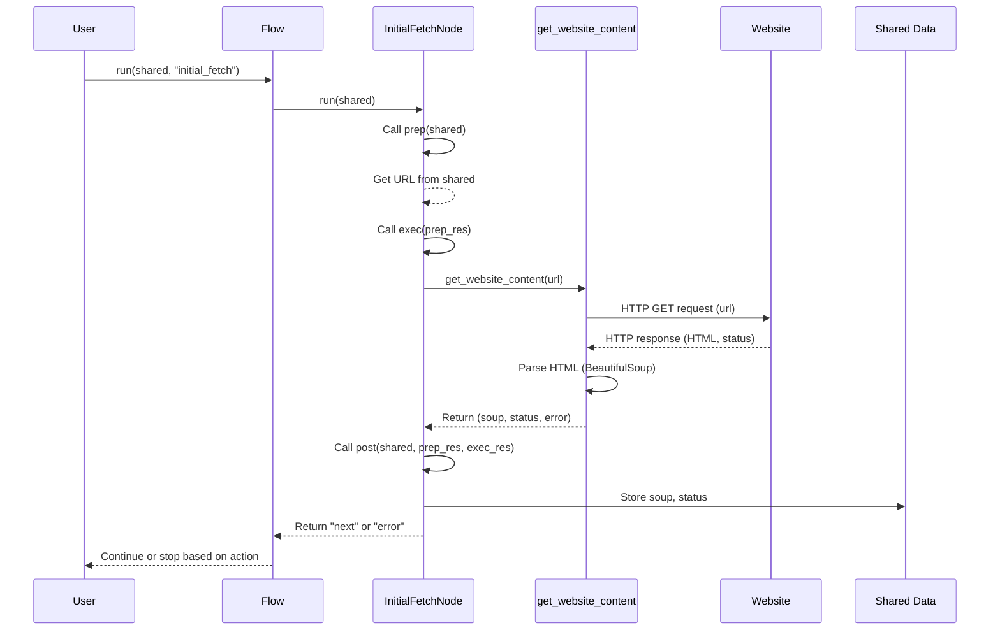

# Chapter 4: Website Content Fetching

Welcome back! In the last chapter, [Batch Processing](03_batch_processing_.md), we explored how `BatchNode`s help us efficiently process many items, like multiple pages of a website. But before we can process anything *from* a website, we need to actually *get* the content of its pages.

Think of analyzing a website like cooking a meal. [Flow Orchestration](01_flow_orchestration_.md) is the recipe, telling you the steps and order. [Processing Nodes](02_processing_nodes_.md) are the different chefs responsible for specific parts (chopping vegetables, baking bread). [Batch Processing](03_batch_processing_.md) is like having multiple chefs prepare ingredients simultaneously. But none of this can start until you have the actual **ingredients**!

For a website, the "ingredients" are the raw HTML source code of its pages. **Website Content Fetching** is the process of getting these ingredients. It's the fundamental first step that provides the raw material for everything else our analyzer does.

### What is Website Content Fetching?

When you type a website address (a URL) into your web browser and press Enter, your browser does a few things behind the scenes:
1.  It sends a request to the web server hosting the website.
2.  The server receives the request and sends back the page's source code, which is usually written in HTML (HyperText Markup Language).
3.  Your browser then reads this HTML and displays the page visually (applying CSS for style, running JavaScript for interactivity, etc.).

Website content fetching in our `Website-Analyzer` is like steps 1 and 2. It sends a request to a URL and receives the raw HTML back. It doesn't try to display it visually or run JavaScript; it just grabs the source code.

This raw HTML is essential because it contains all the text, links, structure, and references to other resources (like images, CSS files) on the page. Future steps will analyze this HTML to extract meaningful data.

### The Fetching Utility: `get_website_content`

Our project has a dedicated utility function specifically for this task: `get_website_content`. This function takes a URL as input and tries to download the HTML content from that URL.

You can find this utility in `utils/get_website_content.py`. Let's look at its purpose and what it returns.

```python
# Inside utils/get_website_content.py (Conceptual)
def get_website_content(url):
    """
    Retrieves HTML content from a URL and parses it.
    
    Args:
        url (str): The URL to retrieve content from.
        
    Returns:
        tuple: (parsed HTML object, status code, error message if any)
    """
    # ... implementation details ...
    pass # Function body explained below
```

The `get_website_content` function is designed to be reusable. Any part of the project that needs to download and parse a web page can call this function. It returns three pieces of information in a tuple:

1.  **Parsed HTML Object (`soup`):** This isn't just the raw text HTML. The function uses a library called `BeautifulSoup` to parse the HTML text into a structured object. Think of `BeautifulSoup` as organizing the messy HTML text into a tidy tree structure that's easy for our code to navigate and find specific elements (like titles, links, paragraphs, etc.). This parsed object is commonly called `soup`.
2.  **Status Code:** This is a standard web code indicating the result of the request (e.g., 200 means success, 404 means page not found, 500 means server error).
3.  **Error Message:** If something went wrong during the fetching process (like a network issue or the server returning an error status), this will contain a description of the error; otherwise, it will be `None`.

### How is Fetching Used in the Flow?

The very first step in our main website analysis flow is to fetch the content of the *initial* URL provided by the user. This job is handled by a specific Node: `InitialFetchNode`.

As we learned in [Processing Nodes](02_processing_nodes_.md), a Node's main work happens in its `run` method, which often calls `prep`, `exec`, and `post`. For `InitialFetchNode`, the fetching happens in the `exec` method.

Let's look at a simplified version of `InitialFetchNode`:

```python
# Inside nodes.py (Simplified InitialFetchNode)
from nodes import Node
from utils.get_website_content import get_website_content # Import the utility

class InitialFetchNode(Node):
    def exec(self, prep_res):
        """Fetch the initial page content using the utility."""
        url = prep_res.get("url") # Get the URL from the shared data
        if not url:
            raise ValueError("No URL provided to InitialFetchNode")
            
        print(f"Fetching initial page: {url}")
        
        # *** CALL THE FETCHING UTILITY ***
        soup, status, error = get_website_content(url) 
        
        if error:
            # Return error info if fetching failed
            return {"error": error, "status": status}
            
        # Return the fetched data (soup and status)
        return {"soup": soup, "status": status}
        
    def post(self, shared, prep_res, exec_res):
        """Store the fetched data in shared context."""
        # Check if there was an error during execution
        if "error" in exec_res:
            print(f"Initial fetch failed: {exec_res['error']}")
            shared["error_message"] = exec_res["error"]
            shared["error_source"] = "initial_fetch"
            shared["succeeded"] = False # Mark the overall process as failed
            return "error" # Tell the Flow to go to an error handler
            
        # If successful, store the results in the shared dictionary
        shared["soup"] = exec_res["soup"] # Store the parsed HTML (soup)
        shared["initial_status"] = exec_res["status"] # Store the status code
        
        print("Initial fetch successful. Soup and status stored in shared.")
        
        # Tell the Flow to move to the next node in the sequence
        return "next" 
```

Here's what's happening:

1.  The `Flow` ([Chapter 1](01_flow_orchestration_.md)) calls the `run` method of `InitialFetchNode`.
2.  The `InitialFetchNode`'s `run` method internally calls its `prep`, then its `exec`, then its `post`.
3.  In `exec`, the node retrieves the `url` from the `shared` data (which was put there when the flow started, see `main.py`). It then calls `get_website_content(url)`.
4.  `get_website_content` does the actual work of downloading and parsing.
5.  `get_website_content` returns the `soup`, `status`, and `error` back to the `exec` method.
6.  The `exec` method checks if there was an error and returns the appropriate data dictionary (`{"soup": soup, ...}` or `{"error": error, ...}`).
7.  The `InitialFetchNode`'s `run` method receives this result and passes it to the `post` method.
8.  In `post`, the node checks the result. If successful, it saves the `soup` object and the `status` code into the `shared` data dictionary so other nodes can access them. It then returns `"next"`, telling the `Flow` to execute the node connected by the `"next"` transition.
9.  If there was an error, it stores an error message in `shared` and returns `"error"`, potentially leading the `Flow` to an error handling node (if defined in the flow transitions).

This is how the fetched content (the `soup` object) gets into the `shared` data where subsequent nodes (like those for sitemap building or content extraction) can access it.

### How `get_website_content` Works Under the Hood

Let's peek inside the `get_website_content` utility function itself, located in `utils/get_website_content.py`. It primarily uses two powerful Python libraries: `requests` for making the HTTP request and `beautifulsoup4` (often imported as `bs4`) for parsing the HTML.

```python
# Inside utils/get_website_content.py (Simplified)
import requests
from bs4 import BeautifulSoup
import logging # For logging errors

def get_website_content(url):
    """Retrieves HTML content and parses it."""
    try:
        # --- Use requests to download the page ---
        # Send a GET request to the URL
        response = requests.get(url, timeout=10) # Added timeout for safety
        
        # Raise an exception for bad status codes (like 404 or 500)
        response.raise_for_status() 
        
        # --- Use BeautifulSoup to parse the HTML text ---
        # response.text contains the HTML as a string
        soup = BeautifulSoup(response.text, 'html.parser') 
        
        # Return the parsed soup, the status code, and no error
        return soup, response.status_code, None 
        
    except requests.exceptions.RequestException as e:
        # --- Handle any errors during the request ---
        logging.error(f"Error fetching {url}: {str(e)}")
        # Return None for soup and status, and the error message
        return None, None, str(e) 
```

Here's a simple walkthrough:

1.  The function receives a `url` (a string).
2.  It enters a `try...except` block to catch potential errors during the network request.
3.  `requests.get(url, timeout=10)`: This is the core step. It sends an HTTP GET request to the specified URL. The `timeout=10` part means it will give up if the website doesn't respond within 10 seconds.
4.  `response.raise_for_status()`: After getting a response, this line checks the status code. If the code indicates an error (like 404, 500, etc.), it immediately stops and jumps to the `except` block.
5.  `BeautifulSoup(response.text, 'html.parser')`: If the request was successful (no error status), `response.text` holds the entire HTML content as a string. This line passes that string to `BeautifulSoup` along with the specified parser (`'html.parser'`). BeautifulSoup reads the string and builds the `soup` object, which is a structured representation of the HTML document.
6.  `return soup, response.status_code, None`: If everything worked, the function returns the created `soup` object, the successful status code, and `None` for the error.
7.  `except requests.exceptions.RequestException as e`: If *any* error occurred during the `requests` part (network issue, timeout, bad status code caught by `raise_for_status`), the code jumps here.
8.  `logging.error(...)`: An error message is logged.
9.  `return None, None, str(e)`: The function returns `None` for the `soup` and `status`, and the error message as a string.

This utility provides a robust way to get the raw webpage data, handling common issues like network errors or non-successful responses.

Here's a simple sequence diagram illustrating the process for the initial fetch:



As you can see, the `InitialFetchNode` acts as the intermediary, calling the dedicated `get_website_content` utility and then taking its results to update the central `shared` data store for other nodes.

### Fetching Content in Batch Nodes

We briefly touched upon this in [Batch Processing](03_batch_processing_.md). Batch Nodes like `SitemapBatchNode`, `DesignElementsBatchNode`, and `ContentBatchNode` also need the content of multiple pages.

The `SitemapBatchNode` is special because it's the one that *discovers* and *initially fetches* the content for subsequent pages during the crawling process. Its `exec` method also calls `get_website_content` for *each* URL in its batch:

```python
# Inside nodes.py (Simplified SitemapBatchNode.exec)
    def exec(self, url):
        """Process a single URL in the batch."""
        print(f"Fetching page for sitemap: {url}")
        # *** CALL THE FETCHING UTILITY FOR EACH ITEM ***
        soup, status, error = get_website_content(url) 
        
        if error or not soup:
            # Handle error for this specific URL
            print(f"Error fetching {url} in batch: {error}")
            return {"url": url, "error": error or "Failed to fetch content", "links": []}
            
        # ... Extract links and structure from soup ...
        page_structure = { 
            "title": soup.title.string if soup.title else "No title",
            # ... other structure details ...
            "links": [],
            "soup": soup  # Store the soup object!
        }
        # ... find links and add to page_structure ...
        
        return {"url": url, "structure": page_structure, "links": links}
```
Notice that the `SitemapBatchNode.exec` also includes `"soup": soup` in the dictionary it returns for *each* page. Its `post` method ([Chapter 3](03_batch_processing_.md)) then collects these `soup` objects from all pages in the batch and stores them in `shared["soups"]`.

This is important because the `DesignElementsBatchNode` and `ContentBatchNode` often *don't* need to fetch the content again. Their `prep` methods get the list of pages *and* the corresponding `soup` objects from `shared["soups"]`, which were stored by the `SitemapBatchNode`. Their `exec` methods then work directly with the `soup` object passed to them, avoiding redundant fetching.

```python
# Inside nodes.py (Simplified DesignElementsBatchNode.exec)
    def exec(self, page_data):
        """Extract design elements from a page using the soup."""
        url, page_key, soup = page_data # Get soup from the batch data
        
        # *** Use the soup object directly! ***
        if not soup:
             # Fallback: if soup wasn't pre-fetched (e.g. initial page only processed by InitialFetchNode)
             # this batch node fetches it now.
             print(f"Soup not found for {url}. Fetching now...")
             soup, status, error = get_website_content(url)
             if error or not soup:
                 print(f"Failed to fetch {url} for design analysis: {error}")
                 return {"page_key": page_key, "error": error or "Failed to fetch content"}
                
        print(f"Extracting design from: {url}")
        # Extract design elements from the soup object
        design_data = extract_design_elements(soup, url) 
        return {"page_key": page_key, "design": design_data}

# ContentBatchNode.exec works similarly, using the soup object
```
This shows a good pattern: the `get_website_content` utility is the single place responsible for the *how* of fetching and parsing HTML, while different Nodes decide *when* and *for which pages* that utility needs to be called.

### Conclusion

In this chapter, we explored Website Content Fetching, the essential first step of getting the raw HTML "ingredients" from a web page. We learned about the `get_website_content` utility function, which uses `requests` to download the HTML and `BeautifulSoup` to parse it into a usable `soup` object, returning the soup, status, and any errors. We saw how the `InitialFetchNode` uses this utility to get the first page's content and store the resulting `soup` in the `shared` data. Finally, we briefly touched on how `BatchNode`s, particularly the `SitemapBatchNode`, also use this utility to fetch multiple pages, ensuring the fetched `soup` objects are available in `shared` for subsequent batch nodes that perform analysis.

Now that we know how to fetch the content, the next logical step is to figure out how to find specific pieces of information *within* that fetched HTML. In the next chapter, we'll dive into [Data Extraction Utilities](05_data_extraction_utilities_.md).

---

<sub><sup>Generated by [AI Codebase Knowledge Builder](https://github.com/The-Pocket/Tutorial-Codebase-Knowledge).</sup></sub> <sub><sup>**References**: [[1]](https://github.com/Theblackcat98/Website-Analyzer/blob/3c2ef570c745520cd623f7b5a5f498ba45f1f35c/nodes.py), [[2]](https://github.com/Theblackcat98/Website-Analyzer/blob/3c2ef570c745520cd623f7b5a5f498ba45f1f35c/utils/build_sitemap.py), [[3]](https://github.com/Theblackcat98/Website-Analyzer/blob/3c2ef570c745520cd623f7b5a5f498ba45f1f35c/utils/get_website_content.py)</sup></sub>