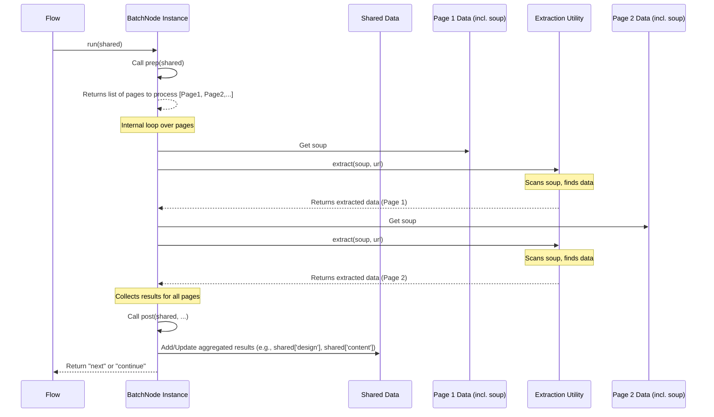

# Chapter 5: Data Extraction Utilities

Welcome back! In the previous chapter, [Website Content Fetching](04_website_content_fetching_.md), we learned how our Website Analyzer gets the raw ingredients for analysis: the HTML content of web pages. We saw how the `get_website_content` utility fetches the page and turns the raw HTML text into a structured `soup` object using `BeautifulSoup`.

But having the raw HTML `soup` object, while useful, isn't the final goal. Imagine you're reading a book about a company. You don't just want the book's raw text; you want to easily find their business name, their contact information, a list of their products, or maybe some customer reviews.

Turning the raw `soup` into these specific facts requires another crucial step: **Data Extraction**.

### What are Data Extraction Utilities?

Data Extraction Utilities are like specialized tools or functions designed to "read" the structured HTML `soup` object and pull out specific types of information. They know how to navigate the HTML tree structure (`soup`) and look for patterns that indicate a business detail, a product listing, a color definition, or a piece of text content.

Think of them as different kinds of scanners:

*   One scanner looks only for color codes and font names.
*   Another scanner looks for business names, phone numbers, and email addresses.
*   A third scanner identifies product listings with names, prices, and descriptions.
*   Yet another scanner finds customer testimonials.
*   And we even have tools that look at the page's overall structure and links to build a sitemap.

Each utility is focused on finding and collecting one specific type of data from the HTML.

### The Central Use Case: Analyzing a Page's Content and Design

Our main goal in this chapter is to understand how we take the `soup` object for a single web page (which we got from fetching) and use different utilities to extract details about its content (text, business info, products, testimonials) and its visual design (colors, fonts).

This extracted data is then what we'll use in later steps to generate specifications and summaries.

### How Extraction Utilities Work (High-Level)

The basic process is straightforward:

1.  Start with a `BeautifulSoup` `soup` object for a page.
2.  Call a specific Data Extraction Utility function, passing the `soup` object (and sometimes the page's URL for context, like resolving image paths or guessing business type).
3.  The utility function uses `BeautifulSoup`'s methods (`find`, `find_all`, searching by tags, classes, attributes, text, etc.) and sometimes regular expressions (`re`) to locate and collect the desired data within the `soup`.
4.  The utility function processes the found data, organizes it into a structured format (like a Python dictionary or list), and returns it.

Let's look at some of the key extraction utilities used in our project. They are mostly found in the `utils/extract_content.py` and `utils/extract_design_elements.py` files.

### Key Extraction Utilities

Our Website Analyzer uses several utility functions for different types of extraction:

| Utility Function (`utils/`) | What it Extracts                                        | Input     | Output (example type)        |
| :-------------------------- | :------------------------------------------------------ | :-------- | :--------------------------- |
| `extract_business_info.py`  | Business name, tagline, contact info (phone, email, address), social media links. | `soup`    | `dict`                       |
| `guess_business_type.py`    | Guesses the type of business (e.g., "Cafe/Coffee Shop", "E-commerce"). | `soup`, `text content` | `tuple` (type string, confidence %) |
| `extract_products.py`       | Product listings (name, price, description, image).   | `soup`    | `list` of `dict`s            |
| `extract_testimonials.py` | Customer testimonials/reviews (text, author).           | `soup`    | `list` of `dict`s            |
| `extract_design_elements.py`| Colors, fonts, image counts, basic layout info.         | `soup`, `url` | `dict`                       |
| (Part of `build_sitemap.py`)| Page title, headings, links (structure for sitemap).    | `soup`    | `dict`                       |

These utilities are the heavy lifters for finding specific data points within the HTML.

### How Extraction Utilities Use `soup` (Simplified Examples)

Let's peek inside a couple of these utilities to see how they use the `BeautifulSoup` `soup` object.

#### Example 1: Finding Business Contact Info (`extract_business_info`)

This utility needs to find things like phone numbers, email addresses, and potentially physical addresses. It uses `soup.find()` and `soup.find_all()` along with patterns.

```python
# Inside utils/extract_content.py (Simplified snippet for phone/email)
from bs4 import BeautifulSoup
import re # Used for pattern matching

def extract_business_info(soup):
    info = { "contact": { "phone": None, "email": None } }
    
    # --- Find Phone Number ---
    # Look for common phone number patterns in text
    phone_pattern = r'\b(?:\+\d{1,3}[\s-]?)?\(?\d{3}\)?[\s.-]?\d{3}[\s.-]?\d{4}\b'
    
    # Iterate through all text on the page
    for text in soup.stripped_strings:
        match = re.search(phone_pattern, text)
        if match:
            info["contact"]["phone"] = match.group(0)
            break # Found one, move on
    
    # --- Find Email Address ---
    # Look for common email patterns
    email_pattern = r'\b[A-Za-z0-9._%+-]+@[A-Za-z0-9.-]+\.[A-Z|a-z]{2,}\b'
    for text in soup.stripped_strings:
        match = re.search(email_pattern, text)
        if match and not info["contact"]["email"]: # Don't overwrite if already found
            info["contact"]["email"] = match.group(0)
            break
            
    # Also check mailto: links
    email_links = soup.find_all('a', href=re.compile(r'^mailto:'))
    if email_links and not info["contact"]["email"]:
        info["contact"]["email"] = email_links[0]['href'].replace('mailto:', '')
            
    # ... (logic for name, address, social media) ...
            
    return info
```

**Explanation:**

*   `soup.stripped_strings`: This is a helpful `BeautifulSoup` feature that lets us loop through all the text content on the page, skipping extra whitespace.
*   `re.search(pattern, text)`: We use the `re` (regular expression) module to search for complex text patterns, like those for phone numbers or email addresses, within the page's text.
*   `soup.find_all('a', href=re.compile(r'^mailto:'))`: This uses `BeautifulSoup` to find all `<a>` (link) tags where the `href` attribute starts with `mailto:`, which is a standard way to create email links.

This shows how the utility combines navigating the `soup` structure with text pattern matching.

#### Example 2: Finding Colors (`extract_design_elements`)

This utility needs to look for color definitions, which can appear in `style` attributes (inline CSS) or external CSS files.

```python
# Inside utils/extract_design_elements.py (Simplified snippet for colors)
from bs4 import BeautifulSoup
import re
# Assume get_css_urls(soup, url) function exists to get CSS text

def extract_design_elements(soup, url):
    design = { "colors": {} }
    colors_list = []
    
    # --- Extract inline colors from style attributes ---
    for tag in soup.find_all(style=True): # Find any tag with a 'style' attribute
        style_str = tag['style']
        # Look for color or background-color properties
        color_matches = re.findall(r'(?:color|background(?:-color)?)\s*:\s*([^;]+)', style_str)
        for color_str in color_matches:
             # We need a function to convert different formats (rgb, hex) to hex
             hex_color = extract_hex_color(color_str.strip()) # Simplified: assume this works
             if hex_color:
                 colors_list.append(hex_color)
                 
    # --- Extract colors from CSS files/styles ---
    # Assume get_css_urls fetches content of external CSS files + inline <style> tags
    for source, css_text in get_css_urls(soup, url):
         # Look for color or background-color properties in the CSS text
         color_matches = re.findall(r'(?:color|background(?:-color)?)\s*:\s*([^;{}]+)', css_text)
         for color_str in color_matches:
             hex_color = extract_hex_color(color_str.strip())
             if hex_color:
                 colors_list.append(hex_color)
    
    # --- Count and store top colors ---
    from collections import Counter
    color_counter = Counter(colors_list)
    design["colors"] = {color: count for color, count in color_counter.most_common(5)}
    
    # ... (logic for fonts, layout, images) ...
    
    return design
```

**Explanation:**

*   `soup.find_all(style=True)`: Finds all HTML tags that have a `style` attribute. We then extract the value of this attribute.
*   `re.findall(...)`: Regular expressions are used again to find patterns like `color: somevalue;` or `background-color: somevalue;` within the CSS text.
*   `get_css_urls(soup, url)`: (Conceptual helper) This function would find `<link rel="stylesheet">` tags and `<style>` tags, fetch the content of the external files, and yield all CSS text found on the page.
*   `extract_hex_color(color_str)`: (Conceptual helper) A separate helper function is needed to take CSS color values (like `rgb(0,0,0)` or `#fff` or `blue`) and convert them into a consistent hex format (`#000000`, `#ffffff`).

This illustrates how the utility needs to look in different places within and linked from the HTML and use pattern matching to find design properties.

### How Nodes Use Extraction Utilities

As we saw in [Chapter 3: Batch Processing](03_batch_processing_.md), `BatchNode`s are designed to process multiple items (like web pages). The `DesignElementsBatchNode` and `ContentBatchNode` are specifically designed to call these extraction utilities for each page they process.

Let's look at the simplified `exec` methods of these nodes:

```python
# Inside nodes.py (Simplified DesignElementsBatchNode.exec)
# Imports for extract_design_elements and get_website_content (if needed)

class DesignElementsBatchNode(...): # Inherits from BatchNode
    def exec(self, page_data):
        """Extract design elements for a single page."""
        # page_data comes from the prep() method of this BatchNode.
        # It likely contains the URL and the soup object pre-fetched by SitemapBatchNode.
        url, page_key, soup = page_data 
        
        if not soup:
             # Fallback fetch if soup wasn't available (e.g., processing initial page only)
             print(f"Soup missing for {url}. Fetching for design analysis...")
             soup, status, error = get_website_content(url)
             if error or not soup:
                 print(f"Skipping design extraction for {url} due to fetch error.")
                 return {"page_key": page_key, "error": error or "Fetch failed"}
                
        print(f"Extracting design elements for: {url}")
        
        # *** Call the Design Extraction Utility! ***
        design_data = extract_design_elements(soup, url) 
        
        # Return the extracted data for this page
        return {"page_key": page_key, "design": design_data}

```

```python
# Inside nodes.py (Simplified ContentBatchNode.exec)
# Imports for extract_content and get_website_content (if needed)

class ContentBatchNode(...): # Inherits from BatchNode
    def exec(self, page_data):
        """Extract content details for a single page."""
        # page_data also contains URL and soup, similar to DesignElementsBatchNode
        url, page_key, soup = page_data 
        
        if not soup:
             # Fallback fetch
             print(f"Soup missing for {url}. Fetching for content analysis...")
             soup, status, error = get_website_content(url)
             if error or not soup:
                 print(f"Skipping content extraction for {url} due to fetch error.")
                 return {"page_key": page_key, "error": error or "Fetch failed"}
                
        print(f"Extracting content for: {url}")
        
        # *** Call the main Content Extraction Utility! ***
        # Note: extract_content calls other utilities internally
        content_data = extract_content(soup, url) 
        
        # Return the extracted data for this page
        return {"page_key": page_key, "content": content_data}
```

**Explanation:**

1.  These are `BatchNode`s, so their main logic is in the `exec` method, which is called once for *each item* in the batch (where an item is usually a page's data including its `soup`).
2.  Inside `exec`, they receive the `soup` object (usually pre-fetched by the `SitemapBatchNode`).
3.  They then call the appropriate extraction utility function (`extract_design_elements` or `extract_content`), passing the `soup` object.
4.  The utility does its work of scanning the `soup` and returns the structured data (a dictionary of design info or content info for that specific page).
5.  The `exec` method returns this structured data for the single page.
6.  The `BatchNode`'s `post` method collects these returned dictionaries from *all* pages in the batch and aggregates them into the `shared` data dictionary (into `shared['design']` and `shared['content']`).

This shows how the Nodes act as orchestrators *for a batch*, calling the focused extraction utilities for each item they handle and then consolidating the results.

### Sequence Diagram: Extraction in a Batch Node

Here's a simplified look at how extraction works within one iteration of a Batch Node:



This diagram highlights that the `BatchNode` manages the list of items, retrieves the `soup` for each, delegates the scanning task to the `Extraction Utility`, and finally aggregates the individual results back into `shared`.

### Conclusion

Data Extraction Utilities are essential components of our Website Analyzer. They are the specialized tools that take the raw HTML `soup` object obtained from fetching and transform it into structured, meaningful data about a website's content, business details, and design elements. By using specific utility functions like `extract_business_info`, `extract_products`, and `extract_design_elements`, which internally use `BeautifulSoup` and regular expressions to scan the HTML, we can collect the precise information needed for analysis. These utilities are typically called by `BatchNode`s that process multiple pages, with the results being consolidated in the central `shared` data store.

Now that we have the structured data extracted from the website's pages, the next step is to make sense of it and present it in a useful format. In the next chapter, we'll learn about [Specification Generation](06_specification_generation_.md).

---

<sub><sup>Generated by [AI Codebase Knowledge Builder](https://github.com/The-Pocket/Tutorial-Codebase-Knowledge).</sup></sub> <sub><sup>**References**: [[1]](https://github.com/Theblackcat98/Website-Analyzer/blob/3c2ef570c745520cd623f7b5a5f498ba45f1f35c/utils/build_sitemap.py), [[2]](https://github.com/Theblackcat98/Website-Analyzer/blob/3c2ef570c745520cd623f7b5a5f498ba45f1f35c/utils/extract_content.py), [[3]](https://github.com/Theblackcat98/Website-Analyzer/blob/3c2ef570c745520cd623f7b5a5f498ba45f1f35c/utils/extract_design_elements.py)</sup></sub>