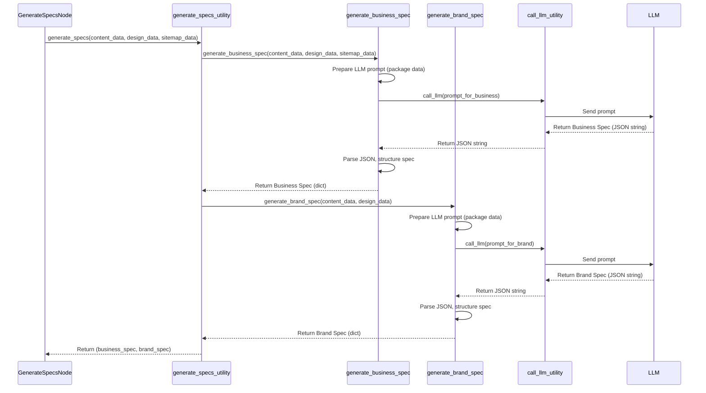

# Chapter 6: Specification Generation

Welcome back! In the last chapter, [Data Extraction Utilities](05_data_extraction_utilities_.md), we learned how to take the raw HTML `soup` object for each page and use specialized tools to pull out specific pieces of information – like the text content, business details, and design elements.

Now we have all these pieces of data scattered across potentially many pages. Imagine you're a market researcher, and you've collected survey data, interview notes, and competitor information. That raw data is valuable, but it's not a summary you can present to someone to understand the whole picture of a business or market.

You need to analyze all that data and synthesize it into structured reports – like a business profile and a brand identity document.

This is exactly what the **Specification Generation** step does in our Website Analyzer.

### What is Specification Generation?

Specification Generation is the process of taking all the extracted data (from content, design, sitemap) and analyzing it to produce structured, higher-level summaries of the website's underlying characteristics. It's where we combine the pieces and infer things about the business and its brand.

Think of it as the step where our system acts like an expert analyst:

*   It looks at the collected business info, main content, and page structure to understand **What the Business Is** and **What it Does**. This leads to a **Business Specification**.
*   It looks at the colors, fonts, overall layout, tone of voice in the content (like testimonials and product descriptions) to understand **How the Business Presents Itself**. This leads to a **Brand Specification**.

This process often requires more than just simple data aggregation. Sometimes, you need a bit of "understanding" or "inference" to connect the dots. This is where our project uses a powerful tool: a Large Language Model (LLM), like Ollama, as the intelligent analyst to help generate these specifications based on the input data.

### The Central Use Case: Creating Business and Brand Profiles

The core use case for Specification Generation is generating these two key outputs:

1.  **Business Specification:** A summary covering the business's purpose, target audience, value proposition, products/services, etc.
2.  **Brand Specification:** A summary detailing the brand's identity, personality, visual elements (colors, fonts), and voice/tone.

These specifications provide a structured overview of the analyzed website, making the complex analysis results easy to digest.

### Which Node Does This?

In our Flow Orchestration ([Chapter 1](01_flow_orchestration_.md)), this crucial step is handled by the **`GenerateSpecsNode`**.

Looking at the flow definition in `flow.py`, the `GenerateSpecsNode` comes after the batch processing nodes have finished collecting all the design and content data. Its job is to take that combined data from the `shared` store and produce the specifications.

Here's where `GenerateSpecsNode` fits in the simplified flow:

```python
# Simplified flow from flow.py conceptual view
# ... other nodes like SitemapBatchNode, ContentBatchNode, DesignElementsBatchNode ...

# Add node instance
generate_specs_node = GenerateSpecsNode()
flow.add_node("generate_specs", generate_specs_node)

# Define transitions - runs AFTER data extraction batches
flow.add_transition("content_batch", "next", "generate_specs") 
flow.add_transition("design_batch", "next", "generate_specs") # These might run in parallel, then flow to generate_specs

# ... transition from generate_specs to the next node ...
flow.add_transition("generate_specs", "next", "create_html_summary") 
# ... other transitions ...
```

The `GenerateSpecsNode` waits until the necessary data (`shared['content']`, `shared['design']`, `shared['sitemap']`) has been added to `shared` by the preceding nodes.

### How to Use `GenerateSpecsNode`

From the perspective of the `Flow`, using the `GenerateSpecsNode` is just like using any other node: you add it to the flow and define transitions leading to and from it.

The `GenerateSpecsNode` itself is responsible for:

1.  Gathering the necessary extracted data from the `shared` dictionary (`prep` method).
2.  Calling the underlying logic (a utility function) to perform the actual specification generation, which might involve the LLM (`exec` method).
3.  Storing the resulting specifications and potentially a file path where they are saved back into the `shared` dictionary, and returning the appropriate action for the Flow (`post` method).

Let's look at simplified parts of the `GenerateSpecsNode`'s `prep` and `post` methods from `nodes.py`.

```python
# Inside nodes.py (Simplified GenerateSpecsNode)
# Imports for generate_specs, save_specs utilities

class GenerateSpecsNode(Node):
    def prep(self, shared):
        """
        Prepare data for specification generation by pulling from shared.
        """
        print("GenerateSpecsNode: Preparing data...")
        # Retrieve needed data from the shared dictionary
        return {
            "url": shared.get("url", ""),
            "content_data": shared.get("content", {}), # Get aggregated content data
            "design_data": shared.get("design", {}),   # Get aggregated design data
            "sitemap_data": shared.get("sitemap", {}), # Get sitemap data
            "output_dir": shared.get("output_dir", "output") # Get output directory setting
        }
    
    def exec(self, prep_data):
        """
        Execute specification generation logic (calls utilities).
        """
        print("GenerateSpecsNode: Generating specifications...")
        # *** This is where the generation utility is called ***
        # We'll look at generate_specs() in detail next
        business_spec, brand_spec = generate_specs(
            prep_data["content_data"],
            prep_data["design_data"],
            prep_data["sitemap_data"]
        )
        
        # Also save the specs to a file
        specs_file = save_specs(
            business_spec,
            brand_spec,
            prep_data["url"],
            prep_data["output_dir"]
        )
        
        # Return the generated specs and the file path
        return {
            "success": True, # Indicate success
            "business_spec": business_spec,
            "brand_spec": brand_spec,
            "specs_file": specs_file
        }
    
    def post(self, shared, prep_res, exec_res):
        """
        Store specifications in shared context and decide next action.
        """
        if exec_res.get("success", False):
            print(f"GenerateSpecsNode: Specs generated and saved to {exec_res['specs_file']}")
            # *** Store the results back into the shared dictionary ***
            shared["business_spec"] = exec_res["business_spec"]
            shared["brand_spec"] = exec_res["brand_spec"]
            shared["specs_file"] = exec_res["specs_file"]
            
            # Tell the Flow to move to the next node
            return "next"
        else:
            print("GenerateSpecsNode: Failed to generate specifications.")
            # Store error info and tell the Flow to handle the error
            shared["error_message"] = exec_res.get('error', 'Specification generation failed')
            shared["error_source"] = "generate_specs"
            shared["succeeded"] = False
            return "error"
```

**Explanation:**

*   The `prep` method collects the necessary data (`content`, `design`, `sitemap`) from `shared` and passes it to the `exec` method.
*   The `exec` method calls the `generate_specs` utility function (and `save_specs`) using the prepared data. It gets back the generated specifications.
*   The `post` method takes the results from `exec`, checks if it was successful, and if so, writes the `business_spec`, `brand_spec`, and `specs_file` path back into the `shared` dictionary so they are available for later nodes (like the HTML summary generator). It then returns `"next"` to continue the flow. If there was an error in `exec`, it returns `"error"`.

This shows how the `GenerateSpecsNode` orchestrates the process of generation and updates the `shared` data.

### How Specification Generation Works Under the Hood

The real work of analyzing the data and producing the specifications happens within a utility function, primarily `generate_specs`, located in `utils/generate_specs.py`.

This utility function is like the market researcher's final analysis phase, where they look at *all* the collected data and write the reports. A key part of this is often leveraging the **LLM** to perform complex reasoning and synthesis that would be difficult with just simple rules.

Here's a simplified sequence of what happens when the `generate_specs` utility is called:



This diagram shows that `generate_specs` orchestrates the calls to `generate_business_spec` and `generate_brand_spec`. Each of these functions then prepares the relevant extracted data, crafts a specific request (a "prompt") for the LLM using the `call_llm` utility, sends it to the LLM, gets the LLM's response (which is expected to be a JSON string), and then parses that JSON into a Python dictionary format for the final specification.

### Peeking into `utils/generate_specs.py`

Let's look at simplified snippets from `utils/generate_specs.py`.

First, the main `generate_specs` function simply calls the two functions responsible for each type of specification:

```python
# Inside utils/generate_specs.py (Simplified)
# Imports for generate_business_spec, generate_brand_spec, save_specs

def generate_specs(content_data, design_data, sitemap_data):
    """
    Generate both business and brand specifications.
    """
    print("Generating Business Spec...")
    business_spec = generate_business_spec(content_data, design_data, sitemap_data)
    
    print("Generating Brand Spec...")
    brand_spec = generate_brand_spec(content_data, design_data)
    
    # The save_specs utility is called by the node, not here in this example
    # but in the real code it's often called right after generation.
    # save_specs(business_spec, brand_spec, url, output_dir) 
    
    return business_spec, brand_spec
```

Next, let's look at how `generate_business_spec` prepares data and interacts with the LLM via `call_llm`. `generate_brand_spec` works in a very similar way, just focusing on different data points and prompting the LLM for brand-related insights.

```python
# Inside utils/generate_specs.py (Simplified generate_business_spec)
# Imports for json, call_llm

def generate_business_spec(content_data, design_data, sitemap_data):
    """
    Generate a business specification sheet using LLM.
    """
    # --- 1. Prepare Data from Extracted Info ---
    # Pull out relevant pieces from the content, design, and sitemap data
    business_info = content_data.get("business_info", {})
    business_type = content_data.get("business_type", {})
    page_title = content_data.get("page_title", "")
    products = content_data.get("products", [])
    testimonials = content_data.get("testimonials", [])
    word_count = content_data.get("word_count", 0)
    pages_count = len(sitemap_data.get("pages", {}))
    
    # Structure the data clearly for the LLM
    input_data_for_llm = {
        "business_name": business_info.get("name"),
        "page_title": page_title,
        "tagline": business_info.get("tagline"),
        "business_type": business_type.get("type"),
        "contact_info": business_info.get("contact"),
        "social_media": business_info.get("social_media"),
        "pages_count": pages_count,
        "word_count": word_count,
        # Simplify lists for the LLM (e.g., just top 5 products)
        "products_sample": products[:5], 
        "testimonials_sample": testimonials[:3],
        # Include a sample of main content if needed for context
        "content_sample_snippet": content_data.get("main_content", {}).get("main", [])[:2] 
    }
    
    # --- 2. Craft the Prompt for the LLM ---
    # Ask the LLM to act as a business analyst and generate the spec
    prompt = f"""
    Analyze the following website data and generate a Business Specification in JSON format.
    Data: {json.dumps(input_data_for_llm, indent=2)}
    
    Include sections for Business Overview, Target Audience, Value Proposition, Products/Services, etc.
    Focus on key details and inferences based on the data provided.
    """
    
    # Define a system message to guide the LLM's role and output format
    system_message = """
    You are a helpful business analyst. Generate a JSON object representing the business spec.
    Only output JSON.
    """
    
    # --- 3. Call the LLM Utility ---
    llm_response_text = call_llm(prompt, system_message)
    print("Received response from LLM.")
    
    # --- 4. Parse the LLM's Response ---
    try:
        # Try to load the response text as JSON
        business_spec = json.loads(llm_response_text)
        print("Successfully parsed LLM response.")
        return business_spec # Return the structured dictionary
    except json.JSONDecodeError as e:
        print(f"Error parsing LLM JSON response: {e}. Attempting fallback...")
        # Add basic error handling if LLM doesn't return perfect JSON
        # The actual code has more robust JSON extraction
        return {"error": "Failed to parse LLM response", "raw_response": llm_response_text}
```

**Explanation:**

1.  The function starts by taking the aggregated `content_data`, `design_data`, and `sitemap_data` dictionaries.
2.  It then prepares a smaller, relevant dictionary (`input_data_for_llm`) containing the key pieces of information needed for the business specification. This helps focus the LLM.
3.  A `prompt` string is constructed. This string tells the LLM what task to perform (analyze data and generate a business spec) and provides the prepared data, often formatted as JSON for clarity.
4.  A `system_message` string helps set the role for the LLM (business analyst) and specifies the desired output format (JSON only).
5.  The `call_llm(prompt, system_message)` utility function is called. This utility handles the communication with the actual LLM service (like Ollama) ([Chapter 8: Ollama LLM Integration](08_ollama_llm_integration_.md) explains this in more detail).
6.  The `call_llm` utility sends the prompt and system message to the LLM and returns the LLM's text response.
7.  The function attempts to parse the LLM's response, which is expected to be a JSON string, into a Python dictionary using `json.loads()`.
8.  Finally, it returns the resulting Python dictionary, which represents the structured Business Specification. `generate_brand_spec` does the same for the Brand Specification.

The `save_specs` utility function, also used by the `GenerateSpecsNode`, is a simple helper that takes the two specification dictionaries and saves them to a single `specs.json` file in the output directory.

```python
# Inside utils/generate_specs.py (Simplified save_specs)
import json
import os
from urllib.parse import urlparse

def save_specs(business_spec, brand_spec, url, output_dir="output"):
    """
    Save specifications to a JSON file.
    """
    # ... Create output directory ...
    os.makedirs(output_dir, exist_ok=True)
    
    # Create a filename based on the URL (e.g., example.com_specs.json)
    parsed_url = urlparse(url)
    domain = parsed_url.netloc.replace("www.", "")
    filename = f"{domain.replace('.', '_')}_specs.json"
    filepath = os.path.join(output_dir, filename)
    
    # Combine specs into one dictionary
    combined_specs = {
        "url": url,
        "business_spec": business_spec,
        "brand_spec": brand_spec
    }
    
    # Write to file
    with open(filepath, 'w', encoding='utf-8') as f:
        json.dump(combined_specs, f, indent=2) # Save as pretty-printed JSON
        
    print(f"Specifications saved to {filepath}")
    return filepath
```
This utility is straightforward: it takes the generated specs, combines them, determines a filename based on the original URL, and saves the result as a JSON file. The path to this saved file is also stored in `shared` by the `GenerateSpecsNode`'s `post` method.

### Conclusion

Specification Generation is a critical step where our Website Analyzer synthesizes the raw, extracted data into structured, high-level summaries of the website's business and brand. This is primarily handled by the `GenerateSpecsNode`, which relies on the `generate_specs` utility function. The `generate_specs` utility, in turn, leverages the power of a Large Language Model (LLM) by preparing prompts based on the extracted data and sending them via the `call_llm` utility. The LLM performs the complex analysis and returns structured results (like JSON), which are then parsed and saved. The resulting `business_spec` and `brand_spec` are stored in the `shared` data, ready for the next stage.

Now that we have these structured specifications, we can use them to create a final, user-friendly report. In the next chapter, we'll learn about [HTML Summary Generation](07_html_summary_generation_.md).

---

<sub><sup>Generated by [AI Codebase Knowledge Builder](https://github.com/The-Pocket/Tutorial-Codebase-Knowledge).</sup></sub> <sub><sup>**References**: [[1]](https://github.com/Theblackcat98/Website-Analyzer/blob/3c2ef570c745520cd623f7b5a5f498ba45f1f35c/nodes.py), [[2]](https://github.com/Theblackcat98/Website-Analyzer/blob/3c2ef570c745520cd623f7b5a5f498ba45f1f35c/tests/test_llm_generation.py), [[3]](https://github.com/Theblackcat98/Website-Analyzer/blob/3c2ef570c745520cd623f7b5a5f498ba45f1f35c/utils/generate_specs.py)</sup></sub>