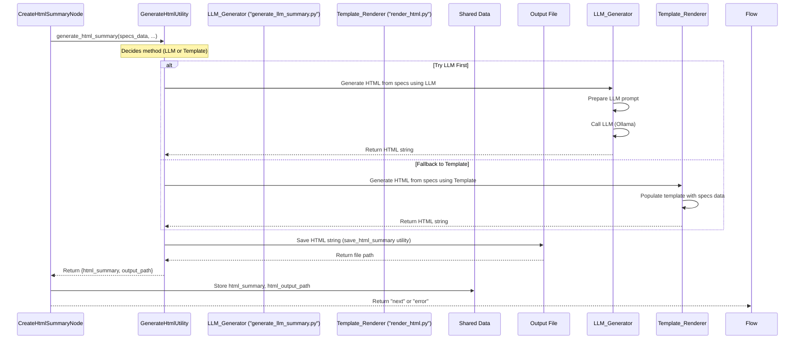

# Chapter 7: HTML Summary Generation

Welcome back! In the previous chapter, [Specification Generation](06_specification_generation_.md), we learned how our Website Analyzer synthesizes all the extracted data (content, design, sitemap) into structured **Business Specifications** and **Brand Specifications**. These specifications are like detailed reports prepared by an analyst, summarizing key aspects of the website.

However, these specifications are typically stored in a structured format like JSON (JavaScript Object Notation), which is great for computers and other parts of the analysis flow, but not very user-friendly for a human reader who just wants a quick overview.

Imagine receiving a complex technical report in a raw data file format. You'd much rather have a nicely formatted PDF or a clear web page that presents the key findings visually and is easy to read.

This is the purpose of the **HTML Summary Generation** step. It takes those structured business and brand specifications and transforms them into a user-friendly, visually appealing HTML web page. This HTML page is often the primary output that the user sees and interacts with to understand the analysis results.

### The Central Use Case: Creating the Final Report

The core use case for HTML Summary Generation is simple: **Produce the final, human-readable report.**

We have all the analysis results captured in the Business and Brand Specifications. This step is about publishing those results in a polished format that can be easily viewed in a web browser. It's like the final stage in the research process where the analyst creates the executive summary or a detailed report with charts and formatting.

### Which Node Does This?

In our Flow Orchestration ([Chapter 1](01_flow_orchestration_.md)), the step responsible for creating this final HTML report is handled by the **`CreateHtmlSummaryNode`**.

Looking at the flow definition in `flow.py`, this node comes right after the `GenerateSpecsNode`:

```python
# Simplified flow snippet from flow.py conceptual view
# ... after data extraction and specification generation ...

# Add node instance
create_html_node = CreateHtmlSummaryNode()
flow.add_node("create_html", create_html_node)

# Define transition - runs AFTER specs are generated
flow.add_transition("generate_specs", "next", "create_html") 

# ... define what happens after create_html node finishes ...
flow.add_transition("create_html", "next", "complete_flow_action_or_node") 
# ... other transitions like "error" ...
```

The `CreateHtmlSummaryNode` requires the `business_spec` and `brand_spec` to be present in the `shared` data dictionary before it runs. These were added to `shared` by the preceding `GenerateSpecsNode` ([Chapter 6](06_specification_generation_.md)).

### How to Use `CreateHtmlSummaryNode`

Like any other node, you don't directly "use" the `CreateHtmlSummaryNode` from your main script; you add it to the `Flow` and the `Flow` manages its execution.

The `CreateHtmlSummaryNode` itself handles three main things:

1.  **Gathering Data (`prep` method):** It collects the necessary specifications (and potentially other relevant data like the original URL or sitemap) from the `shared` dictionary.
2.  **Generating HTML (`exec` method):** It calls the underlying logic (a utility function or script) that performs the actual HTML creation using the gathered data. This is where the intelligence of using an LLM or a template comes in.
3.  **Storing Results (`post` method):** It takes the generated HTML (or the path to the saved HTML file) and stores it back into the `shared` dictionary, typically indicating where the final report can be found. It then signals the `Flow` to move to the next step.

Let's look at simplified parts of the `CreateHtmlSummaryNode`'s `prep` and `post` methods from `nodes.py`.

```python
# Inside nodes.py (Simplified CreateHtmlSummaryNode)
# Imports for generate_html_summary, save_html_summary utilities

class CreateHtmlSummaryNode(Node):
    def prep(self, shared):
        """
        Prepare data for HTML summary generation by pulling from shared.
        """
        print("CreateHtmlSummaryNode: Preparing data...")
        # Retrieve needed data from the shared dictionary
        return {
            "url": shared.get("url", "Unknown URL"),
            "business_spec": shared.get("business_spec", {}), # Get generated business spec
            "brand_spec": shared.get("brand_spec", {}),   # Get generated brand spec
            # Include other data that might be useful in the report
            "sitemap_data": shared.get("sitemap", {}), 
            "design_data": shared.get("design", {}), 
            "content_data": shared.get("content", {}), 
            "output_dir": shared.get("output_dir", "output") # Where to save the file
        }
    
    def exec(self, prep_data):
        """
        Execute HTML generation logic (calls utility).
        """
        print("CreateHtmlSummaryNode: Generating HTML summary...")
        # *** This is where the generation utility/script is called ***
        # The actual generation logic (LLM or Template) happens inside this call
        # We'll look at how this works under the hood next.
        
        # This utility call will handle the LLM/template choice internally
        # and return the generated HTML string.
        html_content = generate_html_summary(
            prep_data["url"],
            prep_data["business_spec"],
            prep_data["brand_spec"],
            prep_data["sitemap_data"],
            prep_data["design_data"],
            prep_data["content_data"]
        )
        
        # Save the generated HTML to a file
        output_path = save_html_summary(
            html_content,
            prep_data["url"],
            prep_data["output_dir"]
        )
        
        # Return the generated HTML and the file path
        return {
            "success": True, # Indicate success
            "html_summary": html_content,
            "output_path": output_path
        }
    
    def post(self, shared, prep_res, exec_res):
        """
        Store summary results in shared context and decide next action.
        """
        if exec_res.get("success", False) and exec_res.get("output_path"):
            print(f"CreateHtmlSummaryNode: HTML summary generated and saved to {exec_res['output_path']}")
            # *** Store the results back into the shared dictionary ***
            shared["html_summary"] = exec_res["html_summary"]
            shared["html_output_path"] = exec_res["output_path"]
            
            # Tell the Flow to move to the next node
            return "next"
        else:
            print("CreateHtmlSummaryNode: Failed to generate HTML summary.")
            # Store error info and tell the Flow to handle the error
            shared["error_message"] = exec_res.get('error', 'HTML summary generation failed')
            shared["error_source"] = "create_html_summary"
            shared["succeeded"] = False
            return "error"
```

**Explanation:**

*   The `prep` method simply gathers the specification data and other useful information (like the original `url` and the `output_dir` setting) from the `shared` dictionary.
*   The `exec` method is where the core work happens. It calls the `generate_html_summary` utility function, passing all the collected data. This utility is responsible for creating the HTML content string. It then calls `save_html_summary` to write this string to a file.
*   The `post` method checks if the `exec` step was successful (did it generate HTML and save it?). If yes, it stores the generated HTML content itself and, more importantly, the file path where it was saved (`html_output_path`) back into the `shared` dictionary. It then returns `"next"` to indicate the flow should continue. If there was an error, it returns `"error"`.

This pattern is consistent with other nodes: `prep` collects input, `exec` does the work (often calling a utility), and `post` stores the output and signals the next step to the `Flow`.

### How HTML Generation Works Under the Hood

The actual logic for creating the HTML from the specifications lives outside the `CreateHtmlSummaryNode` itself, primarily in utility functions or dedicated scripts. The `exec` method of the node delegates the task to these components.

The project provides flexibility in *how* the HTML is generated, specifically offering a choice between using a powerful LLM or a simpler, template-based approach.

Here's the conceptual sequence of what happens within the `generate_html_summary` process triggered by the node:



This diagram illustrates that the `CreateHtmlSummaryNode` initiates the process by calling a `GenerateHtmlUtility`. This utility (or the scripts it might call) contains the logic to attempt LLM-based generation first. If that works, it uses the LLM's output. If it fails, it falls back to the template-based approach. Finally, the generated HTML is saved using a `save_html_summary` utility, and the path is returned to the node to be stored in `shared`.

### Peeking into the Generation Methods

While the `CreateHtmlSummaryNode` calls a utility function (like `generate_html_summary` in `utils/generate_html_summary.py`), the actual LLM interaction and the template rendering might live in separate scripts (`generate_llm_summary.py` and `render_html.py`) which are designed to be runnable on their own but can also be imported or called.

Let's look conceptually at how the two main methods work:

#### Method 1: LLM-based Generation (Primary)

This method leverages an LLM ([Chapter 8](08_ollama_llm_integration_.md)) to generate the entire HTML structure and content based on the provided specifications.

*   **Input:** Business Spec (dict), Brand Spec (dict), potentially other data, and a prompt telling the LLM what kind of HTML to create. The prompt might even include a basic HTML structure template for the LLM to follow.
*   **Process:** The relevant specification data is formatted (e.g., as JSON or simple text) and included in the prompt sent to the LLM (via a utility like `call_llm`). The prompt instructs the LLM to output *only* the HTML code for a summary page.
*   **Output:** The LLM returns a string containing the generated HTML code.

This approach is powerful because the LLM can interpret the nuances in the specifications and create a well-structured and even creatively styled HTML page. However, it relies on the LLM being available and responding correctly, and LLMs can sometimes produce invalid or unexpected output.

The code responsible for this approach is typically found in a script like `generate_llm_summary.py`. It includes logic to format the prompt, call the `call_llm` utility, and process the LLM's text response.

```python
# Inside generate_llm_summary.py (Simplified conceptual snippet)
# Imports: json, call_llm utility

def generate_html_from_specs_llm(specs_data):
    """
    Generate HTML using LLM based on specs data.
    """
    # --- 1. Format data and craft prompt for the LLM ---
    specs_json_string = json.dumps(specs_data, indent=2)
    
    prompt = f"""
    Generate a complete, styled HTML page summarizing this data:
    {specs_json_string}
    
    Make sure the HTML is well-formatted, easy to read, and uses appropriate styling.
    Include sections for Business Overview, Brand, Products, etc.
    Output ONLY the HTML code, no extra text or markdown.
    """
    
    # --- 2. Call the LLM ---
    print("Calling LLM to generate HTML...")
    html_content = call_llm(prompt) # Call the LLM utility
    
    if not html_content:
        print("LLM failed to generate content.")
        return None # Indicate failure
        
    # --- 3. Return the raw HTML string ---
    return html_content

# This function would be called by the node's exec method
# or orchestrated by an intermediary utility.
```
This snippet shows the core idea: package the specs into the prompt and ask the LLM utility (`call_llm`) to generate the HTML.

#### Method 2: Template-based Generation (Fallback)

This method uses a pre-defined HTML structure (a template) with placeholders. It then simply plugs the relevant pieces of data from the specifications into these placeholders.

*   **Input:** Business Spec (dict), Brand Spec (dict), etc., and an HTML template file or string.
*   **Process:** The code identifies specific data points in the specification dictionaries (e.g., `business_spec['business_overview']['name']`). It then inserts these values into corresponding spots in the HTML template string. This might involve simple string formatting or using a templating library.
*   **Output:** A string containing the final HTML code.

This approach is less flexible than the LLM but is much more reliable. It guarantees a predictable output structure as long as the template is valid.

The code for this is often found in a script like `render_html.py` or potentially within a utility like `utils/generate_html_summary.py` as the fallback logic.

```python
# Inside render_html.py or utils/generate_html_summary.py (Simplified snippet)

def generate_html_from_specs_template(specs_data):
    """
    Generate HTML using a simple template based on specs data.
    """
    # --- 1. Get the specs data ---
    business_spec = specs_data.get('business_spec', {})
    brand_spec = specs_data.get('brand_spec', {})
    url = specs_data.get('url', 'Unknown URL')
    
    # --- 2. Extract specific data points ---
    business_name = business_spec.get('business_overview', {}).get('name', 'Unknown Business')
    brand_personality = ", ".join(brand_spec.get('brand_identity', {}).get('personality_traits', []))
    # ... extract other key data points ...
    
    # --- 3. Define or load a simple HTML template ---
    html_template = f"""
    <!DOCTYPE html>
    <html>
    <head>
        <title>Analysis: {{business_name}}</title>
        <style>/* basic css here */</style>
    </head>
    <body>
        <h1>Website Analysis: {{business_name}}</h1>
        <p>Source URL: <a href="{{url}}">{{url}}</a></p>
        
        <h2>Business Overview</h2>
        <p>Business Name: {{business_name}}</p>
        <p>Business Type: {{business_spec.business_overview.type}}</p>
        
        <h2>Brand Identity</h2>
        <p>Personality: {{brand_personality}}</p>
        <!-- ... other template sections ... -->
    </body>
    </html>
    """ # Simplified template string with placeholders

    # --- 4. Populate the template (simplified string replace) ---
    # In a real template engine, this would be more robust
    html_content = html_template.replace('{{business_name}}', business_name)
    html_content = html_content.replace('{{url}}', url)
    html_content = html_content.replace('{{brand_personality}}', brand_personality)
    # ... replace other placeholders ...

    # --- 5. Return the populated HTML string ---
    return html_content

# This function would be used as the fallback if LLM fails
```
This demonstrates extracting specific data and plugging it into a predefined structure.

#### Saving the HTML (`save_html_summary`)

Regardless of which generation method is used (LLM or template), the resulting HTML content (a string) needs to be saved to a file so the user can open it in a browser. This is the job of the `save_html_summary` utility.

```python
# Inside utils/generate_html_summary.py (Simplified save_html_summary)
import os
from urllib.parse import urlparse
from datetime import datetime

def save_html_summary(html_content, url, output_dir="output"):
    """
    Save HTML summary string to a file in the output directory.
    """
    try:
        # Ensure the output directory exists
        os.makedirs(output_dir, exist_ok=True)
        
        # Create a filename based on the URL and timestamp
        parsed_url = urlparse(url)
        domain = parsed_url.netloc.replace("www.", "")
        timestamp = datetime.now().strftime("%Y%m%d_%H%M%S")
        filename = f"{domain.replace('.', '_')}_{timestamp}_summary.html"
        filepath = os.path.join(output_dir, filename)
        
        # Write the HTML content to the file
        with open(filepath, 'w', encoding='utf-8') as f:
            f.write(html_content)
            
        print(f"HTML summary saved to {filepath}")
        return filepath # Return the path
        
    except Exception as e:
        print(f"Error saving HTML summary: {str(e)}")
        return None # Indicate failure
```
This utility handles creating the directory if needed, generating a sensible filename based on the source URL and the current time, and writing the provided HTML string to that file. The path to this saved file is the critical piece of information returned to the `CreateHtmlSummaryNode`'s `exec` method and subsequently stored in `shared['html_output_path']`.

### Conclusion

HTML Summary Generation is the final presentation layer of our Website Analyzer. It takes the structured Business and Brand Specifications created in the previous step and turns them into a user-friendly HTML web page. This is handled by the `CreateHtmlSummaryNode`, which collects the necessary data from the `shared` dictionary, calls a utility function that performs the actual HTML generation (preferring the LLM-based method when available, and falling back to a template if not), and finally saves the resulting HTML to a file using the `save_html_summary` utility. The path to this final HTML report is then stored in `shared` for the user to easily find the output.

Understanding this step shows how the complex analysis data is transformed into a consumable report, making the results accessible. In the next chapter, we will dive deeper into how the LLM integration, which is a key part of the Specification Generation and HTML Summary Generation steps, actually works: [Ollama LLM Integration](08_ollama_llm_integration_.md).

---

<sub><sup>Generated by [AI Codebase Knowledge Builder](https://github.com/The-Pocket/Tutorial-Codebase-Knowledge).</sup></sub> <sub><sup>**References**: [[1]](https://github.com/Theblackcat98/Website-Analyzer/blob/3c2ef570c745520cd623f7b5a5f498ba45f1f35c/generate_llm_summary.py), [[2]](https://github.com/Theblackcat98/Website-Analyzer/blob/3c2ef570c745520cd623f7b5a5f498ba45f1f35c/generate_summary.py), [[3]](https://github.com/Theblackcat98/Website-Analyzer/blob/3c2ef570c745520cd623f7b5a5f498ba45f1f35c/nodes.py), [[4]](https://github.com/Theblackcat98/Website-Analyzer/blob/3c2ef570c745520cd623f7b5a5f498ba45f1f35c/render_html.py), [[5]](https://github.com/Theblackcat98/Website-Analyzer/blob/3c2ef570c745520cd623f7b5a5f498ba45f1f35c/tests/test_llm_generation.py), [[6]](https://github.com/Theblackcat98/Website-Analyzer/blob/3c2ef570c745520cd623f7b5a5f498ba45f1f35c/utils/generate_html_summary.py)</sup></sub>