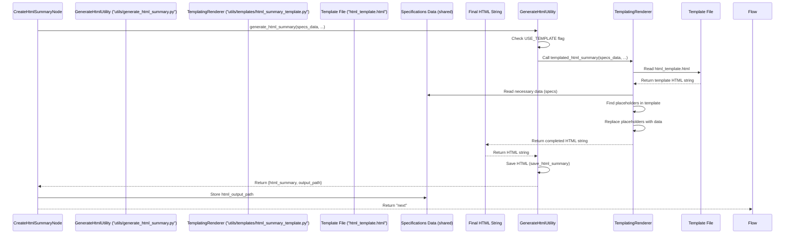

# Chapter 9: HTML Templating

Welcome back! In our journey through the Website Analyzer project, we've reached the point where we have gathered raw website content ([Chapter 4](04_website_content_fetching_.md)), extracted specific data from it ([Chapter 5](05_data_extraction_utilities_.md)), synthesized that data into structured Business and Brand Specifications ([Chapter 6](06_specification_generation_.md)), and even explored using an LLM ([Chapter 8](08_ollama_llm_integration_.md)) to help write those specifications and potentially the final report ([Chapter 7](07_html_summary_generation_.md)).

Chapter 7 introduced the `CreateHtmlSummaryNode` as the step responsible for generating the final, user-friendly HTML report. While the LLM approach can be powerful for generating flexible and creative reports, sometimes you need a guarantee of a certain structure and appearance. What if the LLM is offline, returns invalid HTML, or just doesn't format things the way you need?

This is where **HTML Templating** comes in. It provides a reliable, predictable way to generate the HTML summary, ensuring consistency every time, even if the LLM is not used or fails.

### The Central Use Case: Generating a Predictable HTML Report

Imagine you need to produce a report that always has a specific layout: a header at the top, a section for business details, a section for brand elements, maybe a table of contents, and a footer. The information within these sections will change depending on the website analyzed, but the sections themselves and their general look should be the same for every report.

HTML Templating solves this by letting you define a pre-formatted HTML file with placeholders for where the dynamic data goes. Our **central use case** for HTML Templating is to use this pre-defined structure to build the final HTML summary page based on the generated specifications.

### What is HTML Templating?

Think of HTML Templating like using a fancy pre-printed form or report paper.

*   **The Template:** This is the pre-printed paper itself. It has a fixed structure – headings, sections, tables, and maybe some basic styling. Crucially, it also has blank spaces or labels that say "Fill in the Business Name here," "Add the list of colors here," etc. In our case, the template is an HTML file (`html_template.html`) with special placeholders.
*   **The Data:** This is the information you've collected – our Business and Brand Specifications ([Chapter 6](06_specification_generation_.md)) and perhaps other extracted details. This is the content you need to fill into the blanks.
*   **The Renderer:** This is the process or script that takes the data and the template, finds all the placeholders in the template, and replaces them with the actual data. The output is a complete, filled-out document (the final HTML report).

The key advantage of templating is that the *structure* and basic *appearance* are controlled by the template file, not by potentially unpredictable LLM output.

### Key Concepts in HTML Templating

1.  **Template File:** An HTML file containing the fixed structure and presentation. It includes special markers indicating where dynamic content should be inserted. In our project, a primary template is located at `utils/templates/html_template.html`.
2.  **Placeholders:** These are special strings within the template that the renderer script looks for. They act as markers for where data should be placed. For example, a template might have `{business_name}` or a more complex loop like sections for displaying lists of items (products, colors).
3.  **Data Source:** The structured information used to fill the placeholders. In our project, this is primarily the `business_spec` and `brand_spec` dictionaries and potentially other details from the `shared` data ([Chapter 1](01_flow_orchestration_.md)).
4.  **Rendering Logic:** The Python code that reads the template, takes the data, finds the placeholders, and generates the final HTML string by inserting the data into the template. This logic is implemented in our project, mainly within `utils/generate_html_summary.py`.

### How is Templating Used in the Project?

As discussed in [Chapter 7: HTML Summary Generation](07_html_summary_generation_.md), the `CreateHtmlSummaryNode` is responsible for generating the final HTML. This node delegates the actual HTML creation to a utility function, `generate_html_summary`, found in `utils/generate_html_summary.py`.

This `generate_html_summary` utility is designed to potentially use different methods for HTML creation. In our project's current structure, it includes logic to check if a templated approach is available and preferred (`USE_TEMPLATE` flag). If it is, it calls a dedicated templating function (like `templated_html_summary`). If not, or if the template method fails, it falls back to a simpler, hardcoded HTML generation logic.

Let's look at a simplified view of how `utils/generate_html_summary.py` might decide to use the template:

```python
# Inside utils/generate_html_summary.py (Simplified)
# Assume templated_html_summary function is imported/available

# This flag indicates if the template-based generator is available/preferred
# It's often set based on imports (as shown in the actual code snippet)
USE_TEMPLATE = True 

def generate_html_summary(url, business_spec, brand_spec, sitemap_data, design_data, content_data=None):
    """
    Generate an HTML summary page using a template or fallback.
    """
    # --- Decision Point: Use Template? ---
    if USE_TEMPLATE:
        print("Attempting to generate HTML using template...")
        try:
            # Call the function that implements the template rendering logic
            html_content = templated_html_summary(url, business_spec, brand_spec, sitemap_data, design_data, content_data)
            print("Template HTML generation successful.")
            return html_content # Return the HTML from the template
        except Exception as e:
            print(f"Template HTML generation failed: {e}. Falling back...")
            # If template rendering fails, continue to the fallback
            pass # Fall through to the fallback logic below

    # --- Fallback HTML Generation (if template not used or failed) ---
    print("Generating HTML using built-in fallback logic...")
    # This is the hardcoded HTML generation logic shown in Chapter 7 snippet
    html = f"""
    <!DOCTYPE html>
    ... # Your hardcoded HTML structure here
    <h1>Website Analysis: {business_spec.get('business_overview',{}).get('name', 'Unknown Business')}</h1>
    ... # Insert other data using string formatting
    """
    print("Fallback HTML generation complete.")
    return html # Return the fallback HTML

# Assume templated_html_summary function exists elsewhere (e.g. utils/templates/html_summary_template.py)
# This function would load the template file, populate it, and return the string.
# def templated_html_summary(...): ...
```

This snippet shows that the `generate_html_summary` function checks `USE_TEMPLATE`. If `True`, it calls the `templated_html_summary` function. This separates the *decision* of how to generate from the *logic* of templating.

The `templated_html_summary` function (which might live in `utils/templates/html_summary_template.py`) is the one that performs the actual templating: it loads the HTML template file (`html_template.html`) and fills it with data.

### How Templating Works Under the Hood

Let's trace the process when the template method is used:



Here's a breakdown of the steps performed by the `TemplatingRenderer` (the logic within `utils/templates/html_summary_template.py`):

1.  **Load Template:** The script reads the raw text content of the template HTML file (`utils/templates/html_template.html`). This template contains the fixed HTML structure and placeholder like `{business_name}`.
2.  **Get Data:** It receives the structured data, primarily the `business_spec` and `brand_spec` dictionaries, which were previously generated ([Chapter 6](06_specification_generation_.md)) and passed down from the `CreateHtmlSummaryNode`.
3.  **Populate Placeholders:** It iterates through the template string, finds the placeholders (e.g., `{business_name}`), looks up the corresponding data in the specification dictionaries (e.g., `business_spec['business_overview']['name']`), and replaces the placeholder in the template string with the actual data value. This often involves handling nested data structures and lists.
4.  **Generate Final HTML:** After replacing all placeholders, the result is a complete HTML string that is ready to be saved to a file.

Let's look at simplified code snippets illustrating the population step within the `templated_html_summary` function (or similar logic in `utils/generate_html_summary.py`):

```python
# Inside utils/templates/html_summary_template.py or utils/generate_html_summary.py (Simplified)
import os
import logging
from urllib.parse import urlparse

# Assume template content is loaded into a string variable:
# template_html = "... content of html_template.html ..."

def templated_html_summary(url, business_spec, brand_spec, sitemap_data, design_data, content_data):
    """
    Generate HTML summary using the template.
    """
    # Load the template content (simplified - real code might use get_template utility)
    template_path = os.path.join(os.path.dirname(__file__), 'html_template.html')
    if not os.path.exists(template_path):
        # Fallback logic if template file is missing (or use a default string)
        logging.error(f"Template file not found at {template_path}")
        return "<h1>Error: Template not found</h1>" # Return simple error HTML

    with open(template_path, 'r', encoding='utf-8') as f:
        template_html = f.read()

    # --- Extract specific data points from specs ---
    # Need to handle potential missing keys safely
    business_overview = business_spec.get('business_overview', {})
    brand_identity = brand_spec.get('brand_identity', {})
    
    business_name = business_overview.get('name', 'Unknown Business')
    brand_personality = ", ".join(brand_identity.get('personality_traits', []))
    
    # Get colors from design data for CSS variables (as seen in default template)
    colors = list(design_data.get('colors', {}).keys())
    primary_color = colors[0] if colors else "#4a90e2"
    accent_color = colors[1] if len(colors) > 1 else "#34495e"
    
    # ... extract other data points needed for the template ...

    # --- Populate the template using simple string replacement ---
    # This is a very basic method; real templating engines are more powerful
    html_content = template_html.replace('{business_name}', business_name)
    html_content = html_content.replace('{url}', url)
    
    # Example for CSS variables based on extracted colors
    html_content = html_content.replace('{primary_color}', primary_color)
    html_content = html_content.replace('{accent_color}', accent_color)
    
    # Populate sections - might require more complex loops/conditions in real code
    # Example: filling a "Business Information" section placeholder
    business_info_html = f"""
    <h3>Business Overview</h3>
    <p><strong>Name:</strong> {business_name}</p>
    <p><strong>Type:</strong> {business_overview.get('type', 'Not specified')}</p>
    ... # add more business details
    """
    # If the template has a specific comment or marker for this section:
    html_content = html_content.replace('<!-- Business Information Section -->', business_info_html)
    
    # Populate brand section
    brand_info_html = f"""
    <h3>Brand Identity</h3>
    <p><strong>Personality:</strong> {brand_personality}</p>
    ... # add more brand details including colors, fonts
    """
    html_content = html_content.replace('<!-- Brand Information Section -->', brand_info_html)
    
    # ... replace other placeholders ...

    return html_content # Return the final HTML string
```

This simplified snippet shows how the Python code:
1.  Loads the template file content.
2.  Accesses specific pieces of data from the input dictionaries (`business_spec`, `brand_spec`, etc.).
3.  Uses string manipulation (like `.replace()` in this basic example) to substitute the placeholders in the template with the actual data values.

The actual code in `utils/generate_html_summary.py` and potentially `utils/templates/html_summary_template.py` includes more detailed logic to handle the complex structure of the specification dictionaries and insert the data into various parts of the pre-defined HTML template, including generating lists of items (like colors or products) as HTML list items or cards. It effectively takes the structured data and maps it onto the visual structure defined by the template.

After `templated_html_summary` returns the complete HTML string, the `generate_html_summary` utility (or the `CreateHtmlSummaryNode` itself) calls the `save_html_summary` function (introduced in [Chapter 7](07_html_summary_generation_.md)) to write this string to a `.html` file in the output directory. The path to this file is then stored in `shared` for the user to find.

### Why Use Templating (vs LLM HTML Generation)?

Templating offers distinct advantages, especially as a reliable fallback:

| Feature         | HTML Templating                     | LLM HTML Generation ([Chapter 8](08_ollama_llm_integration_.md)) |
| :-------------- | :---------------------------------- | :--------------------------------------- |
| **Predictability** | Very High: Output structure is fixed by the template. | Lower: Output structure and wording can vary. |
| **Reliability** | High: Code logic is deterministic.  | Lower: Depends on LLM availability and ability to follow instructions perfectly. |
| **Cost**        | Very Low: Just computation.         | Can be High: LLM API calls cost money or require significant local resources. |
| **Speed**       | Faster: Simple string manipulation. | Slower: Requires communication with LLM and its processing time. |
| **Flexibility** | Lower: Limited by template structure and rendering logic. | Higher: LLM can potentially create unique layouts or content interpretations. |
| **Structure Control** | Full control via template file.     | Less control, relies on prompt instructions. |

Templating guarantees that you will always get a valid HTML file with the expected sections, providing a solid foundation for the report, even if the more flexible LLM generation method encounters issues.

### Conclusion

HTML Templating is a powerful and reliable method used in our Website Analyzer project to generate the final HTML summary report. By using a pre-defined HTML template with placeholders, the project's rendering logic can consistently take the structured specification data and populate the template to produce a user-friendly web page. This approach, often used as a fallback or alternative to LLM-based HTML generation, ensures a predictable structure and appearance for the analysis reports, making the results easy for users to consume. This concludes our tutorial on the core concepts of the Website Analyzer project, from Flow Orchestration to generating the final HTML summary.

---

<sub><sup>Generated by [AI Codebase Knowledge Builder](https://github.com/The-Pocket/Tutorial-Codebase-Knowledge).</sup></sub> <sub><sup>**References**: [[1]](https://github.com/Theblackcat98/Website-Analyzer/blob/3c2ef570c745520cd623f7b5a5f498ba45f1f35c/generate_llm_summary.py), [[2]](https://github.com/Theblackcat98/Website-Analyzer/blob/3c2ef570c745520cd623f7b5a5f498ba45f1f35c/utils/generate_html_summary.py), [[3]](https://github.com/Theblackcat98/Website-Analyzer/blob/3c2ef570c745520cd623f7b5a5f498ba45f1f35c/utils/templates/html_template.html), [[4]](https://github.com/Theblackcat98/Website-Analyzer/blob/3c2ef570c745520cd623f7b5a5f498ba45f1f35c/utils/templates/template_generator.py)</sup></sub>